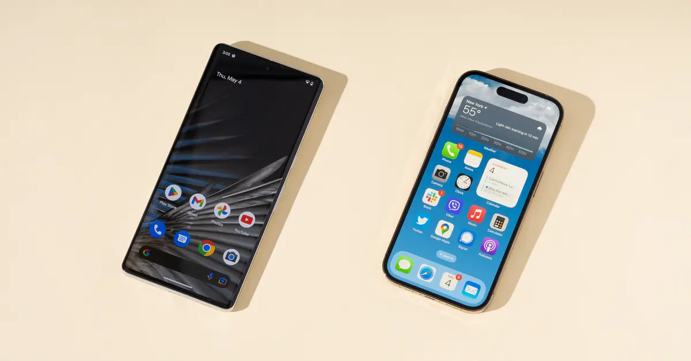

# Summary
# Introduction Mobile App Development

### **POIN 1**

Materi ini membahas tentang pengetahuan umum dan *basic* seputar *Mobile App Development* untuk mengenalkan bagaimana dunia pengembangan aplikasi *mobile*, baik Android maupun iOS.

 

### **POIN 2**

Dalam pengembangan aplikasi *mobile*, terutama untuk platform Android dan menggunakan kerangka kerja seperti Flutter, terdapat beberapa komponen penting yang terlibat. Berikut adalah penjelasan singkat tentang komponen-komponen tersebut :  
1. **Bahasa Pemrograman** : Pemrograman adalah proses menulis kode yang akan dijalankan oleh komputer atau perangkat. Untuk pengembangan Android, bahasa pemrograman yang umum digunakan adalah Java dan Kotlin. Sementara itu, Flutter menggunakan bahasa pemrograman Dart. 

2. ***Compiler*** : *Compiler* adalah alat yang menerjemahkan kode yang ditulis dalam bahasa pemrograman tertentu menjadi kode mesin yang dapat dijalankan oleh perangkat. *Compiler* mengubah kode tingkat tinggi (seperti Java, Kotlin, atau Dart) menjadi instruksi yang dipahami oleh perangkat keras.

3. ***Interpreter*** :
*Interpreter* adalah perangkat lunak yang membaca dan menjalankan kode langsung tanpa perlu mengompilasinya terlebih dahulu. Dalam pengembangan aplikasi *mobile*, *interpreter* digunakan untuk menjalankan kode Dart dalam kerangka kerja Flutter. Kode Dart Flutter diinterpretasikan oleh mesin Dart yang terintegrasi dengan aplikasi, menghasilkan antarmuka pengguna dan fungsionalitas yang diinginkan.  
  
 

### **POIN 3**

Berdasarkan sistem operasi yang digunakan pada perangkat *mobile*, perangkat lunak *mobile* dapat dibagi menjadi 2 kategori utama : **perangkat lunak Android** dan **perangkat lunak iOS**.

1. **Perangkat Lunak Android** :  
Android adalah sistem operasi yang dikembangkan oleh Google dan banyak digunakan pada berbagai jenis perangkat *mobile*, termasuk smartphone dan tablet. Perangkat lunak Android dapat dikembangkan menggunakan bahasa pemrograman Java atau Kotlin. Aplikasi Android diunduh dan diinstal melalui Google Play Store. Beberapa *software mobile* khusus Android (tidak ada di iOS) :
   - **Tasker** : Aplikasi otomatisasi yang memungkinkan pengguna untuk mengatur tindakan atau skenario berdasarkan kondisi tertentu di perangkat Android mereka. 
   - **ZArchiver** : Aplikasi manajemen *file* yang kuat untuk perangkat Android. Aplikasi ini memungkinkan pengguna untuk mengekstrak dan mengompres *file* dalam berbagai format seperti ZIP, RAR, 7z, dan banyak lagi. 
   - **Lucky Patcher** : Aplikasi yang memungkinkan pengguna untuk memodifikasi aplikasi dan permainan Android mereka. Dengan Lucky Patcher, pengguna dapat menghapus iklan, memodifikasi izin aplikasi, menghapus verifikasi lisensi, dan banyak lagi. 
   - **ES File Explorer** : Aplikasi manajemen *file* populer yang memungkinkan pengguna untuk memanipulasi *file* dan folder di perangkat Android mereka. Aplikasi ini dilengkapi dengan fitur-fitur seperti akses ke *cloud storage*, pemutar media, dan bahkan fitur pemutaran video *online*.
   - **Xposed Framework** : Kerangka kerja yang memungkinkan pengguna Android untuk memodifikasi sistem operasi mereka tanpa perlu melakukan flashing ROM. Dengan Xposed Framework, pengguna dapat menginstal modul yang memberikan fungsi tambahan dan penyesuaian pada perangkat Android mereka.
   
    
  
1. **Perangkat Lunak iOS** :  
iOS adalah sistem operasi yang dikembangkan oleh Apple dan digunakan pada perangkat mobile seperti iPhone dan iPad. Pengembangan aplikasi iOS dilakukan menggunakan bahasa pemrograman Swift atau Objective-C. Aplikasi iOS diunduh dan diinstal melalui App Store. Beberapa software mobile yang hanya terdapat pada iOS, di antaranya :
   - **GarageBand** : Aplikasi produksi musik yang dikembangkan oleh Apple. Meskipun ada banyak aplikasi produksi musik di kedua platform, GarageBand adalah aplikasi yang hanya tersedia di iOS dan macOS. Ini memungkinkan pengguna untuk membuat, merekam, dan mengedit musik langsung dari perangkat mereka.
   - **Widget** : Aplikasi penyuntingan video yang juga dikembangkan oleh Apple. Aplikasi ini dirancang untuk membuat dan mengedit video dengan antarmuka yang ramah pengguna dan fitur-fitur canggih.
   - **Watch App** : Aplikasi yang memungkinkan pengguna untuk membuat video pendek dengan menggunakan gambar, video, dan efek khusus.
   - **Procreate** : Sebuah aplikasi seni digital yang populer dan kuat yang khusus tersedia untuk platform iOS, terutama untuk perangkat iPad. Aplikasi ini dirancang untuk para seniman, ilustrator, dan kreatif lainnya untuk membuat karya seni digital dengan berbagai alat gambar dan fitur-fitur kreatif. 

