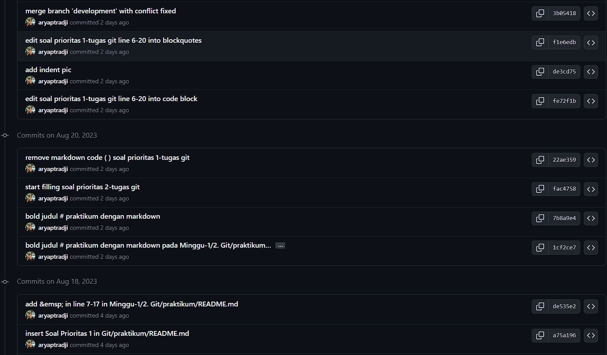

# Summary
# Basic Version Control and Branch Management (Git)

Berikut ini merupakan Git command yang berhasil saya pelajari :
### Command Dasar
`git init`&nbsp; : inisialiasi local working directory ke repository

`git clone`&nbsp; : mengunduh projek dari repository ke dalam local directory

`git config`&nbsp; : menyetting remote repository mana yang mau disambungkan ke dalam local directory

`git add`&nbsp; : memindahkan file dari directory ke staging area sehingga dapat dilakukan commit

`git commit`&nbsp; : menyimpan perubahan terbaru ke repository

`git log`&nbsp; : melihat history perubahan yang sudah dilakukan

### Command Branching and Merging
`git branch`&nbsp; : melakukan pengecekan status branch, dan membuat/menghapus branch baru

`git checkout`&nbsp; : memindahkan pointer HEAD ke branch/commit lain

`git merge`&nbsp; : menggabungkan suatu branch dengan branch lainnya

`git rebase`&nbsp; : menyusun ulang base commit agar ketika melakukan merge menjadi lebih rapih

### Command Remote Repository
`git remote`&nbsp; : menghubungkan/melepaskan local directory ke remote repository, dan juga menampilkan remote mana yang terhubung

`git fetch`&nbsp; : mengunduh perubahan terbaru commit apa saja yang sudah terjadi di remote dan juga branch baru apa saja yang sudah dibuat di remote ke dalam local directory

`git pull`&nbsp; : mengunduh perubahan terbaru source code dari commit yang sudah dibuat di remote ke dalam local directory

`git push`&nbsp; : mengunggah perubahan terbaru source code dan commit yang sudah dilakukan di local directory ke remote repository

### Command Lainnya
`git diff`&nbsp; : menampilkan perubahan source code mana yang terjadi di dalam file

`git tag`&nbsp; : memberikan tag pada commit tertentu

`git stash`&nbsp; : menyimpan perubahan sementara sebagai draft tanpa perlu melakukan commit

`git reset`&nbsp; : kembali ke suatu commit sekaligus menghapus commit-commit setelahnya

`git revert`&nbsp; : menghapus isi suatu commit yang sudah dilakukan tanpa menghapus commit tersebut dengan membuat commit baru yang berisi penghapusan commit tersebut

 

### Hasil Praktikum

Untuk melihat hasil praktikum lebih lengkapnya, dapat klik [di sini](https://github.com/aryaptradji/flutter_Muhammad-Aryaputra-Adji/tree/master/Minggu-1/2.%20Basic%20Version%20and%20Branch%20Management%20(Git)/praktikum)