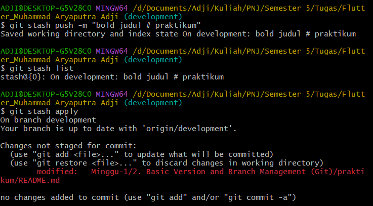
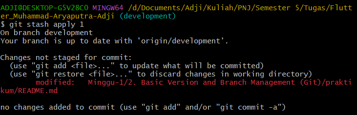

# Praktikum
# Basic Version Control and Branch Management (Git)

### **SOAL PRIORITAS 1**
- Saya telah membuat repository dengan nama `flutter_Muhammad-Aryaputra-Adji`
- Saya menggunakan format folder tugas sebagai berikut :  
  
      Minggu-1/
        1. Judul Materi 1 pada Minggu-1  
        2. Judul Materi 2 pada Minggu-1  
        dst.  
      Minggu-2/
        1. Judul Materi 1 pada Minggu-2  
        2. Judul Materi 2 pada Minggu-2  
        3. Judul Materi 3 pada Minggu-2  
        dst.  
      Minggu-3/  
      dst.   

  Kemudian, di dalamnya ada folder `praktikum` dan `screenshot`, serta file `README.md`.

  

 

### **SOAL PRIORITAS 2**

**// Menggunakan &nbsp;`git branch`**

- Saya membuat branch `master`, `development`, `featureA`, dan `featureB` melalui git bash dengan command :  

      git branch <nama branch>          

  

 

**// Menggunakan &nbsp;`git pull`**

- Saya menggunakan &nbsp;`git pull`&nbsp; untuk mengunduh pembaruan terbaru dari remote `origin/featureB` ke working directory `featureB`, begitupun dengan branch `master` dengan remote `origin/master`.
- Saya melakukan &nbsp;`git pull`&nbsp; melalui git bash dengan command :  

      git pull 

  Jika sudah melakukan upstream dengan &nbsp;`-u`&nbsp;, seperti pada gambar di bawah :

  

  atau dengan command :  

      git pull <nama remote> <nama branch>

  Jika belum melakukan upstream, seperti pada gambar di bawah :

  

 

**// Menggunakan &nbsp;`git stash`**

- Saya melakukan &nbsp;`git stash`&nbsp; di branch `development` untuk membuat draft dalam menentukan perubahan tulisan judul "# praktikum" **bold** atau *italic*.
- Saya melakukan &nbsp;`git stash`&nbsp; melalui git bash dengan command :

      git stash push -m "isi draft"

  Kemudian, untuk melihat list draft yang sudah kita buat menggunakan command :

      git stash list

  Setelah itu, tinggal pilih draft mana yang mau kita gunakan dengan command :

      git stash apply

  Untuk menerapkan draft terakhir/terbaru, atau :

      git stash apply <nomor draft>

  Untuk menerapkan draft tertentu yang diinginkan.

   

- Penerapannya seperti pada gambar di bawah :  

  

  

  

   

**// Menggunakan &nbsp;`git merge`**

- Saya menggunakan &nbsp;`git merge`&nbsp; untuk melakukan merge branch `development` dari branch `master`.
- Saya melakukan &nbsp;`git merge`&nbsp; melalui git bash dengan command :

      git merge <nama branch>

  

- Disini saya juga langsung melakukan manajemen konflik karena terdapat perubahan file yang sama dan pada baris yang sama dalam file `README.md`.
  
  

- Setelah conflict fixed, saya baru melanjutkan merge dengan melakukan commit.

   
  

**// Menggunakan &nbsp;`git push`**

- Saya menggunakan &nbsp;`git push`&nbsp; untuk mengunduh pembaruan terbaru working directory &nbsp;`master`&nbsp; ke remote &nbsp;`origin/master`&nbsp; GitHub.
- Saya melakukan &nbsp;`git push`&nbsp; melalui git bash dengan command :

      git push

  Jika sudah dilakukan upstream dengan &nbsp;`-u`&nbsp;, atau 

      git push -u <nama remote> <nama branch>

  Jika belum dilakukan upstream.

  

 

### **SOAL EKSPLORASI**

- Berikut merupakan Git Graph dan GitHub Flow dari projek &nbsp;`flutter_Muhammad Aryaputra Adji`

  

  