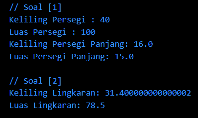
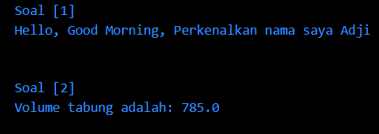

# Summary
# Fundamental Dart

### **SOAL PRIORITAS 1**

*SOAL 1*  
**// Menghitung keliling dan luas persegi**

- Saya mengawali dengan menginisialisasikan &nbsp;`int s`&nbsp; sebagai sisi persegi 

    ```dart
    // Menentukan nilai sisi persegi
    int s = 10;
    ```
    

- Kemudian, saya menentukan rumus keliling dan luas persegi dengan menggunakan Arithmetic Operator &nbsp;`*`&nbsp; sebagai perkalian 

    ```dart
    // Menghitung keliling persegi
    final keliling_persegi = 4 * s;
    // Menghitung luas persegi
    final luas_persegi = s * s;
    ```

- Setelah itu, saya menampilkan hasilnya dengan &nbsp;`print`&nbsp;

    ```dart
    // Menampilkan hasil keliling dan luas persegi
    print("Keliling Persegi : $keliling_persegi");
    print("Luas Persegi : $luas_persegi");
    ```

<br>

**// Menghitung keliling dan luas persegi panjang**

- Saya mengawali dengan menginisialisasi &nbsp;`double panjang`&nbsp; dan &nbsp;`double lebar`&nbsp;

    ```dart 
    // Menentukan nilai panjang dan lebar persegi panjang
    double panjang = 5.0;
    double lebar = 3.0;
    ```

- Dilanjutkan dengan menentukan rumus keliling dan luas persegi panjang dengan menggunakan Arithmetic Operators &nbsp;`*`&nbsp; (perkalian) dan &nbsp;`+`&nbsp; (penjumlahan)

    ```dart
    // Menghitung keliling persegi panjang
    double keliling_persegipanjang = 2 * (panjang + lebar);

    // Menghitung luas persegi panjang
    double luas_persegipanjang = panjang * lebar;
    ```

- Selanjutnya, menampilkan hasil menggunakan &nbsp;`print`&nbsp;

    ```dart
    // Menampilkan hasil keliling dan luas persegi panjang
    print('Keliling Persegi Panjang: $keliling_persegipanjang');
    print('Luas Persegi Panjang: $luas_persegipanjang');
    ```
    
<br>

*SOAL 2*  
**// Menghitung keliling dan luas lingkaran**

- Diawali dengan melakukan inisiasi jari-jari dari lingkaran dalam variabel &nbsp;`double jariJari`&nbsp;

    ```dart
    // Menentukan nilai jari-jari lingkaran
    double jariJari = 5.0;
    ```

- Lalu, menentukan rumus keliling dan luas lingkaran dengan menggunakan Arithmetic Operator yaitu perkalian &nbsp;`*`&nbsp;

    ```dart
    // Menghitung keliling lingkaran
    double keliling_lingkaran = 2 * 3.14 * jariJari;

    // Menghitung luas lingkaran
    double luas_lingkaran = 3.14 * jariJari * jariJari;
    ```

- Setelah itu, baru menampilkan hasil perhitungan tadi dengan &nbsp;`print`&nbsp;

    ```dart
    // Menampilkan hasil keliling dan luas lingkaran
    print('Keliling Lingkaran: $keliling_lingkaran');
    print('Luas Lingkaran: $luas_lingkaran');
    ```

<br>

***Hasil output yang dihasilkan :**



<br><br>

### **SOAL PRIORITAS 2**

*SOAL 1*  
// Menggabungkan 3 variabel dengan tipe data &nbsp;`String`&nbsp;

- Saya mengawali dengan melakukan inisiasi terhadap variabel &nbsp;`hello`&nbsp;, &nbsp;`greet`&nbsp;, dan &nbsp;`nama`&nbsp;

    ```dart
    // Membuat 3 variabel string
    String hello = "Hello";
    String greet = "Good Morning";
    String nama = "Adji";
    ```

- Lalu, saya menggabungkannya dengan menggunakan interpolasi &nbsp;`$`&nbsp; yang dibungkus dengan String dalam &nbsp;`hasil`&nbsp;

    ```dart
    // Menggabungkan 3 variabel
    String hasil = "$hello, $greet, Perkenalkan nama saya $nama";
    ```

- Kemudian, saya menampilkan hasil dengan &nbsp;`print`&nbsp;

    ```dart
    // Menampilkan hasil
    print(hasil);
    ```

<br>

*SOAL 2*

- Saya mengawali dengan inisiasi variabel &nbsp;`tinggi`&nbsp; dan &nbsp;`jariJari`&nbsp; dengan tipe data double

    ```dart
    // Menentukan nilai tinggi tabung
    double tinggi = 10.0;
    // Menentukan nilai jari-jari tabung
    double jariJari = 5.0;
    ```

- Menghitung rumus volume tabung dengan Arithmetic Operation berupa perkalian

    ```dart
    // Menghitung volume tabung
    double volume = 3.14 * jariJari * jariJari * tinggi;
    ```

- Terakhir, menampilkan hasil perhitungan volume tabung

    ```dart
    // Menampilkan hasil volume tabung
    print("Volume tabung adalah: $volume");
    ```

<br>

***Hasil output yang dihasilkan :**

