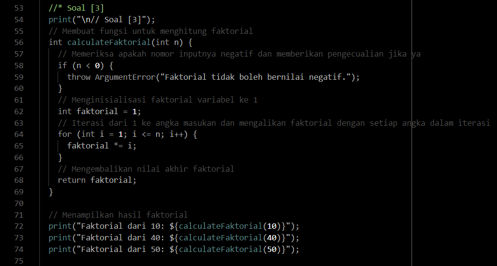
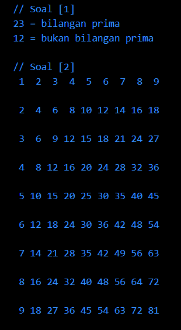

# Summary

# Branching-Looping-Function

### **Branching**
Dalam Dart, ada beberapa jenis *branching* (percabangan) yang digunakan untuk mengontrol alur eksekusi program. Dalam Dart, jenis-jenis branching meliputi &nbsp;**`if`**&nbsp;, &nbsp;**`if else`**&nbsp;, &nbsp;**`else if`**&nbsp;, &nbsp;**`switch`**&nbsp;, dan **Ternary Operator**. Berikut adalah penjelasan lengkap serta rumus penggunaannya :

1. &nbsp;**`if`**&nbsp; : Ini adalah bentuk paling dasar dari branching. Jika kondisi yang diberikan bernilai `true`, maka blok kode yang terkait akan dieksekusi. 
 
    Rumus :
    ```dart
    if (kondisi) {
        // blok kode yang dieksekusi jika kondisi true
    }
    ```

2. &nbsp;**`if-else`**&nbsp; : Ini digunakan untuk mengeksekusi satu blok kode jika kondisi bernilai `true`, dan mengeksekusi blok lain jika kondisi bernilai `false`. 
   
   Rumus :
    ```dart
    if (kondisi) {
        // blok kode yang dieksekusi jika kondisi true
    } else {
        // blok kode yang dieksekusi jika kondisi false
    }
    ```

3. &nbsp;**`else-if`**&nbsp; : Ini digunakan untuk mengecek beberapa kondisi secara berurutan dan menjalankan kode terkait yang sesuai dengan kondisi yang pertama kali memenuhi syarat.

    Rumus : 
    ```dart
    if (kondisi1) {
      // blok kode yang dieksekusi jika kondisi1 true
    } else if (kondisi2) {
        // blok kode yang dieksekusi jika kondisi2 true
      } else {
          // blok kode yang dieksekusi jika tidak ada kondisi yang terpenuhi
        }
    ```

4. &nbsp;**`switch`**&nbsp; : Ini digunakan untuk membandingkan nilai ekspresi dengan beberapa nilai yang berbeda dan menjalankan kode terkait yang sesuai.

    Rumus : 
    ```dart
    switch (ekspresi) {
        case nilai1:
            // blok kode jika ekspresi sama dengan nilai1
            break;
        case nilai2:
            // blok kode jika ekspresi sama dengan nilai2
            break;
        default:
            // blok kode jika tidak ada nilai yang cocok
    }
    ```

5. **Ternary Operator** : Ini adalah bentuk singkat dari if else yang digunakan untuk mengevaluasi kondisi dalam satu baris.

    Rumus :
    ```dart
    kondisi ? ekspresi1 : ekspresi2
    ```

<br>

### **Looping**
Di bagian lain, terdapat beberapa jenis *looping* (perulangan) yang digunakan untuk mengulang eksekusi blok kode. Jenis-jenis *looping* di Dart meliputi &nbsp;**`for`**&nbsp;, &nbsp;**`while`**&nbsp;, dan &nbsp;**`do while`**&nbsp;. Berikut adalah penjelasan lengkap serta rumus penerapannya :

1. &nbsp;**`for`**&nbsp; : Jenis perulangan yang digunakan untuk menjalankan blok kode sejumlah iterasi yang telah ditentukan.

    Rumus : 
    ```dart
    for (inisialisasi; kondisi; iterasi) {
        // blok kode yang diulang
    }
    ```

2. &nbsp;**`while`**&nbsp; : Ini digunakan untuk menjalankan blok kode selama kondisi yang diberikan bernilai `true`. Kondisi diperiksa sebelum eksekusi blok kode.

    Rumus : 
    ```dart
    while (kondisi) {
        // blok kode yang diulang selama kondisi true
    }
    ```

3. &nbsp;**`do while`**&nbsp; : Ini mirip dengan &nbsp;`while loop`&nbsp;, tetapi perbedaannya adalah blok kode dijalankan minimal sekali bahkan jika kondisi awalnya salah. Setelah eksekusi blok kode, kondisi diperiksa.

    Rumus :
    ```dart
    do {
        // blok kode yang diulang
    } while (kondisi);
    ```

<br>

### **Function**
Dalam Dart, *function* (fungsi) adalah blok kode yang dapat dipanggil dengan nama tertentu. *Function* memungkinkan Anda untuk mengelompokkan kode yang dapat digunakan ulang dan membagi program menjadi bagian-bagian yang lebih kecil dan lebih teratur. Berikut merupakan jenis-jenis *function* dalam Dart serta rumus penerapannya :

1. **Function tanpa Nilai Kembali (*Void Function*)**  
   Jenis ini digunakan ketika function tidak mengembalikan nilai apapun. Fungsinya hanya untuk menjalankan tugas tertentu.  

   Rumus :
   ```dart
   void namaFungsi(parameter1, parameter2, ...) {
       // Blok kode fungsinya
   }
   ```

2. **Function dengan Nilai Kembali (*Non-Void Function*)**  
   Jenis ini digunakan ketika function mengembalikan nilai yang sesuai dengan tipe data yang telah didefinisikan.

   Rumus :
   ```dart
   tipeData namaFungsi(parameter1, parameter2, ...) {
       // Blok kode fungsinya
       return nilai;
   }
   ```

3. **Function sebagai Parameter (*Higher-Order Function*)**  
   Jenis ini memungkinkan Anda untuk mengirimkan function sebagai parameter ke function lainnya.

   Rumus : 
   ```dart
   void higherOrderFunction(Function fungsiParameter) {
       // Panggil fungsiParameter di dalamnya
   }
   ```

4. **Anonymous Function (*Lambda Function*)**  
   Fungsi anonim adalah fungsi yang tidak memiliki nama dan dapat dideklarasikan langsung tanpa harus diberi nama.

   Rumus :
   ```dart
   (parameter1, parameter2, ...) {
       // Blok kode fungsinya
       return nilai;
   }
   ```

5. **Arrow Function**  
   Ini adalah bentuk pendek dari anonymous function, digunakan untuk fungsi sederhana yang hanya memiliki satu ekspresi.

   Rumus : 
   ```dart
   tipeData namaFungsi(parameter1, parameter2, ...) => ekspresi;
   ```

<br><br>

# Hasil Praktikum

### **SOAL PRIORITAS 1**
**// Source Code**


**// Output**


<br>

### **SOAL PRIORITAS 2**
**// Source Code**




**// Output**


<br><br>

### **SOAL EKSPLORASI**
**// Source Code**


**// Output**



<br>

Untuk melihat hasil praktikum lebih lengkapnya, dapat klik [di sini](https://github.com/aryaptradji/flutter_Muhammad-Aryaputra-Adji/tree/master/Minggu-2/1.%20Branching-Looping-Function/praktikum)