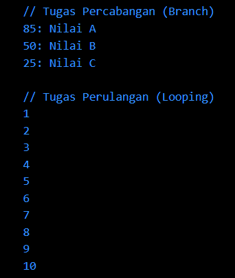
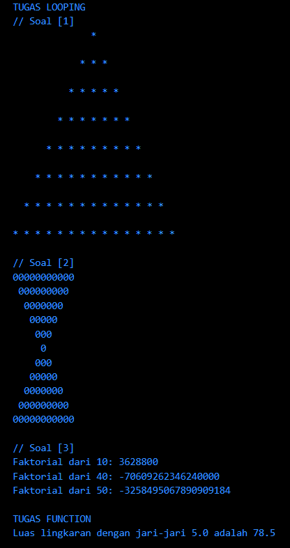
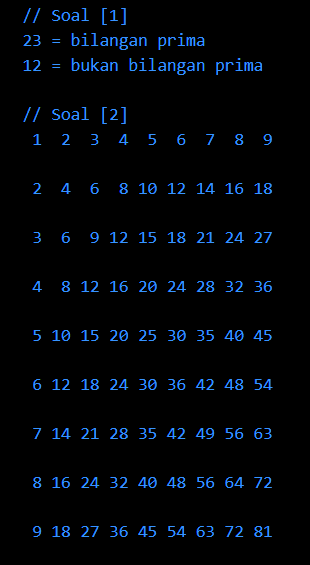

# Documentation 

# Branching-Looping-Function

### **SOAL PRIORITAS 1**

**// Tugas Percabangan (Branching)**
- Saya menginisiasi variabel untuk menentukan nilai yang akan dicek

  ```dart
  // Menentukan nilai yang akan dicek
  int nilai1 = 85;
  int nilai2 = 50;
  int nilai3 = 25
  ```

- Kemudian, membuat function &nbsp;`String checkNilai(int nilai)`&nbsp; yang berisikan pengkondisian &nbsp;`if else`&nbsp;. Apabila nilai lebih besar dari 70 maka akan mengembalikan &nbsp;`"Nilai A"`&nbsp;, apabila nilai lebih besar dari 40 dan lebih kecil sama dengan dari 70 maka akan mengembalikan nilai &nbsp;`"Nilai B"`&nbsp;, serta apabila nilai lebih besar dari 0 dan lebih kecil sama dengan dari 40 maka akan mengembalikan nilai &nbsp;`"Nilai C"`&nbsp;, dan apabila itu semua tidak benar fungsi akan mengembalikan &nbsp;`""`&nbsp; atau String kosong

  ```dart
  // Membuat function dengan pengkondisian if untuk kategori nilai tertentu
  String checkNilai(int nilai) {
    if (nilai > 70) {
      return "Nilai A";
    } else if (nilai > 40 && nilai <= 70) {
      return "Nilai B";
    } else if (nilai > 0 && nilai <= 40) {
      return "Nilai C";
    } else {
      return "";
    }
  }
  ```

- Terakhir, menampilkan hasil dengan menggunakan command &nbsp;`print`&nbsp;

  ```dart
  print("$nilai1: ${checkNilai(nilai1)}");
  print("$nilai2: ${checkNilai(nilai2)}");
  print("$nilai3: ${checkNilai(nilai3)}");
  ```

<br>

**// Tugas Perulangan (Looping)**
- Diawali dengan langsung menginisiasi variabel ke dalam loop &nbsp;`for`&nbsp; yang berisikan variabel &nbsp;`i`&nbsp; sebagai iterasi bernilai 1. Kemudian, dikondisikan selama &nbsp;`i`&nbsp; bernilai lebih kecil sama dengan dari 10 maka akan terus melakukan looping, dan juga mencetak nilai dari &nbsp;`i`&nbsp; dengan &nbsp;`print`&nbsp;

  ```dart
  for (var i = 1; i <= 10; i++) {
    print(i);
  }
  ```

<br>

***Hasil output yang dihasilkan :**



<br><br>

### **SOAL PRIORITAS 2**
*TUGAS LOOPING*  
**// Soal 1 : Membuat piramida bintang**
- Saya mengawalinya dengan menginisiasi jumlah baris dalam sebuah variabel

  ```dart
  // Menentukan jumlah baris piramida bintang
  int rows = 8;
  ```

- Kemudian, saya membuat sebuah nested loop &nbsp;`for`&nbsp; untuk membuat baris-baris dari piramida yang di dalamnya berisikan loop &nbsp;`for`&nbsp; lagi untuk membuat spasi, bintang, dan baris baru

  ```dart
  // Membuat looping baris
  for (int i = 1; i <= rows; i++) {
    // Membuat spasi
    for (int j = 1; j <= rows - i; j++) {
      stdout.write("  ");
    }
    // Membuat bintang
    for (int k = 1; k <= 2 * i - 1; k++) {
      stdout.write("* ");
    }
    // Membuat baris baru
    print("\n");
  }
  ```

<br>

**// Soal 2 : Membuat jam pasir**
- Saya mengawali dengan langsung membuat sebuah fungsi &nbsp;`void jamPasir(int size)`&nbsp;. Di dalamnya, berisikan beberapa loop lagi untuk membuat looping baris, spasi, nol, dan juga baris baru sehingga membentuk nested loop &nbsp;`for`&nbsp; 

  ```dart
  void jamPasir(int size) {
    // Menentukan ukuran jam pasir dan jumlah baris
    int numRows = 2 * size - 1;

    // Membuat looping baris
    for (int i = 0; i < numRows; i++) {
      int numSpaces = i < size ? i : numRows - i - 1;
      int numStars = numRows - 2 * numSpaces;

      // Membuat spasi
      for (int j = 0; j < numSpaces; j++) {
        stdout.write(" ");
      }

      // Membuat nol
      for (int j = 0; j < numStars; j++) {
        stdout.write("0");
      }

      stdout.writeln();
    }
  }
  ```

- Setelah itu, tinggal menampilkan hasil jam pasir dengan menginisiasi parameter &nbsp;`int size`&nbsp; dari fungsi tadi

  ```dart
  // Menampilkan hasil jam pasir
  int size = 6;
  jamPasir(size);
  ```

<br>

**// Soal 3 : Menghitung faktorial dari suatu bilangan**
- Saya mengawali dengan membuat sebuah fungsi dengan parameter &nbsp;`int calculateFaktorial(int n)`&nbsp; untuk menghitung faktorial dari bilangan yang akan dicek nanti

  ```dart
  // Membuat fungsi untuk menghitung faktorial
  int calculateFaktorial(int n) {
    // Memeriksa apakah nomor inputnya negatif dan memberikan pengecualian jika ya
    if (n < 0) {
      throw ArgumentError("Faktorial tidak boleh bernilai negatif.");
    }
    // Menginisialisasi faktorial variabel ke 1
    int faktorial = 1;
    // Iterasi dari 1 ke angka masukan dan mengalikan faktorial dengan setiap angka dalam iterasi
    for (int i = 1; i <= n; i++) {
      faktorial *= i;
    }
    // Mengembalikan nilai akhir faktorial
    return faktorial;
  }
  ```

- Setelah itu, saya menampilkan hasilnya dengan menggunakan &nbsp;`print`&nbsp; yang di dalamnya berisi fungsi &nbsp;`int calculateFaktorial(int n)`&nbsp; yang parameternya sudah diinisiasi dengan nilai 

  ```dart
  // Menampilkan hasil faktorial
  print("Faktorial dari 10: ${calculateFaktorial(10)}");
  print("Faktorial dari 40: ${calculateFaktorial(40)}");
  print("Faktorial dari 50: ${calculateFaktorial(50)}");
  ```

<br><br>

*TUGAS FUNCTION*  
**// Membuat fungsi untuk menghitung luas lingkaran**
- Saya mengawali dengan mendeklarasi sebuah variabel &nbsp;`double radius`&nbsp;

  ```dart
  // Deklarasi radius
  double radius;
  ```

- Kemudian, dilanjutkan dengan membuat sebuah fungsi luas lingkaran

  ```dart
  // Membuat fungsi luas lingkaran
  double calculateCircleArea(double radius) {
    return 3.14 * radius * radius;
  }
  ```

- Lalu, melakukan inisiasi fungsi luas lingkaran dengan mengisi nilai pada parameternya dengan variabel yang sudah dideklarasikan di awal tadi

  ```dart
  // Inisiasi fungsi luas lingkaran
  radius = 5;
  double area = calculateCircleArea(radius);
  ```

- Terakhir, menampilkan hasil dengan &nbsp;`print`&nbsp;

  ```dart
  // Menampilkan hasil fungsi luas lingkaran
  print("Luas lingkaran dengan jari-jari $radius adalah $area");
  ```

<br>

***Hasil output yang dihasilkan :**



<br><br>

*SOAL EKSPLORASI*  
**// Soal 1 : Membuat fungsi untuk mengecek bilangan prima atau bukan bilangan prima**
- Saya mengawali dengan membuat suatu fungsi boolean dengan sebuah parameter untuk mengecek bilangan prima atau bukan bilangan prima

  ```dart
  // Membuat fungsi untuk mengecek bilangan prima atau bukan
  bool isPrime(int bilangan) {
    // Mengecek bilangan prima yang tidak boleh kurang dari 2
    if (bilangan < 2) {
      return false;
    }

    // Mengecek apakah bilangan tersebut habis dibagi bilangan apapun dari 2 hingga akar kuadrat(bilangan)
    for (int i = 2; i <= sqrt(bilangan); i++) {
      if (bilangan % i == 0) {
        return false;
      }
    }
    return true;
  }
  ```

- Setelah itu, melakukan inisiasi bilangan yang akan dicek yang disimpan dalam variabel &nbsp;`int bilangan1`&nbsp; dan &nbsp;`int bilangan2`&nbsp;

  ```dart
  // Menginisiasi nilai bilangan yang akan dicek
  int bilangan1 = 23;
  int bilangan2 = 12;
  ```

- Lalu, tinggal menampilkan hasil dengan menggunakan &nbsp;`if else`&nbsp; yang di dalamnya terdapat inisiasi fungsi &nbsp;`bool isPrime(int bilangan)`&nbsp; untuk menampilkan bilangan prima atau bukan bilangan prima berdasarkan pengembalian nilai &nbsp;`true/false`&nbsp; dari fungsi tadi

  ```dart
  // Menampilkan hasil pengecekan bilangan prima
  if (isPrime(bilangan1)) {
    print('$bilangan1 = bilangan prima');
  } else {
    print('$bilangan1 = bukan bilangan prima');
  }
  if (isPrime(bilangan2)) {
    print('$bilangan2 = bilangan prima');
  } else {
    print('$bilangan2 = bukan bilangan prima');
  }
  ```

<br>

**// Soal 2 : Membuat tabel perkalian**
- Saya mengawali dengan menentukan nilai maksimal dari hasil perkalian

  ```dart
  // Menentukan nilai maksimal dari perkalian
  int input = 9;
  int maxValue = input * input;
  ```

- Dilanjutkan dengan menghitung panjang digit terpanjang untuk penyusunan tabel yang disimpan dalam variabel &nbsp;`int maxDigitCount`&nbsp; 

  ```dart
  // Menghitung panjang digit terpanjang untuk penataan tabel
  int maxDigitCount = maxValue.toString().length;
  ```

- Diakhiri dengan membuat tabel perkalian dengan menggunakan nested loop &nbsp;`for`&nbsp;

  ```dart
  // Membuat tabel perkalian
  for (int i = 1; i <= input; i++) {
    for (int j = 1; j <= input; j++) {
      int product = i * j;
      String formattedProduct = product.toString().padLeft(maxDigitCount);

      stdout.write(formattedProduct + " ");
    }
    print("\n");
  }
  ```
  
<br>

***Hasil output yang dihasilkan :**

