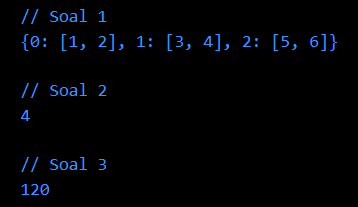

# Summary 

# Advance Function-Async-Await-Collection

Dalam bahasa Dart, terdapat fitur `advance function-async-await-collection` yang memungkinkan kita untuk melakukan pemrograman asynchronous dengan lebih mudah dan efisien. Berikut adalah penjelasan mengenai masing-masing fitur tersebut.

### **Async-Await**
`Async-Await` adalah Fitur yang digunakan untuk mengelola operasi asinkron (misalnya, pembacaan file atau panggilan jaringan) tanpa harus menghentikan eksekusi program. Ini memungkinkan program Anda untuk tetap responsif dan tidak menghambat antarmuka pengguna.
1. &nbsp;`Async`&nbsp;: Untuk menandai bahwa sebuah fungsi adalah asynchronous. Fungsi yang ditandai dengan async dapat mengandung keyword await.
2. &nbsp;`Await`&nbsp;: Untuk menunggu hasil dari eksekusi fungsi asynchronous lainnya. Ketika await digunakan, eksekusi program akan menunggu sampai fungsi asynchronous tersebut selesai dijalankan.  

Berikut contoh penggunaan `async-await` :  
```dart
Future<void> fetchData() async {
  // Simulasi operasi jaringan yang lambat
  await Future.delayed(Duration(seconds: 2));
  print("Data telah diambil");
}

void main() async {
  print("Memulai pengambilan data");
  await fetchData();
  print("Proses selesai");
}

```
Dalam contoh ini, &nbsp;`await`&nbsp; digunakan untuk menunggu hingga operasi fetchData() selesai sebelum melanjutkan.

<br>

### **Collection**
Collection adalah kumpulan objek yang dapat diakses dan dimanipulasi. Terdapat beberapa jenis collection yang dapat digunakan, antara lain &nbsp;`List`&nbsp;, &nbsp;`Set`&nbsp;, dan &nbsp;`Map`&nbsp;.
1. &nbsp;`List`&nbsp;: Kumpulan objek yang diurutkan berdasarkan indeks. Contoh :  
   ```dart
   List<int> numbers = [1, 2, 3, 4, 5];
   numbers.add(6);
   int firstNumber = numbers[0];
   ```
2. &nbsp;`Set`&nbsp;: Kumpulan objek yang tidak memiliki urutan dan tidak mengizinkan duplikasi. Contoh :  
   ```dart
   Set<String> uniqueNames = {"Alice", "Bob", "Alice"};
   // Set hanya akan menyimpan satu "Alice"
   ```
3. &nbsp;`Map`&nbsp;: Kumpulan objek yang terdiri dari pasangan key-value. Contoh :  
   ```dart
   Map<String, int> ages = {"Alice": 30, "Bob": 25, "Carol": 35};
   int aliceAge = ages["Alice"]; // Mengakses nilai dengan kunci "Alice"
   ```

<br><br>

# Hasil Praktikum

### **SOAL PRIORITAS 1**
**// Source Code**


**// Output**


<br>

### **SOAL PRIORITAS 2**

**// Source Code**


**// Output1**



<br>

### **SOAL EKSPLORASI**

**// Source Code**


**// Output**


<br>

Untuk melihat hasil praktikum lebih lengkapnya, dapat klik [di sini](https://github.com/aryaptradji/flutter_Muhammad-Aryaputra-Adji/tree/master/Minggu-2/2.%20Advance%20Function-Async-Await-Collection/praktikum)