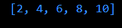
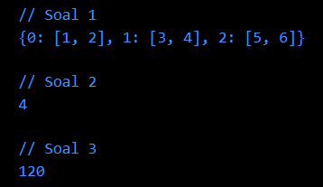
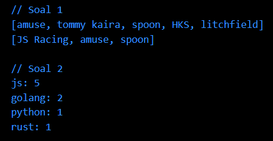

# Documentation

# Advance Function-Async-Await-Collection

### **SOAL PRIORITAS 1**

**// Membuat fungsi dengan spesifikasi**  
- Saya membuat fungsi dengan spesifikasi sebagai berikut :  
  a. &ensp;Menerima 2 parameter, yaitu list data dan pengali  
  b. &ensp;Lakukan perulangan pada list secara asynchronous  
  c. &ensp;Tiap perulangan, kalkan elemen list data dengan pengali  
  d. &ensp;Return list baru yang berisi hasil proses di atas

- Source code dan penjelasannya :  
  ```dart
  Future<List<int>> multiplyListAsync(List<int> data, int multiplier) async {
    List<int> multipliedList = [];

    for (int i = 0; i < data.length; i++) {
        int multipliedValue = await multiplyAsync(data[i], multiplier);
        multipliedList.add(multipliedValue);
    }

    return multipliedList;
  }

  Future<int> multiplyAsync(int value, int multiplier) {
    return Future.delayed(Duration(seconds: 1), () => value * multiplier);
  }

  // Contoh penggunaan fungsi
  void main() {
    List<int> dataList = [1, 2, 3, 4, 5];
    int multiplier = 2;

    multiplyListAsync(dataList, multiplier).then((result) {
        print(result); // Output: [2, 4, 6, 8, 10]
    }).catchError((error) {
        print(error);
    });
  }
  ```
  Pada source code di atas, fungsi `multiplyListAsync` menerima dua parameter yaitu `data` (list data) dan `multiplier` (pengali). Fungsi ini menggunakan keyword `async` untuk menandai bahwa fungsi ini adalah asynchronous. Fungsi ini melakukan perulangan menggunakan `for` loop. Pada setiap iterasi, fungsi `multiplyAsync` dipanggil untuk mengalikan elemen list dengan pengali. Fungsi `multiplyAsync` mengembalikan `Future` yang akan menunggu selama 1 detik sebelum mengembalikan hasil perkalian.

  Setelah semua perulangan selesai, fungsi `multiplyListAsync` mengembalikan list baru yang berisi hasil perkalian. Contoh penggunaan fungsi ini diberikan di bagian `main()` di mana saya memanggil `multiplyListAsync` dan menangani hasilnya menggunakan `then` dan `catchError`.

<br>

***Hasil output yang dihasilkan :**



<br><br>

### **SOAL PRIORITAS 2**

**// Soal 1 : Membuat list dengan spesifikasi**
- Saya membuat list dengan spesifikasi yang telah ditentukan, di antaranya :  
  a. &ensp;Tiap elemen berupa list juga  
  b. &ensp;Tiap elemen wajib terdapat 2 data (sub-elemen)  
  c. &ensp;Buatlah sebuah map dengan menggunakan list tersebut

- Source code dan penjelasannya :  
  ```dart
  List<int> nilai = [7, 5, 3, 5, 2, 1];

  double total = 0;
  for (int i = 0; i < nilai.length; i++) {
    total += nilai[i];
  }

  double rataRata = total / nilai.length;
  int rataRataBulat = rataRata.ceil();

  print(rataRataBulat);
  ```
  Pada contoh di atas, kita membuat sebuah list `dataList` yang berisi list-list dengan 2 elemen. Kemudian, kita membuat sebuah map `dataMap` yang akan menyimpan data dari list tersebut. Setiap elemen list dalam `dataList` akan ditambahkan ke `dataMap` dengan menggunakan index sebagai kunci.

  Hasil dari `dataMap` akan dicetak menggunakan `print` untuk melihat hasilnya. Outputnya akan menjadi :

  ```
  {0: [1, 2], 1: [3, 4], 2: [5, 6]}
  ```

  Dalam map tersebut, index dari list menjadi kunci dan list itu sendiri menjadi nilai dalam map.

<br>

**// Soal 2 : Menghitung rata-rata dan melakukan pembulatan dari hasil rata-rata**
- Saya membuat program dengan :  
  **Sampel Input : `[7,5,3,5,2,1]`**  
  **Sampel Output : `4`**

- Source code dan penjelasannya :  
  ```dart
  List<int> nilai = [7, 5, 3, 5, 2, 1];

  double total = 0;
  for (int i = 0; i < nilai.length; i++) {
    total += nilai[i];
  }

  double rataRata = total / nilai.length;
  int rataRataBulat = rataRata.ceil();

  print(rataRataBulat);
  ```
  Pada contoh di atas, kita memiliki list `nilai` yang berisi sekumpulan nilai. Kita menggunakan variabel `total` untuk menyimpan jumlah total dari semua nilai dalam list tersebut. Kemudian, kita menggunakan `for` loop untuk menjumlahkan semua nilai dalam list.

  Setelah itu, kita menghitung rata-rata dengan membagi total dengan jumlah nilai dalam list. Kemudian, kita menggunakan metode `ceil()` dari library `dart:math` untuk melakukan pembulatan ke atas dari nilai rata-rata.

  Hasil dari `rataRataBulat` akan dicetak menggunakan `print` untuk melihat hasilnya. Outputnya akan menjadi:

  ```
  4
  ```

  Dalam contoh ini, rata-rata dari nilai-nilai yang diberikan adalah 4 setelah dilakukan pembulatan ke atas.

<br>

**// Soal 3 : Menghitung bilangan faktorial secara asinkron**
- Saya membuat program dengan :  
  **Sampel Input : `5`**  
  **Sampel Output : `120`**

- Source code dan penjelasannya :  
  ```dart
  import 'dart:async';

  Future<int> factorialAsync(int n) async {
    if (n == 0) {
        return 1;
    } else {
        return n * await factorialAsync(n - 1);
    }
  }

  void main() {
    int input = 5;

    factorialAsync(input).then((result) {
        print(result);
    }).catchError((error) {
        print('Error: $error');
    });
  }
  ```
  Pada contoh di atas, kita mendefinisikan sebuah fungsi `factorialAsync` yang menerima parameter `n` sebagai bilangan yang akan dihitung faktorialnya. Fungsi ini menggunakan `async` dan `await` untuk melakukan perhitungan faktorial secara rekursif.

  Dalam fungsi `main()`, kita mendefinisikan input yang ingin kita hitung faktorialnya, yaitu `5`. Kemudian, kita memanggil fungsi `factorialAsync` dengan input tersebut. Kita menggunakan `then` untuk menangani hasil yang dikembalikan oleh fungsi `factorialAsync` dan mencetaknya menggunakan `print`. Jika terjadi error, kita menggunakan `catchError` untuk menangani error tersebut dan mencetak pesan error.

  Hasil dari program ini akan mencetak `120`, yaitu hasil faktorial dari `5`.

  Perlu diingat bahwa dalam contoh ini, perhitungan faktorial dilakukan secara asinkron dengan menggunakan `Future` dan `async/await`. Hal ini memungkinkan kita untuk melakukan operasi yang membutuhkan waktu lama tanpa menghentikan eksekusi program secara keseluruhan.

<br>

***Hasil output yang dihasilkan :**



<br><br>

### **SOAL EKSPLORASI**

**// Soal 1 : Menghilangkan nilai atau data yang sama pada sebuah data**
- Saya membuat program dengan :  
  **Sampel Input : `[amuse, tommy kaira, spoon, HKS, litchfield, amuse, HKS]`**  
  **Sampel Output : `[amuse, tommy kaira, spoon, HKS, litchfield]`**

  **Sampel Input : `[JS Racing, amuse, spoon, spoon, JS Racing, amuse]`**
  **Sampel Output : `[JS Racing, amuse, spoon]`**

- Source code dan penjelasannya :  
  ```dart
  List<String> removeDuplicates(List<String> data) {
    List<String> uniqueData = [];
    for (String item in data) {
      if (!uniqueData.contains(item)) {
        uniqueData.add(item);
      }
    }
    return uniqueData;
  }

  void main() {
    List<String> data1 = ['amuse', 'tommy kaira', 'spoon', 'HKS', 'litchfield', 'amuse', 'HKS'];
    List<String> data2 = ['JS Racing', 'amuse', 'spoon', 'spoon', 'JS Racing', 'amuse'];

    List<String> uniqueData1 = removeDuplicates(data1);
    List<String> uniqueData2 = removeDuplicates(data2);

    print(uniqueData1);
    print(uniqueData2);
  }
  ```
  Pada contoh di atas, kita memiliki dua list, yaitu `data1` dan `data2`. Kita menggunakan fungsi `removeDuplicates` untuk menghilangkan nilai yang sama dari setiap list. Fungsi tersebut menggunakan perulangan `for` untuk memeriksa setiap item pada list. Jika item belum ada dalam list `uniqueData`, maka item tersebut ditambahkan ke dalam list `uniqueData`. Akhirnya, kita mencetak list `uniqueData` untuk melihat hasilnya.

<br>

**// Soal 2 : Menghitung frekuensi pada setiap data di dalam sebuah list**
- Saya membuat program dengan :  
  **Sampel Input : `[js,js,js,golang,python,js,js,golang,rust]`**  
  **Sample Output : `js: 5, golang: 2, python: 1, rust: 1`**

- Source code dan penjelasannya :  
  ```dart
  Map<String, int> countFrequency(List<String> data) {
    Map<String, int> frequency = {};
    for (String item in data) {
      frequency[item] = (frequency[item] ?? 0) + 1;
    }
    return frequency;
  }

  void main() {
    List<String> data = ['js', 'js', 'js', 'golang', 'python', 'js', 'js', 'golang', 'rust'];

    Map<String, int> frequency = countFrequency(data);

    frequency.forEach((key, value) {
      print('$key: $value');
    });
  }
  ```
  Pada contoh di atas, kita menggunakan package `collection` dan mengimpornya menggunakan `import 'package:collection/collection.dart';`. Kemudian, kita menggunakan fungsi `countFrequency` untuk menghitung frekuensi kemunculan setiap data dalam list. Fungsi tersebut menggunakan perulangan `for` untuk memeriksa setiap item dalam list. Kita menggunakan operator `??` untuk menginisialisasi nilai frekuensi dengan 0 jika item belum ada dalam map `frequency`. Selanjutnya, kita mencetak map `frequency` untuk melihat hasilnya.

  <br>

  ***Hasil output yang dihasilkan :**

  