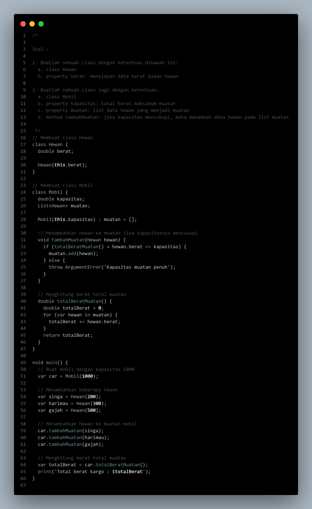
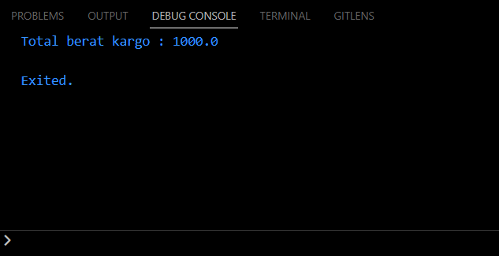
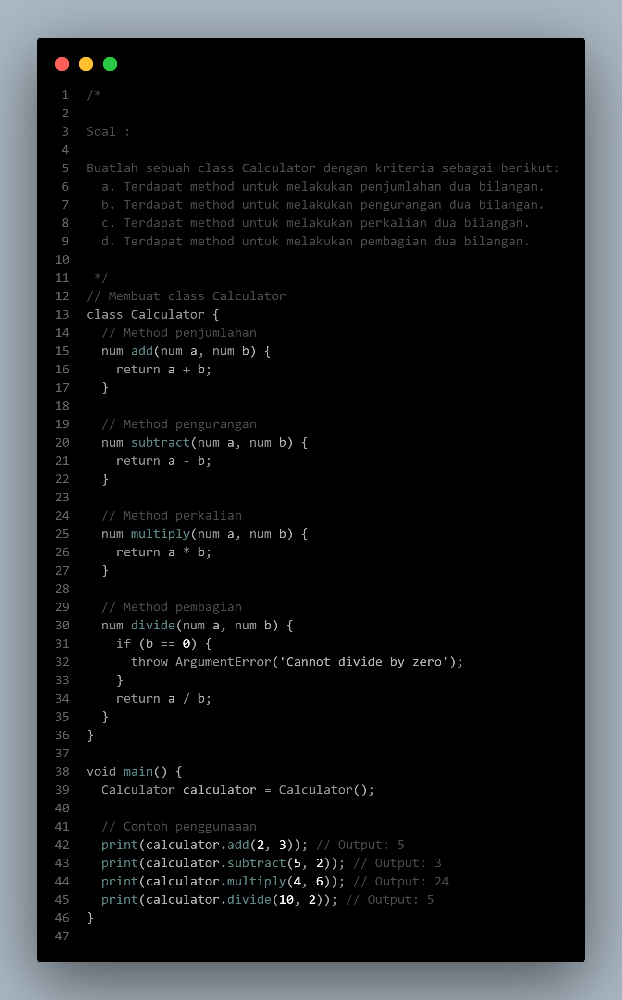
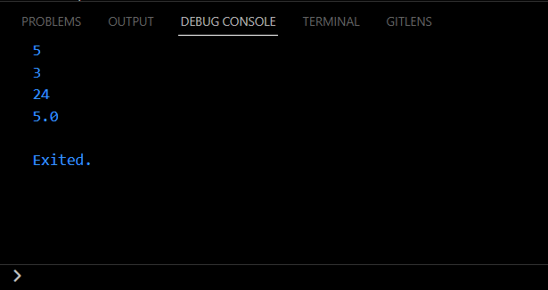
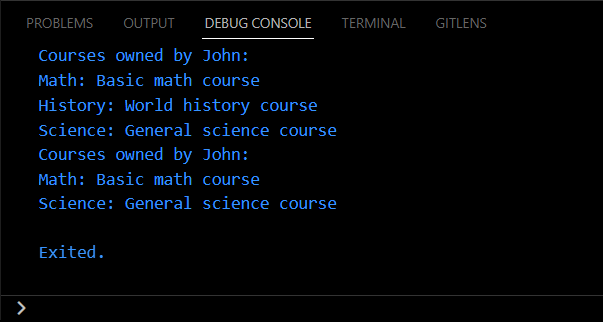
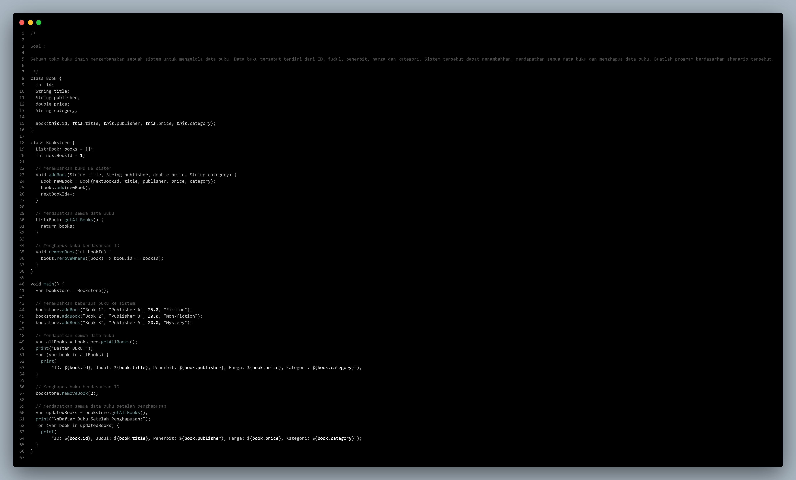
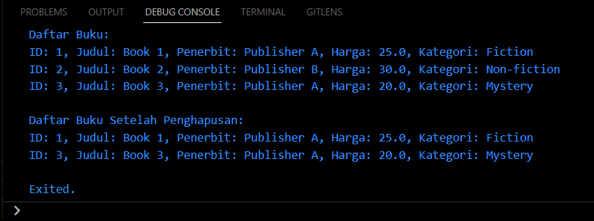

# Summary

# Dart Object Oriented Programming

Pemrograman Berorientasi Objek (OOP) di dalam bahasa pemrograman Dart adalah paradigma pemrograman yang mengorganisasi kode menjadi objek-objek yang dapat berinteraksi satu sama lain. Dart mendukung OOP secara penuh dan memiliki fitur-fitur yang memungkinkan kita untuk memodelkan dunia nyata dan mengorganisasi kode dengan lebih baik. Berikut adalah beberapa poin utama OOP di Dart :

### **1. &nbsp;Kelas dan Objek (*Class and Object*)**
Dalam Dart, kelas adalah blueprint atau template yang mendefinisikan struktur dan perilaku objek. Objek adalah instance konkret dari sebuah kelas.

**Rumus :**  
```dart
class NamaKelas {
  // Properti (atribut)
  TipeData namaProperti;

  // Konstruktor
  NamaKelas(this.namaProperti);

  // Metode
  TipeData namaMetode() {
    // Implementasi metode
  }
}
```

**Contoh :**
```dart
class Mobil {
  // Property atau atribut
  String merk;
  int tahunProduksi;

  // Constructor
  Mobil(this.merk, this.tahunProduksi);

  // Method
  void start() {
    print('Mobil ${merk} mulai berjalan.');
  }
}
```
Kelas `Mobil` memiliki dua properti: `merk` (tipe String) dan `tahunProduksi` (tipe int). Kelas ini juga memiliki constructor yang digunakan untuk menginisialisasi objek `Mobil`. Terdapat satu method yaitu `start`, yang mencetak pesan saat mobil dinyalakan.

<br>

### **2. &nbsp;Atribut (*Property*)**
Property adalah variabel yang terkait dengan objek kelas. Untuk mengakses atau mengubah nilai property, dapat dilakukan dengan menggunakan operator titik &nbsp;`.`&nbsp;. Contoh penggunaan property pada objek &nbsp;`Mobil`&nbsp; :

**Contoh :**
```dart
Mobil mobilBaru = Mobil('Toyota', 2023);
print('Merk mobil: ${mobilBaru.merk}');
print('Tahun produksi: ${mobilBaru.tahunProduksi}');
```
Di sini, saya membuat objek `mobilBaru` dari kelas `Mobil` dan mengakses properti `merk` dan `tahunProduksi` menggunakan operator titik.

<br>

### **3. &nbsp;Metode (*Method*)**
Method adalah fungsi yang terkait dengan objek kelas dan dapat digunakan untuk melakukan tindakan tertentu pada objek tersebut. Method juga menggunakan operator titik untuk memanggil method. Contoh penggunaan method pada objek &nbsp;`Mobil`&nbsp; :

**Contoh :**
```dart
mobilBaru.start();
```
Memanggil method `start()` pada objek `mobilBaru` akan mencetak pesan "Mobil Toyota mulai berjalan."

<br><br>

# Hasil Praktikum

### **SOAL PRIORITAS 1**

**// Source Code**



**// Output**



<br>

### **SOAL PRIORITAS 2**
**// Source Code**  

*Nomor 1*


*Nomor 2*



**// Output**

*Nomor 1*



*Nomor 2*



<br>

### **SOAL EKSPLORASI**

**// Source Code**



**// Output**



<br>

Untuk melihat hasil praktikum lebih lengkapnya, dapat klik [di sini](https://github.com/aryaptradji/flutter_Muhammad-Aryaputra-Adji/tree/master/Minggu-3/1.%20Dart%20Object%20Oriented%20Programming/praktikum)