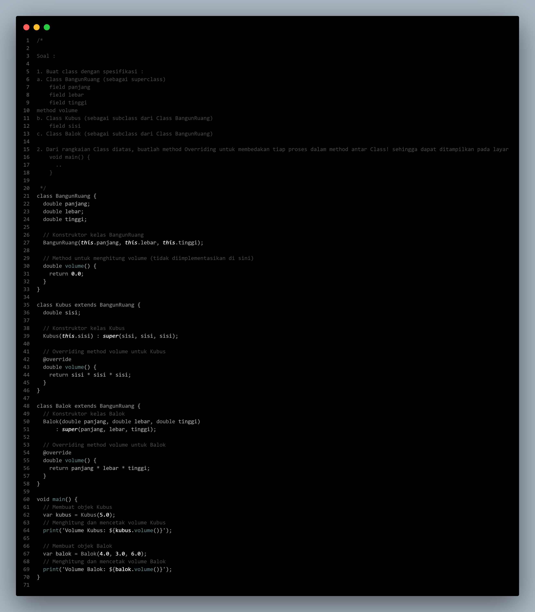
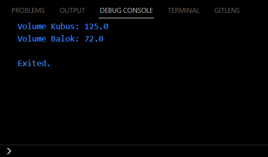
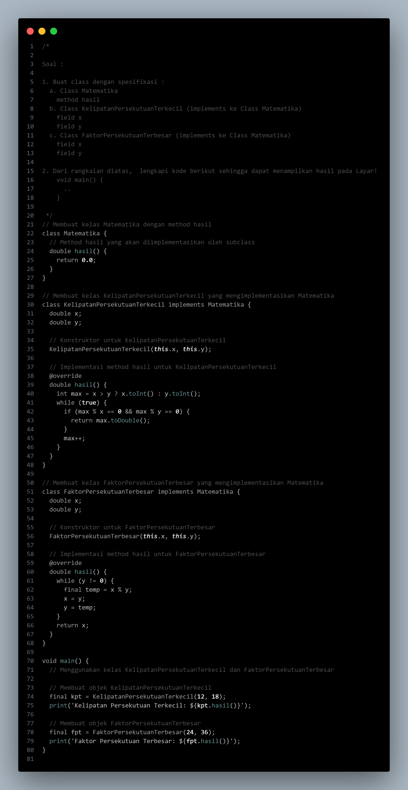
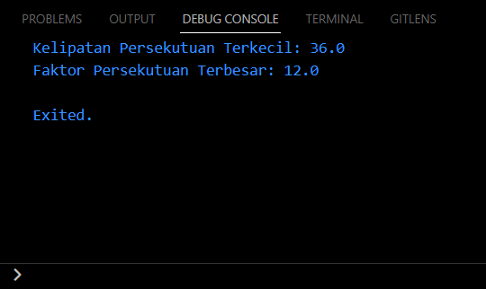
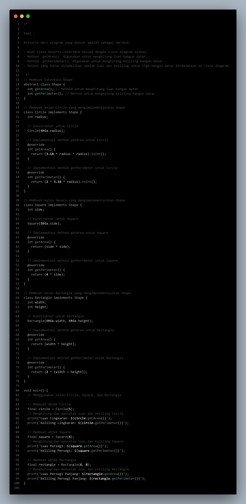
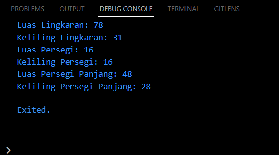

# Summary

# Deep Dive into Dart Object Oriented Programming

Melanjutkan materi sebelumnya, pada materi ini dibahas juga tentang OOP dalam Dart dengan lebih dalam lagi. Pada kali ini, lebih dibahas mengenai inti dari OOP itu sendiri, mulai dari Constructor, Inheritance, Method Overriding, Interface, Abstract Class, Polymorphism, Generics, hingga Enkapsulasi. 

### **1. &nbsp;Constructor**

Constructor adalah method khusus yang digunakan untuk membuat objek dari sebuah class. Constructor dapat digunakan untuk menginisialisasi nilai awal dari property objek.

**Rumus :**
```dart
class ClassName {
  ClassName(parameters);
}
```

**Contoh :**
```dart
class Mobil {
  String merk;

  Mobil(this.merk);
}

var toyota = Mobil('Toyota');
```
Ketika `Mobil('Toyota')` dipanggil, constructor `Mobil` dijalankan dan member `merk` diatur menjadi 'Toyota'.

<br>

### **2. &nbsp;Inheritance (Pewarisan)**

Inheritance adalah konsep dimana sebuah class (subclass) dapat mewarisi property dan method dari class lain yang disebut sebagai superclass atau parent class.

**Rumus :**
```dart
class subClass extends superClass { }
```

**Contoh :**
```dart
class Kendaraan {
  void bergerak() {
    print('Kendaraan bergerak');
  }
}

class Mobil extends Kendaraan { }

Mobil mobil = Mobil();
mobil.bergerak();  // Output: Kendaraan bergerak
```
`Mobil` mewarisi method `bergerak` dari kelas `Kendaraan`.

<br>

### **3. &nbsp;Method Overriding**

Memodifikasi implementasi method yang diwarisi dari kelas induk di kelas turunan.

**Rumus :**
```dart
@override
void methodName() { }
```

**Contoh :**
```dart
class Kendaraan {
  void bergerak() {
    print('Kendaraan bergerak');
  }
}

class Mobil extends Kendaraan {
  @override
  void bergerak() {
    print('Mobil bergerak cepat');
  }
}

Mobil mobil = Mobil();
mobil.bergerak();  // Output: Mobil bergerak cepat
```

<br>

### **4. &nbsp;Interface**

Interface adalah sebuah kontrak yang berisi definisi-definisi method yang harus diimplementasikan oleh class-class lain.

**Rumus :**
```dart
class InterfaceName {
  void methodInInterface();
}
class ClassName implements InterfaceName { }
```

**Contoh :**
```dart
class Bergerak {
  void gerak() {}
}

class Mobil implements Bergerak {
  @override
  void gerak() {
    print('Mobil bergerak');
  }
}
```

<br>

### **5. &nbsp;Abstract Class**

Abstract Class adalah class yang tidak dapat diinstansiasi, tetapi dapat digunakan sebagai superclass untuk membuat class-class turunan.

**Rumus :**
```dart
abstract class ClassName {
  void abstractMethod();
}
```

**Contoh :**
```dart
abstract class Hewan {
  void suara();
}

class Kucing extends Hewan {
  @override
  void suara() {
    print('Meong');
  }
}
```

<br>

### **6. &nbsp;Polymorphism**

Polymorphism adalah konsep dimana sebuah objek dapat memiliki banyak bentuk, yaitu dapat dianggap sebagai objek dari superclass atau objek dari subclass.

**Contoh :**
```dart
class Kendaraan {
  void bergerak() {
    print('Kendaraan bergerak');
  }
}

class Mobil extends Kendaraan {
  @override
  void bergerak() {
    print('Mobil bergerak cepat');
  }
}

Kendaraan v = Mobil();
v.bergerak();  // Output: Mobil bergerak cepat
```

<br>

### **7. &nbsp;Generics**

Generics adalah konsep yang memungkinkan kita untuk menggunakan tipe data yang dapat ditentukan secara dinamis saat membuat objek dari sebuah class atau saat memanggil sebuah method.

**Rumus :**
```dart
class ClassName<T> { }
```

**Contoh :**
```dart
class Kotak<T> {
  T isi;

  Kotak(this.isi);
}

var kotakAngka = Kotak<int>(10);
var kotakString = Kotak<String>('Hello');
```

<br>

### **8. &nbsp;Enkapsulasi**

Enkapsulasi adalah konsep yang menggabungkan data dan method dalam sebuah objek, dan menyembunyikan akses langsung ke data tersebut dari luar objek.

**Contoh :**
```dart
class Manusia {
  String _nama;  // variabel private dengan _

  void setNama(String nama) {
    this._nama = nama;
  }

  String getNama() {
    return _nama;
  }
}

var person = Manusia();
person.setNama('Budi');
print(person.getNama());  // Output: Budi
```

<br><br>

# Hasil Praktikum

### **SOAL PRIORITAS 1**

**// Source Code**



**// Output**



<br>

### **SOAL PRIORITAS 2**

**// Source Code**



**// Output**



<br>

### **SOAL EKSPLORASI**

**// Source Code**



**// Output**



<br>

Untuk melihat hasil praktikum lebih lengkapnya, dapat klik [di sini](https://github.com/aryaptradji/flutter_Muhammad-Aryaputra-Adji/tree/master/Minggu-3/2.%20Deep%20Dive%20into%20Dart%20Object%20Oriented%20Programming/praktikum)