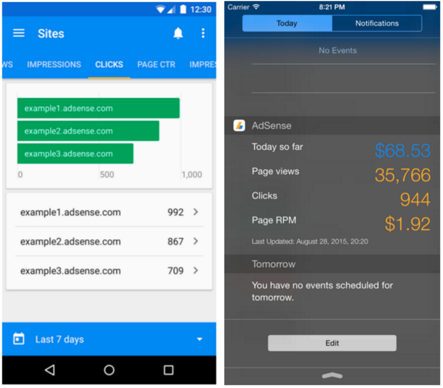
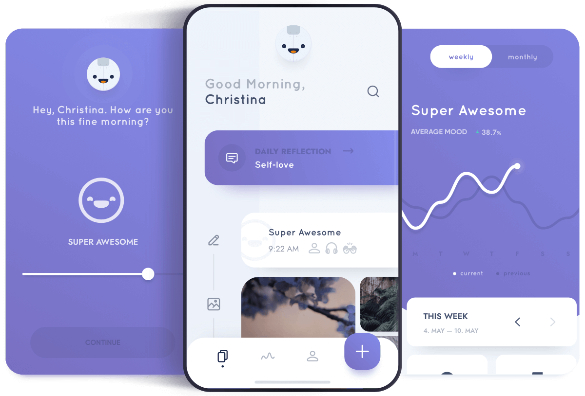

# Documentation

# Introduction Flutter and Flutter Widget

### **SOAL PRIORITAS 1**

*SOAL 1* :  
Sebutkan 3 aplikasi yang dibangun menggunakan teknologi Flutter! lalu screenshot

*JAWAB* :  
Flutter merupakan salah satu framework open-source yang akhir-akhir ini marak digunakan. Berikut ada 3 contoh aplikasi yang menggunakan Flutter :  
1. **Google Ads**  
   Salah satu aplikasi populer yang dibangun dengan Flutter adalah "Google Ads" atau "Google Ads Mobile App." Aplikasi ini digunakan oleh pengiklan dan pemasar untuk mengelola kampanye iklan mereka di platform Google Ads.  

   Aplikasi ini memungkinkan pengguna untuk mengelola kampanye iklan mereka di Google Ads dari perangkat mobile. Pengguna dapat melihat statistik kampanye, mengedit iklan, mengatur anggaran, melihat laporan, dan berinteraksi dengan berbagai fitur Google Ads lainnya.

   Aplikasi ini memanfaatkan Flutter untuk memberikan pengalaman pengguna yang seragam dan responsif di berbagai platform mobile, termasuk Android dan iOS. Pengguna dapat dengan mudah mengakses dan mengelola kampanye iklan mereka tanpa harus menggunakan komputer.

   
   *Gambar 1.1 Aplikasi Google Ads* (sumber : https://www.google.com/url?sa=i&url=https%3A%2F%2Fwww.webpronews.com%2Fgoogle-gives-adsense-app-a-refresh%2F&psig=AOvVaw2b-Mp7CQhA6Gs5LSTBoVaZ&ust=1694447882966000&source=images&cd=vfe&opi=89978449&ved=0CBAQjRxqFwoTCNjnlrO0oIEDFQAAAAAdAAAAABAh)

 

2. **Reflectly (Journal & AI Diary)**  
   Reflectly adalah aplikasi jurnal dan diari yang menggunakan kecerdasan buatan (AI) untuk membantu pengguna merenung dan merekam perasaan serta pengalaman mereka sehari-hari. Aplikasi ini memungkinkan pengguna untuk menulis entri jurnal, menambahkan foto, dan menganalisis perasaan mereka.

   Reflectly menggunakan Flutter untuk menyediakan antarmuka yang indah dan responsif kepada pengguna di kedua platform utama, Android dan iOS. Dengan menggunakan Flutter, pengembang dapat merancang tampilan yang menarik dan memiliki kemampuan cross-platform yang kuat, memungkinkan aplikasi ini tersedia untuk lebih banyak pengguna.

   
   *Gambar 1.2 Aplikasi Reflectly* (sumber : https://www.google.com/url?sa=i&url=https%3A%2F%2Freflectly.app%2F&psig=AOvVaw1O74dPUrqpHCnOZngwnlAo&ust=1694447512121000&source=images&cd=vfe&opi=89978449&ved=0CBAQjRxqFwoTCLCwvpi4oIEDFQAAAAAdAAAAABAE)

 

3. **Alibaba Group's Xianyu (闲鱼)**  
   Xianyu adalah platform penjualan barang bekas yang populer di Tiongkok yang dimiliki oleh Alibaba Group. Aplikasi ini memungkinkan pengguna untuk membeli dan menjual berbagai barang bekas secara online. Xianyu memanfaatkan Flutter untuk membangun aplikasi mobilenya agar dapat berjalan dengan baik di berbagai perangkat Android dan iOS.

   Dengan Flutter, Xianyu dapat menyediakan pengalaman pengguna yang seragam di kedua platform utama (Android dan iOS). Ini juga memungkinkan untuk mengembangkan dan merilis pembaruan dengan cepat untuk kedua platform tanpa banyak kerumitan dalam pengembangan.

   ")
   *Gambar 1.3 Aplikasi Alibaba Xianyu (闲鱼)* (sumber : https://play.google.com/store/apps/details?id=com.taobao.idlefish&hl=en_US)

  

*SOAL 2* :  
Tampilkan informasi software yang dibutuhkan oleh Flutter dengan menggunakan perintah Flutter doctor! lalu screenshot

*JAWAB* :  

*Gambar 1.4 flutter doctor*

 

*Gambar 1.5 flutter doctor -v*

  

*SOAL 3* :  
Buatlah sebuah project flutter (jika flutter berhasil dibuat tapi masih belum bisa tampil, maka masuk ke nilai prioritas 1)

*JAWAB* :  

*Gambar 1.6 Screenshot berhasil membuat projek*

  

### **SOAL PRIORITAS 2**

*SOAL 1* :  
Setelah project dibuat, jalankan di emulator

*JAWAB* :

*Gambar 2.1 Screenshot berhasil menampilkan pada emulator*