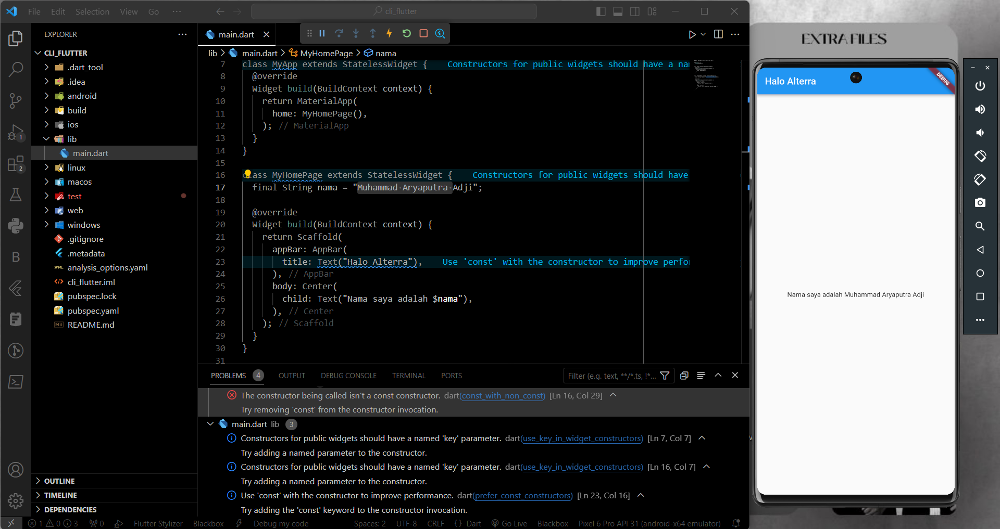

# Documentation

# Installation Command Line Interface and Package Management in Flutter

### **SOAL PRIORITAS 1**

**// Melakukan inisiasi**  
- Saya melakukan inisiasi dengan membuat projek baru dengan menggunakan command &nbsp;`git create <nama_projek>`
  
  

**// Menambahkan package**
- Saya menambahkan package http (untuk nanti diremove) dengan command &nbsp;`flutter pub add <nama_package>`
  
  .png "Menambahkan package http dengan flutter pub add")

**// Menginstall package**
- Saya menginstall package dengan command &nbsp;`flutter pub get`
  
  

**// Menghapus package yang terinstall**
- Saya menghapus package http dengan command &nbsp;`flutter pub remove <nama_package>`
  
  

**// Melakukan hot-reload**
- Saya melakukan hot reload dengan menjalankan command &nbsp;`flutter run` kemudian mengetik huruf `r`
  
  .png "Melakukan flutter run tanpa hot-reload")

  .png "Melakukan flutter run dengan hot-reload")

**// Membuat APK**
- Saya membuat apk dengan &nbsp;`flutter build apk`

  

**// Membersihkan cache**
- Saya membersihkan cache dari projek dengan command &nbsp; `flutter clean`

  

<br>

### **SOAL PRIORITAS 2**

Mmengubah Appbar dengan tulisan “Halo Alterra” dan di halaman bodynya berisi tulisan “Nama saya adalah Muhammad Aryaputra Adji”
```dart
import 'package:flutter/material.dart';

void main() {
  runApp(MyApp());
}

class MyApp extends StatelessWidget {
  @override
  Widget build(BuildContext context) {
    return MaterialApp(
      home: MyHomePage(),
    );
  }
}

class MyHomePage extends StatelessWidget {
  final String nama = "Muhammad Aryaputra Adji";

  @override
  Widget build(BuildContext context) {
    return Scaffold(
      appBar: AppBar(
        title: Text("Halo Alterra"),
      ),
      body: Center(
        child: Text("Nama saya adalah $nama"),
      ),
    );
  }
}
```
***Output:**

