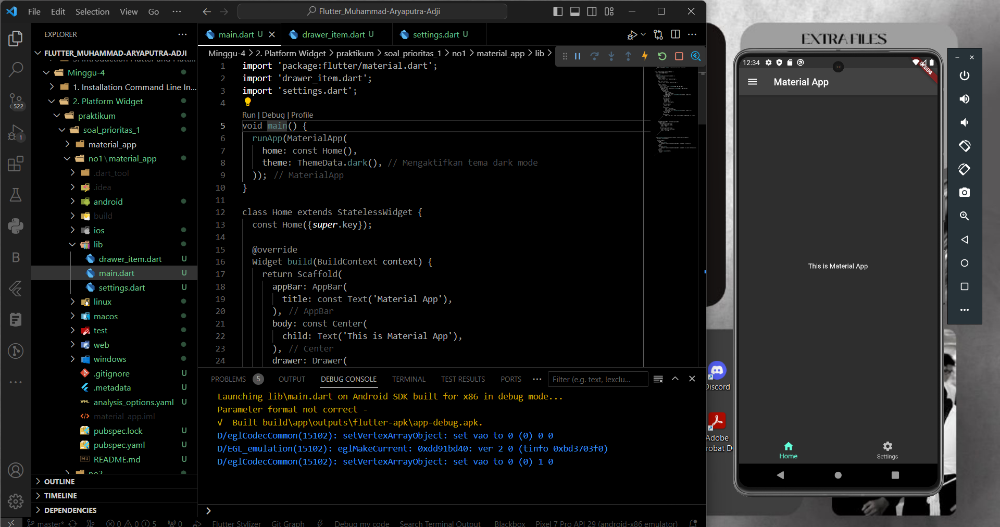
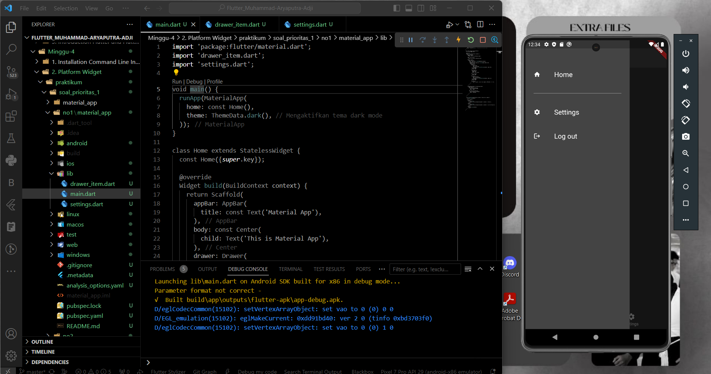
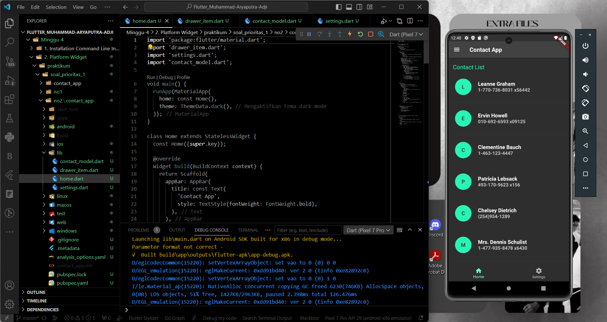
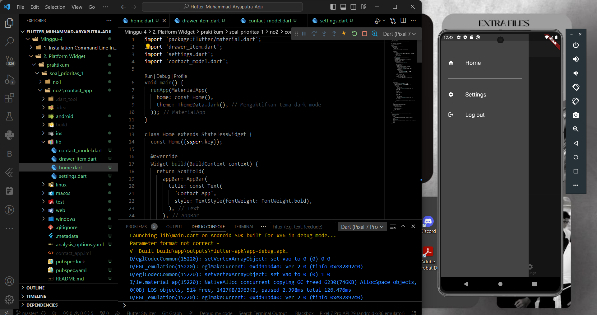
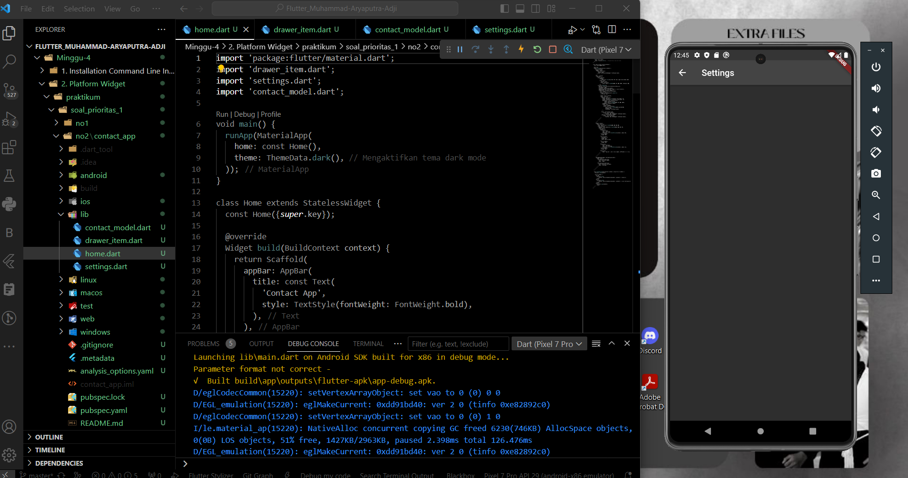
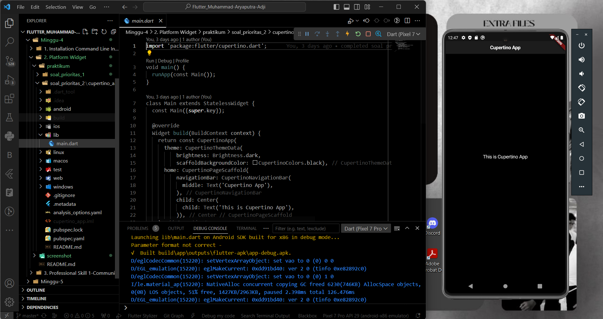

# Summary 

# Platform Widget & Layout 

## Platform Widget
Platform Widget adalah widget yang mengadopsi tampilan dan perilaku yang sesuai dengan platform atau tema tertentu, seperti **Material Design (Android)** atau **Cupertino (iOS)**. Ini memungkinkan untuk membuat antarmuka pengguna yang terlihat dan berperilaku seperti aplikasi yang sesuai dengan platform yang digunakan pengguna. Flutter memiliki 2 set Platform Widget utama, yaitu untuk **Material Design (dalam material.dart)** dan **Cupertino (dalam cupertino.dart)**.

<br>

## Platform Layout
Layout adalah tata letak atau susunan elemen-elemen UI dalam aplikasi Flutter. Keduanya, Material App dan Cupertino App, memiliki pendekatan desain yang berbeda dalam hal tata letak dan tampilan elemen UI.  
1. **Material App Layout**: Material Design adalah panduan desain yang dikembangkan oleh Google untuk Android. Tata letak dalam Material App sering menggunakan konsep seperti "Drawer" untuk menu samping, "AppBar" untuk bar atas, "Card" untuk mengelompokkan informasi dalam kartu, dan lainnya. Tata letak Material Design biasanya berfokus pada elevasi, warna, dan bayangan untuk memberikan tampilan yang menarik dan interaktif.
2. **Cupertino App Layout**: Cupertino adalah panduan desain yang dikembangkan oleh Apple untuk iOS. Tata letak dalam Cupertino App lebih mirip dengan tampilan iOS, menggunakan elemen seperti "NavigationBar" untuk navigasi, "CupertinoButton" untuk tombol, "CupertinoPicker" untuk pilihan, dan lainnya. Tata letak Cupertino lebih sederhana dan berfokus pada tampilan minimalis yang khas dari iOS.

<br>

## Jenis-jenis Platform Widget
Ada banyak jenis Platform Widget yang tersedia dalam Flutter, dan berikut adalah beberapa di antaranya berserta contohnya:  
1. **Platform-specific AppBar**  
   - Digunakan untuk menampilkan app bar sesuai dengan platform.
   - Material App:  
     ```dart
     AppBar(title: Text('Material App AppBar'))
     ```
   - Cupertino App  
     ```dart
     CupertinoNavigationBar(middle: Text('Cupertino App AppBar'))
     ```

2. **Platform-specific Buttons**  
   - Tombol yang sesuai dengan tampilan platform yang digunakan.  
   - Material App:  
     ```dart
     ElevatedButton(onPressed: () {}, child: Text('Material Button'))
     ```
   - Cupertino App:  
     ```dart
     CupertinoButton(onPressed: () {}, child: Text('Cupertino Button'))
     ```

3. **Platform-specific Navigation**  
   - Digunakan untuk navigasi platform sesuai dengan platform yang digunakan.  
   - Material App:  
     ```dart
     Navigator.push(context, MaterialPageRoute(builder: (context) => NextScreen()));
     ```
   - Cupertino App:  
     ```dart
     Navigator.push(context, CupertinoPageRoute(builder: (context) => NextScreen()));
     ```

4. **Platform-specific Icons**  
   - Menggunakan ikon yang sesuai dengan platform.  
   - Material App:
     ```dart
     Icon(Icons.star)
     ```
   - Cupertino App:  
     ```dart
     CupertinoIcons.star
     ```

5. **Platform-specific Dialogs**  
   - Menampilkan dialog sesuai dengan tampilan platform.  
   - Material App:  
     ```dart
     showDialog(context: context, builder: (_) => AlertDialog(title: Text('Material Dialog')));
     ```
   - Cupertino App:  
     ```dart
     showCupertinoDialog(context: context, builder: (_) => CupertinoAlertDialog(title: Text('Cupertino Dialog')));
     ```

<br><br>

# Hasil Praktikum

### **SOAL PRIORITAS 1**
*Soal 1*  
Material App






*Soal 2*  
Contact App







<br>

### **SOAL PRIORITAS 2**
Cupertino App



<br>

Untuk melihat hasil praktikum, dapat klik [di sini](https://github.com/aryaptradji/flutter_Muhammad-Aryaputra-Adji/tree/master/Minggu-4/2.%20Platform%20Widget/praktikum)