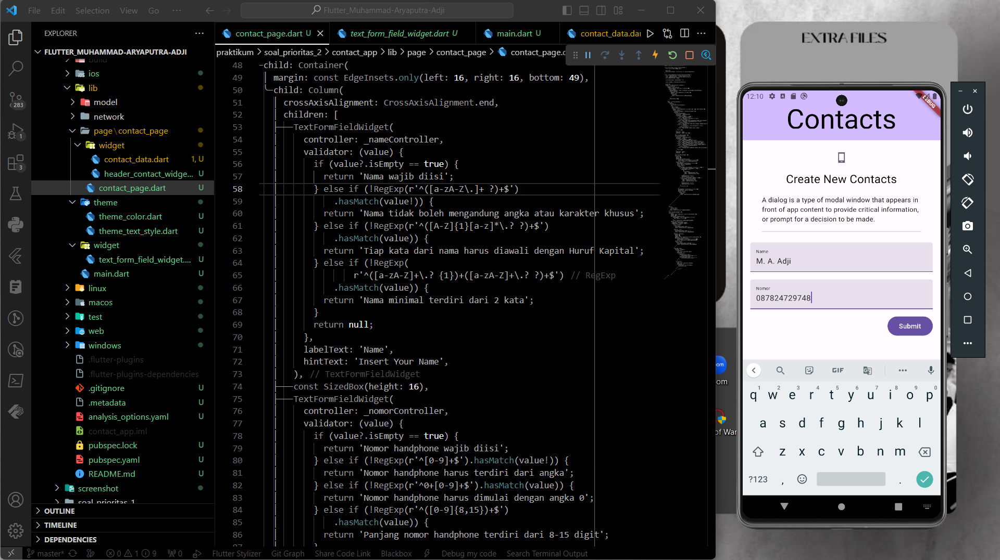

# Summary

# Flutter Form 

Flutter Form adalah widget yang digunakan dalam kerangka kerja Flutter untuk mengelola input pengguna, validasi, dan tindakan yang terkait dengan formulir. Flutter Form akan membantu dalam hal membuat dan mengelola formulir dengan mudah dalam aplikasi Flutter Kita.

Ada beberapa komponen penting dalam Flutter Form:
1. `Form Widget`&nbsp;: Form adalah widget utama yang membungkus elemen-elemen formulir di dalamnya. Kita dapat memiliki banyak elemen formulir dalam satu Form. Form bertanggung jawab atas validasi dan pengiriman data yang dimasukkan oleh pengguna.

2. `TextFormField`&nbsp;: TextFormField adalah widget yang digunakan untuk memungkinkan pengguna memasukkan teks atau data lainnya ke dalam formulir. Kita dapat menambahkan berbagai properti, seperti controller (untuk mengontrol isian teks), validator (untuk validasi), dan banyak lagi.

3. `GlobalKey<FormState>`&nbsp;: Kita memerlukan `GlobalKey<FormState>` untuk mengakses status dan metode validasi dari Form. Kita harus menghubungkannya ke Form menggunakan properti key.

4. `FormState`&nbsp;: FormState adalah objek yang berisi informasi tentang keadaan Form seperti status validasi, apakah formulir telah di-submit, dan lainnya.

5. **Submit Button**: Kita biasanya menyertakan tombol "Submit" yang akan mengirimkan data formulir ke server atau mengambil tindakan lainnya sesuai dengan kebutuhan aplikasi Kita.

6. **Validation**: Kita dapat menambahkan logika validasi ke dalam formulir Kita menggunakan properti `validator` dalam `TextFormField` atau dengan menggunakan `FormState`. Properti ini hanya tersedia pada `TextFormField` tetapi tidak pada `TextField`. Dengan validasi, Kita dapat memastikan bahwa data yang dimasukkan oleh pengguna sesuai dengan aturan tertentu sebelum mengizinkannya untuk di-submit. 

7. `onChanged`&nbsp;: Kita juga dapat menggunakan properti onChanged dalam `TextField` untuk menentukan apa yang harus dilakukan dengan data yang dimasukkan setelah data tersebut dinyatakan valid. Ketika menggunakan properti `onChanged` ini kita harus membuat controller terlebih dahulu untuk mengambil data text yang ada di TextField dari class `TextEditingController`.

8. **Form Submission**: Ketika pengguna menekan tombol "Submit" atau tindakan serupa, Kita dapat mengakses data formulir yang divalidasi melalui `FormState` dan mengambil tindakan sesuai dengan data tersebut, misalnya mengirimkannya ke server.

  

# Hasil Praktikum

### **SOAL PRIORITAS 1**

**// Soal 1: Membuat halaman Form Contact App**

**// Soal 2: Menampilkan isi data List pada console ketika tombol Submit ditekan**

 

### **SOAL PRIORITAS 2**

**// Soal 1: Membuat tampilan ListView yang berisi data-data dalam List**

**// Soal 2: Membuat fitur untuk menambah data kontak**

**// Soal 3: Membuat fitur untuk menghapus data pada ListView**

**// Soal 4: Membuat fitur untuk melakukan update pada kontak**

 

### **SOAL EKSPLORASI**

**// Soal 1: Membuat fitur validasi nama**  
- Nama harus diisi oleh user

  

- Nama harus terdiri dari 2 kata minimal

  

- Setiap kata harus dimulai dengan Huruf Kapital

  

- Nama tidak boleh mengandung angka atau karakter khusus

  

**// Soal 2: Membuat fitur validasi nomor handphone**

- Nomor handphone harus diisi oleh user

  

- Nomor handphone hanya boleh terdiri dari angka

  

- Panjang nomor handphone harus minimal 8 digit dan maksimal 15 digit

  

- Nomor handphone harus dimulai dengan 0

  

 

Untuk melihat hasil praktikum, dapat klik [di sini]()