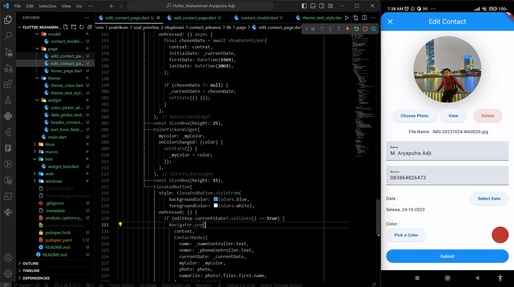

# Summary

# Flutter Advance Form

Pada materi Flutter Advance Form, yang merupakan lanjutan dari Flutter Form, masih membahas seputar kegunaan dan berbagai macam Widget di dalam Widget Form. Berikut merupakan penjabaran dari Widget-Widget yang sudah dipelajari:

### 1. Date Picker  
Datepicker adalah widget built-in yang digunakan dalam Flutter untuk memungkinkan pengguna memilih tanggal dari kalender atau jadwal. Datepicker sangat berguna dalam aplikasi yang memerlukan input tanggal, seperti aplikasi agenda, aplikasi reservasi, atau aplikasi yang melibatkan penjadwalan.

DatePicker di Flutter biasanya diimplementasikan menggunakan widget `showDatePicker`. Widget ini memungkinkan pengguna untuk memilih tanggal dari kalender dengan antarmuka yang mudah digunakan. Anda dapat mengatur tanggal awal, tanggal akhir, dan tanggal awal terpilih saat pertama kali ditampilkan.

Contoh:
```dart
showDatePicker(
  context: context,
  initialDate: DateTime.now(), // Tanggal awal yang akan ditampilkan
  firstDate: DateTime(2020),  // Batas tanggal pertama yang dapat dipilih
  lastDate: DateTime(2030),   // Batas tanggal terakhir yang dapat dipilih
).then((selectedDate) {
  if (selectedDate != null) {
    // Lakukan sesuatu dengan tanggal yang dipilih
    print("Tanggal yang dipilih: $selectedDate");
  }
});
```
Dalam contoh di atas, kita menggunakan `showDatePicker` untuk menampilkan dialog pemilihan tanggal. Kita dapat mengatur tanggal awal dengan `initialDate`, batas tanggal pertama yang dapat dipilih dengan `firstDate`, dan batas tanggal terakhir yang dapat dipilih dengan `lastDate`. Setelah memilih tanggal, kita menangani tanggal yang dipilih dalam callback `then`.

### 2. Date Format
`DateFormat` adalah kelas dalam Flutter yang digunakan untuk memformat objek `DateTime` ke dalam string dan sebaliknya, yaitu mengambil string yang berisi tanggal dan waktu dan mengonversinya menjadi objek `DateTime`. `DateFormat` sangat berguna dalam aplikasi Flutter untuk menampilkan tanggal dan waktu dengan format yang diinginkan dan untuk mengurai input tanggal dan waktu dari pengguna.

Kelas `DateFormat` memungkinkan kita untuk dengan mudah mengonversi objek `DateTime` menjadi string dengan format yang kita tentukan. Ini sangat berguna saat kita ingin menampilkan tanggal dan waktu dengan format tertentu dalam antarmuka pengguna atau ketika kita ingin mengurai input tanggal dari pengguna.

Contoh:
```dart
import 'package:intl/intl.dart';

void main() {
  DateTime now = DateTime.now();

  // Membuat objek DateFormat
  DateFormat dateFormat = DateFormat('yyyy-MM-dd');
  DateFormat timeFormat = DateFormat('HH:mm:ss');

  // Mengonversi objek DateTime ke string dengan format yang diinginkan
  String formattedDate = dateFormat.format(now);
  String formattedTime = timeFormat.format(now);

  print('Tanggal: $formattedDate');
  print('Waktu: $formattedTime');

  // Mengurai string tanggal dan waktu menjadi objek DateTime
  DateTime parsedDate = dateFormat.parse('2023-10-30');
  DateTime parsedTime = timeFormat.parse('14:30:00');

  print('Tanggal yang diurai: $parsedDate');
  print('Waktu yang diurai: $parsedTime');
}
```
Dalam contoh di atas, kita mengimpor paket `intl` untuk mengakses `DateFormat`. Kemudian, kita membuat objek `DateFormat` untuk tanggal dan waktu dengan format yang diinginkan. Kemudian, kita menggunakan metode `format` untuk mengonversi objek `DateTime` ke string dengan format yang sesuai. Selanjutnya, kita menggunakan metode `parse` untuk mengurai string tanggal dan waktu kembali menjadi objek `DateTime`.

`DateFormat` memiliki banyak pilihan format, dan kita dapat menyesuaikan formatnya sesuai kebutuhan kita, termasuk format tanggal, waktu, dan zona waktu.

### 3. Color Picker
Di Flutter, tidak ada widget bawaan yang disebut "ColorPicker". Namun, Kita dapat membuat ColorPicker dengan menggabungkan berbagai widget Flutter, atau Kita dapat menggunakan paket atau plugin pihak ketiga yang menyediakan ColorPicker siap pakai.

Salah satu paket pihak ketiga yang populer untuk ColorPicker di Flutter adalah `flutter_colorpicker`. Paket ini memungkinkan Kita menambahkan ColorPicker dengan mudah ke proyek Flutter Kita. 

`flutter_colorpicker` adalah paket Flutter yang menyediakan komponen ColorPicker siap pakai untuk memilih warna dalam aplikasi Flutter Kita. Dengan paket ini, pengguna dapat memilih warna sesuai dengan preferensi mereka.

Cara dan contoh penggunaannya:
1. Tambahkan dependensi `flutter_colorpicker` ke file `pubspec.yaml`:
    ```dart
    dependencies:
    flutter:
        sdk: flutter
    flutter_colorpicker: ^latest_version
    ```

2. Import paket `flutter_colorpicker` di dalam file Dart Kita:
   ```dart
   import 'package:flutter/material.dart';
   import 'package:flutter_colorpicker/flutter_colorpicker.dart';
   ```

3. Gunakan widget `ColorPicker` dalam aplikasi Kita:
    ```dart
    class ColorPickerExample extends StatefulWidget {
    @override
    _ColorPickerExampleState createState() => _ColorPickerExampleState();
    }

    class _ColorPickerExampleState extends State<ColorPickerExample> {
    Color selectedColor = Colors.blue; // Warna awal yang ditampilkan

    void changeColor(Color color) {
        setState(() {
        selectedColor = color;
        });
    }

    @override
    Widget build(BuildContext context) {
        return Scaffold(
        appBar: AppBar(
            title: Text('Color Picker Example'),
        ),
        body: Center(
            child: Column(
            mainAxisAlignment: MainAxisAlignment.center,
            children: <Widget>[
                Container(
                width: 200,
                height: 200,
                color: selectedColor,
                ),
                SizedBox(height: 20),
                RaisedButton(
                onPressed: () {
                    showDialog(
                    context: context,
                    builder: (BuildContext context) {
                        return AlertDialog(
                        title: Text('Pilih Warna'),
                        content: SingleChildScrollView(
                            child: ColorPicker(
                            pickerColor: selectedColor,
                            onColorChanged: changeColor,
                            enableLabel: true,
                            pickerAreaHeightPercent: 0.8,
                            ),
                        ),
                        actions: <Widget>[
                            TextButton(
                            child: Text('Simpan'),
                            onPressed: () {
                                Navigator.of(context).pop();
                            },
                            ),
                        ],
                        );
                    },
                    );
                },
                child: Text('Ubah Warna'),
                ),
            ],
            ),
        ),
        );
    }
    }

    void main() => runApp(MaterialApp(
        home: ColorPickerExample(),
        ));
    ```
    Dalam contoh di atas, Kita menggunakan `flutter_colorpicker` untuk membuat ColorPicker yang memungkinkan pengguna memilih warna. Saat tombol "Ubah Warna" ditekan, dialog ColorPicker ditampilkan, dan ketika pengguna memilih warna, tampilan kontainer di atas akan mengganti warna sesuai dengan pilihan pengguna.

### 4. File Picker
FilePicker adalah sebuah package Flutter yang memungkinkan Kita untuk membuka dialog pemilihan file yang terintegrasi dengan sistem file perangkat pengguna. Kita dapat menggunakan FilePicker untuk memungkinkan pengguna memilih file yang nantinya dapat Kita proses dalam aplikasi Kita, misalnya untuk mengunggah atau membaca file tersebut.

Cara dan contoh penggunaannya:
1. Tambahkan dependensi `file_picker` ke file `pubspec.yaml`:
    ```dart
    dependencies:
    flutter:
        sdk: flutter
    file_picker: ^4.0.3
    ```
2. Import paket `file_picker` di dalam file Dart Kita:
    ```dart
    import 'package:flutter/material.dart';
    import 'package:file_picker/file_picker.dart';
    ```

3. Gunakan widget FilePicker dalam aplikasi Kita:
    ```dart
    class FilePickerExample extends StatefulWidget {
    @override
    _FilePickerExampleState createState() => _FilePickerExampleState();
    }

    class _FilePickerExampleState extends State<FilePickerExample> {
    String? filePath;

    Future<void> pickFile() async {
        FilePickerResult? result = await FilePicker.platform.pickFiles();

        if (result != null) {
        filePath = result.files.single.path;
        print('Path file terpilih: $filePath');
        } else {
        print('Tidak ada file yang dipilih.');
        }

        setState(() {});
    }

    @override
    Widget build(BuildContext context) {
        return Scaffold(
        appBar: AppBar(
            title: Text('File Picker Example'),
        ),
        body: Center(
            child: Column(
            mainAxisAlignment: MainAxisAlignment.center,
            children: <Widget>[
                if (filePath != null)
                Text('File terpilih: $filePath')
                else
                Text('Tidak ada file yang dipilih'),
                SizedBox(height: 20),
                ElevatedButton(
                onPressed: pickFile,
                child: Text('Pilih File'),
                ),
            ],
            ),
        ),
        );
    }
    }

    void main() => runApp(MaterialApp(
        home: FilePickerExample(),
        ));
    ```
    Dalam contoh di atas, Kita menggunakan package `file_picker` untuk membuat aplikasi Flutter yang memungkinkan pengguna memilih file. Ketika tombol "Pilih File" ditekan, dialog pemilihan file akan muncul, dan ketika pengguna memilih file, path file yang terpilih akan ditampilkan di layar. Pastikan untuk menambahkan dependensi package `file_picker` ke proyek Kita sebelum menggunakannya.

### 5. Open File
`open_file` adalah library Flutter yang memungkinkan Kita membuka file dalam aplikasi yang sesuai dengan tipe file, seperti membuka PDF dengan pembaca PDF bawaan perangkat, atau membuka gambar dengan aplikasi galeri. Ini memungkinkan integrasi yang mulus dengan aplikasi lain di perangkat pengguna.

Cara dan contoh penggunaannya:
1. Tambahkan dependensi `open_file` ke file `pubspec.yaml`:
    ```dart
    dependencies:
    flutter:
        sdk: flutter
    open_file: ^3.0.2
    ```

2. Import library open_file di dalam file Dart Kita:
    ```dart
    import 'package:flutter/material.dart';
    import 'package:open_file/open_file.dart';
    ```

3. Gunakan fungsi `openFile` untuk membuka file:
    ```dart
    class OpenFileExample extends StatelessWidget {
        Future<void> openPdf() async {
            final filePath = '/path/to/your/pdf/file.pdf'; // Ganti dengan path file yang sesuai

            final result = await OpenFile.open(filePath);

            if (result.type != ResultType.done) {
            // Handle kesalahan, misalnya jika file tidak ditemukan
            print('Gagal membuka file: ${result.message}');
            }
        }

        @override
        Widget build(BuildContext context) {
            return MaterialApp(
            home: Scaffold(
                appBar: AppBar(
                title: Text('Open File Example'),
                ),
                body: Center(
                child: ElevatedButton(
                    onPressed: openPdf,
                    child: Text('Buka PDF'),
                ),
                ),
            ),
            );
        }
    }

    void main() {
        runApp(OpenFileExample());
    }
    ```
    Dalam contoh di atas, kita menggunakan library `open_file` untuk membuka file PDF. Fungsi `openFile` digunakan untuk membuka file yang diberikan dalam path file yang sesuai. Jika berhasil, file akan dibuka dalam aplikasi default yang sesuai dengan tipe file tersebut.

    Pastikan untuk mengganti `filePath` dengan path file yang sesuai dengan file yang ingin dibuka.

### 6. Image Picker
ImagePicker adalah package Flutter yang memudahkan Anda dalam mengambil gambar dari kamera perangkat atau memilih gambar dari galeri. Anda dapat menggunakannya untuk aplikasi yang memerlukan fungsi seperti mengganti foto profil pengguna, mengunggah gambar, atau membuat aplikasi kamera.

Cara dan contoh penggunaannya:
1. Tambahkan dependensi `image_picker` ke file `pubspec.yaml`:
    ```dart
    dependencies:
    flutter:
        sdk: flutter
    image_picker: ^0.8.4
    ```

2. Import library `image_picker` di dalam file Dart Kita:
    ```dart
    import 'package:flutter/material.dart';
    import 'package:image_picker/image_picker.dart';
    ```

3. Gunakan widget ImagePicker dalam aplikasi Kita:
    ```dart
    class ImagePickerExample extends StatefulWidget {
        @override
        _ImagePickerExampleState createState() => _ImagePickerExampleState();
    }

    class _ImagePickerExampleState extends State<ImagePickerExample> {
        XFile? _image;

        Future<void> _getImage(ImageSource source) async {
            final image = await ImagePicker().pickImage(source: source);
            if (image != null) {
                setState(() {
                    _image = image;
                });
            }
        }

        @override
        Widget build(BuildContext context) {
            return MaterialApp(
            home: Scaffold(
                appBar: AppBar(
                    title: Text('Image Picker Example'),
                ),
                body: Center(
                    child: Column(
                        mainAxisAlignment: MainAxisAlignment.center,
                        children: <Widget>[
                        _image == null
                            ? Text('Pilih gambar terlebih dahulu')
                            : Image.file(File(_image!.path)),
                        SizedBox(height: 20),
                    Row(
                        mainAxisAlignment: MainAxisAlignment.center,
                        children: <Widget>[
                        ElevatedButton(
                            onPressed: () => _getImage(ImageSource.camera),
                            child: Text('Ambil Gambar Dari Kamera'),
                        ),
                        ElevatedButton(
                            onPressed: () => _getImage(ImageSource.gallery),
                            child: Text('Pilih Gambar Dari Galeri'),
                        ),
                        ],
                    ),
                    ],
                ),
                ),
            ),
            );
        }
    }

    void main() {
        runApp(ImagePickerExample());
    }
    ```
    Dalam contoh di atas, Kita menggunakan package `image_picker` untuk membuat aplikasi Flutter yang memungkinkan pengguna mengambil gambar dari kamera atau memilih gambar dari galeri. Saat tombol "Ambil Gambar Dari Kamera" atau "Pilih Gambar Dari Galeri" ditekan, aplikasi akan menampilkan dialog pengambilan gambar, dan gambar yang dipilih akan ditampilkan di layar. Kita dapat menyesuaikan tampilan dan fungsi tambahan sesuai kebutuhan aplikasi Kita.

<br><br>

# Hasil Praktikum

### **SOAL PRIORITAS 1**

**// Membuat halaman dengan mengimplementasikan Date Picker, Color Picker, dan File Picker**

1. Date Picker

    

    

2. Color Picker

    

    

3. File Picker

    

    

<br>

### **SOAL PRIORITAS 2**

**// Membuat button submit ditekan akan memasukkan data name, nomor, date, color dan name file ke dalam console**

1. Mengisi data kontak baru

    

2. Hasil data kontak baru berhasil ditampilkan

    

<br>

### **SOAL EKSPLORASI**

**// Membuat tampilan User Interface (UI) yang menarik dari List Contact beserta data-datanya**

1. UI Home Page

    

2. UI Edit Contact Page

    

3. UI Add Contact Page

    

<br>

Untuk melihat hasil praktikum selengkapnya, dapat klik [di sini](https://github.com/aryaptradji/flutter_Muhammad-Aryaputra-Adji/tree/master/Minggu-5/3.%20Flutter%20Advance%20Form/praktikum)