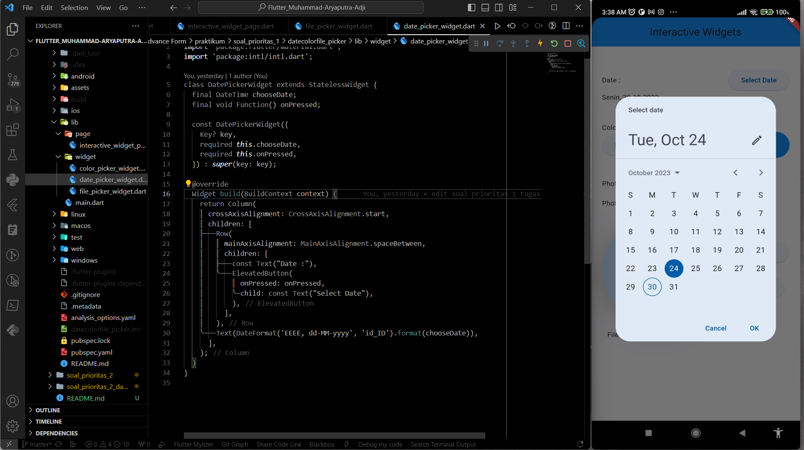
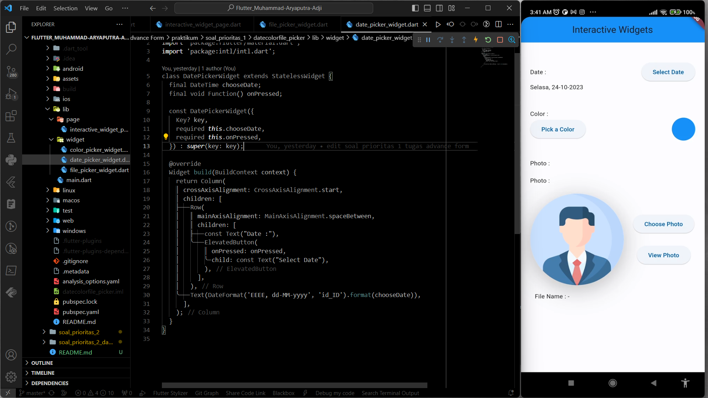
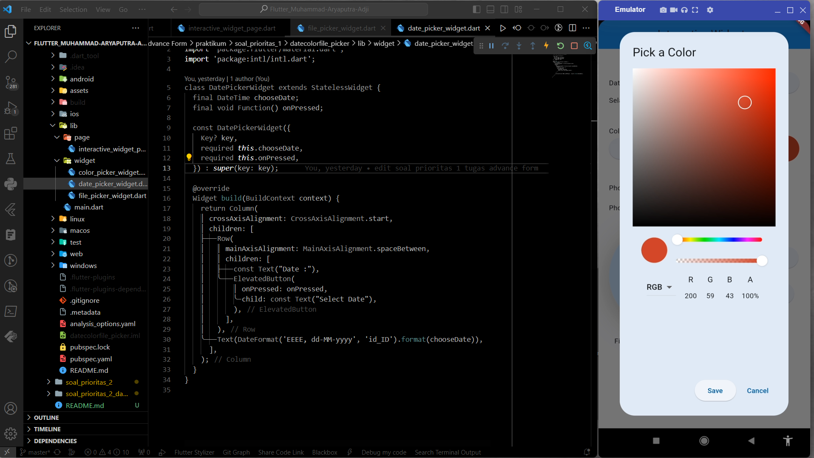
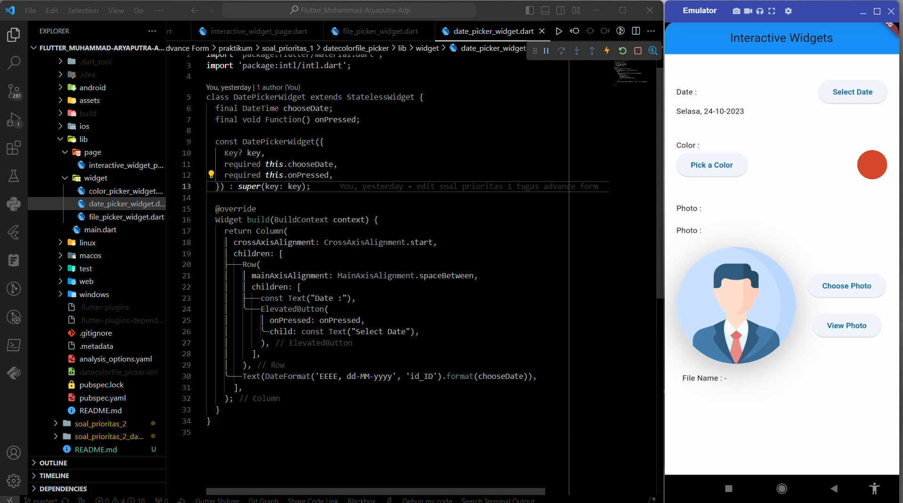
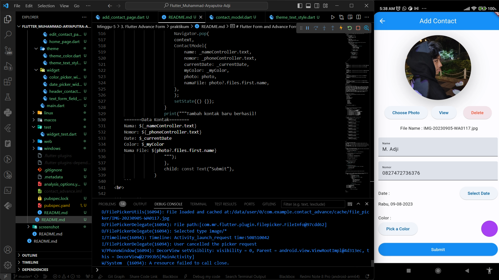
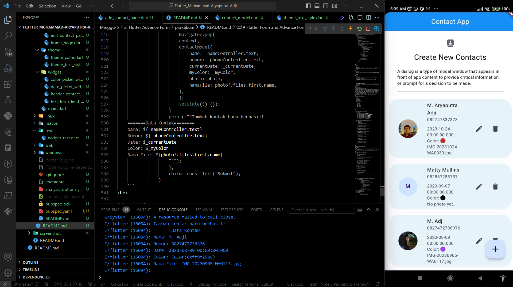
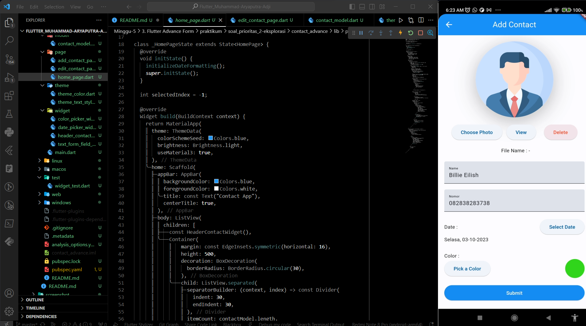

# Documentation 

# Flutter Advance Form

### **SOAL PRIORITAS 1**

**// Melakukan penyusunan struktur folder**
- **Folder Page**: Folder ini berisi page utama saja yang terdapat pada file &nbsp;`interactive_widget_page.dart`&nbsp;
- **Folder Widget**: Folder ini berisi komponen-komponen yang dipecah dalam bentuk widget yang terdiri dari 3 file, di antaranya &nbsp;`color_picker_widget.dart`&nbsp;, &nbsp;`date_picker_widget.dart`&nbsp;, dan &nbsp;`file_picker_widget.dart`&nbsp;.

<br>

**// Menambahkan package ke depedencies**
- Package yang akan diperlukan adalah sebagai berikut :  
  1. `intl`&nbsp;: Package untuk mengkonversi format waktu
  2. `flutter_colorpicker`&nbsp;: Package untuk mengimplementasi colorpicker untuk memilih warna
  3. `file_picker`&nbsp;: Package untuk upload file ke aplikasi
  4. `open_file`&nbsp;: Package untuk membuka file yang ada dalam penyimpanan handphone
  5. `image_picker`&nbsp;: Package untuk mengupload file, lebih tepatnya file tipe gambar (jpg, png, jpeg, mp4, dll.)

<br>

**// Membuat komponen &nbsp;`DatePickerWidget`**
1. Import depedencies
   - Dimulai dengan import package &nbsp;`material`&nbsp; untuk DatePicker built-in flutter dan package &nbsp;`intl`&nbsp; untuk format tanggalnya
     ```dart
     import 'package:flutter/material.dart';
     import 'package:intl/intl.dart';
     ```

2. Membuat konstruktor class `StatelessWidget` dengan properti &nbsp;`chooseDate`&nbsp; untuk memilih tanggal dan &nbsp;`onPressed`&nbsp; untuk menjalankan fungsi Widget DatePicker, tetapi hanya dijadikan parameter karena properti akan diberi value ketika komponen ini dipanggil saja
    ```dart
    class DatePickerWidget extends StatelessWidget {
        final DateTime chooseDate;
        final void Function() onPressed;

        const DatePickerWidget({
            Key? key,
            required this.chooseDate,
            required this.onPressed,
        }) : super(key: key);
    ```

3. Menyusun tampilan Widget dan menggunakan &nbsp;`DateFormat`&nbsp; untuk menentukan bentuk format tanggal dengan parameter &nbsp;`locale`&nbsp; yaitu &nbsp;`'id_ID'`&nbsp; agar menjadi format jam Indonesia
    ```dart
    @override
    Widget build(BuildContext context) {
        return Column(
        crossAxisAlignment: CrossAxisAlignment.start,
        children: [
            Row(
            mainAxisAlignment: MainAxisAlignment.spaceBetween,
            children: [
                const Text("Date :"),
                ElevatedButton(
                onPressed: onPressed,
                child: const Text("Select Date"),
                ),
            ],
            ),
            Text(DateFormat('EEEE, dd-MM-yyyy', 'id_ID').format(chooseDate)),
        ],
        );
    }
    ```

<br>

**// Membuat komponen &nbsp;`ColorPickerWidget`**  
1. Import depedencies khusus untuk Widget ColorPicker yaitu &nbsp;`flutter_colorpicker`
   ```dart
   import 'package:flutter/material.dart';
   import 'package:flutter_colorpicker/flutter_colorpicker.dart';
   ```

2. Membuat konstruktor dengan parameter yang diperlukan untuk nanti dipanggil
   ```dart
   class ColorPickerWidget extends StatelessWidget {
        final Color myColor;
        final void Function(Color) onColorChanged;

        const ColorPickerWidget(
            {super.key, required this.myColor, required this.onColorChanged});
   ```

3. Menyusun tampilan dan membuat Widget &nbsp;`ColorPicker`&nbsp; yang disimpan di dalam Widget &nbsp;`ElevatedButton`&nbsp;. Properti &nbsp;`pickerColor`&nbsp; diisi dengan parameter class yaitu &nbsp;`myColor`. Kemudian, properti &nbsp;`onColorChanged`&nbsp; diisi dengan parameter &nbsp;`onColorChanged`&nbsp;. Parameter-parameter class ini nanti akan diisi dengan value ketika komponen &nbsp;`ColorPickerWidget` dipanggil
   ```dart
   ElevatedButton(
        onPressed: () {
        showDialog(
            context: context,
            barrierDismissible: false,
            builder: (context) {
                return AlertDialog(
                title: const Text("Pick a Color"),
                content: ColorPicker(
                    pickerColor: myColor,
                    onColorChanged: onColorChanged),
                actions: [
                    ElevatedButton(
                    onPressed: () {
                        Navigator.pop(context);
                    },
                    child: const Text("Save"),
                    ),
                    TextButton(
                    onPressed: () {},
                    child: const Text("Cancel"),
                    )
                ],
                );
            });
        },
        child: const Text("Pick a Color"),
    ),
   ```

4. Setelah itu, warna yang telah dipilih akan disimpan di dalam Widget &nbsp;`Container`
   ```dart
   Container(
        width: 50,
        height: 50,
        decoration: BoxDecoration(
            color: myColor,
            shape: BoxShape.circle,
        ),
        )
   ```

<br>

**// Membuat komponen &nbsp;`FilePickerWidget`**  
1. Import library &nbsp;`file_picker`&nbsp; dan &nbsp;`open_file`&nbsp; serta library built-innya
   ```dart
   import 'dart:io';
   import 'package:file_picker/file_picker.dart';
   import 'package:flutter/material.dart';
   import 'package:open_file/open_file.dart';
   ```

2. Membuat class turunan &nbsp;`StatefulWidget`&nbsp; dan membuat properti &nbsp;`photo`&nbsp; dengan tipe data &nbsp;`FilePickerResult`&nbsp; untuk menampung file diupload nantinya
   ```dart
   class FilePickerWidget extends StatefulWidget {
      const FilePickerWidget({super.key});

      @override
      State<FilePickerWidget> createState() => _FilePickerWidgetState();
   }

   class _FilePickerWidgetState extends State<FilePickerWidget> {
      FilePickerResult? photo;
   ```

3. Membuat method &nbsp;`viewPhoto(PlatformFile file)` dengan parameter untuk nanti diisi dengan value hasil &nbsp;`FilePicker`
   ```dart
   void viewPhoto(PlatformFile file) {
        if (photo != null) {
            OpenFile.open(file.path);
        }
        setState(() {});
   }
   ```

4. Membuat method aynchronous &nbsp;`choosePhoto()`&nbsp; karena hasil dari &nbsp;`FilePicker` bertipe Future
    ```dart
    void choosePhoto() async {
        FilePickerResult? selectedPhoto = await FilePicker.platform.pickFiles();

        if (selectedPhoto != null) {
        photo = selectedPhoto;
        }
        setState(() {});
    }
    ```

5. Menampilkan hasil file yang sudah diupload pada Widget &nbsp;`FileImage`&nbsp; yang dibungkus dengan Widget &nbsp;`Container`&nbsp;. Jika file foto tidak jadi diupload (bernilai null) maka akan menampilkan asset gambar
    ```dart
    Container(
        width: 200,
        height: 200,
        decoration: BoxDecoration(
        shape: BoxShape.circle,
        color: Colors.grey[50],
        boxShadow: [
            BoxShadow(
            color: Colors.grey[400]!,
            offset: const Offset(0, 10),
            blurRadius: 40,
            spreadRadius: 1,
            ),
        ],
        image: DecorationImage(
            image: photo != null
                ? FileImage(
                    File(photo?.paths.first ?? ""),
                )
                : const AssetImage("assets/people_account.png")
                    as ImageProvider,
            fit: BoxFit.cover,
        ),
        ),
    ),
    ```

6. Membuat button untuk mengoperasikan method-method yang sudah dibuat
    ```dart
    Column(
        children: [
            ElevatedButton(
                onPressed: () {
                    choosePhoto();
                },
                child: const Text("Choose Photo"),
            ),
            const SizedBox(height: 20),
            ElevatedButton(
                onPressed: () {
                    viewPhoto(photo!.files.first);
                },
                child: const Text("View Photo"),
            )
        ],
    ),
    ```

7. Menampilkan nama file yang diupload pada Widget &nbsp;`Text`
    ```dart
    Text("File Name : ${photo?.files.first.name ?? "-"} "),
    ```

<br>

**// Membuat file page utama &nbsp;`InteractiveWidgetPage`**  
1. Membuat class turunan &nbsp;`StatefulWidget`&nbsp; dengan membuat juga properti-properti yang diperlukan untuk diinisisasi pada parameter-parameter class yang ada. Properti-properti akan diinisiasi pada class ini karena valuenya akan berubah-ubah (dinamis)
    ```dart
    class InteractiveWidgetPage extends StatefulWidget {
        const InteractiveWidgetPage({super.key});

        @override
        State<InteractiveWidgetPage> createState() => _InteractiveWidgetPageState();
        }

    class _InteractiveWidgetPageState extends State<InteractiveWidgetPage> {
        Color _myColor = Colors.blue;
        DateTime _dueDate = DateTime.now();
    ```

2. Menginisiasi &nbsp;`initializeDateFormatting()`&nbsp; pada &nbsp;`initState()`&nbsp; agar properti &nbsp;`locale`&nbsp; pada &nbsp;`DateFormat` nanti dapat berjalan
    ```dart
    @override
    void initState() {
        initializeDateFormatting();
        super.initState();
    }
    ```

3. Menyusun tampilan dan memanggil komponen-komponen Widget yang sudah dibuat tadi dan mengisi parameter class tadi dengan properti yang sudah diinisiasi tadi
    ```dart
    @override
    Widget build(BuildContext context) {
        return MaterialApp(
        theme: ThemeData(
            colorSchemeSeed: Colors.blue,
            brightness: Brightness.light,
            useMaterial3: true,
        ),
        home: Scaffold(
            appBar: AppBar(
            backgroundColor: Colors.blue,
            title: const Text("Interactive Widgets"),
            centerTitle: true,
            ),
            body: Padding(
            padding: const EdgeInsets.symmetric(horizontal: 20, vertical: 40),
            child: Builder(builder: (context) {
                return ListView(
                children: [
                    DatePickerWidget(
                        chooseDate: _dueDate,
                        onPressed: () async {
                        final chosenDate = await showDatePicker(
                            context: context,
                            initialDate: _dueDate,
                            firstDate: DateTime(1969),
                            lastDate: DateTime(2069),
                        );

                        if (chosenDate != null) {
                            _dueDate = chosenDate;
                            setState(() {});
                        }
                        }),
                    const SizedBox(height: 40),
                    ColorPickerWidget(
                        myColor: _myColor,
                        onColorChanged: (color) {
                        setState(() {
                            _myColor = color;
                        });
                        }),
                    const SizedBox(height: 40),
                    const Text("Photo :"),
                    const SizedBox(height: 20),
                    const FilePickerWidget(),
                ],
                );
            }),
            ),
        ),
        );
    }
    ```
<br>

***HASIL:**
1. DatePicker
   
   

   

<br>

2. ColorPicker
   
   

   

<br>

3. FilePicker
   
   

   

<br>

4. Open File
   
   

   

<br><br>

### **SOAL PRIORITAS 2**

**// Melakukan penyusunan struktur folder**
- **Folder Page**: Folder ini berisi page-page seperti file &nbsp;`home_page.dart`&nbsp; sebagai page utama, &nbsp;`add_contact_page.dart`&nbsp; sebagai page untuk menambah kontak baru, dan &nbsp;`edit_contact_page.dart`&nbsp; sebagai page untuk mengedit data kontak.
- **Folder Widget**: Folder ini berisi komponen-komponen yang dipecah dalam bentuk widget yang terdiri dari 4 file, di antaranya &nbsp;`color_picker_widget.dart`&nbsp;, &nbsp;`date_picker_widget.dart`&nbsp;, &nbsp;`heade_contact_widget.dart`&nbsp;, dan &nbsp;`text_form_field_widget.dart`&nbsp;.
- **Folder Model**: Folder ini berisi data-data properti yang diperlukan yang disimpan pada file &nbsp;`contact_model.dart`&nbsp;.
- **Folder Theme**: Folder ini berisi tema warna seperti pada file &nbsp;`theme_color.dart`&nbsp; dan juga tema style text pada file &nbsp;`theme_text_style.dart`.

<br>

**// Membuat &nbsp;`ContactModel`**  
- Membuat tipe data class untuk menyimpan value data-data ke dalam properti
    ```dart
    class ContactModel {
    int? index;
    String? name;
    String? nomor;
    FilePickerResult? photo;
    String? namaFile;
    DateTime? currentDate;
    Color? myColor;

    ContactModel(
        {this.index,
        this.name,
        this.nomor,
        this.photo,
        this.namaFile,
        this.currentDate,
        this.myColor});
    }

    List<ContactModel> contactModel = [];
    ```

<br>

**// Membuat class untuk menentukan tema yang akan digunakan**
1. Class &nbsp;`ThemeColor` untuk tema warna
    ```dart
    class ThemeColor {
        Color m3SysLightBlack = const Color(0xFF1C1B1F);
        Color blackColor = const Color(0xFF000000);
        Color whiteColor = const Color(0xFFFFFFFF);
        Color m3SysLightPurpleSecondary = const Color(0xFF625B71);
        Color m3SysLightPurple = const Color(0xFF6750A4);
        Color m3SysLightPurple90 = const Color(0xFFEADDFF);
        Color m3SysLightPurple80 = const Color(0xFFCAC4D0);
        Color m3SysLightPurple70 = const Color(0xFFE7E0EC);
        Color m3SysLightPurple60 = const Color(0xFF49454F);
        Color m3SysLightPurple50 = const Color(0xFFFFFBFE);
        Color m3SysDarkBlue = const Color(0xFF21005D);
    }
    ```

2. Class &nbsp;`ThemeTextStyle`&nbsp; untuk tema style text
    ```dart
    class ThemeTextStyle {
        TextStyle m3DisplayLarge = GoogleFonts.roboto(
            fontSize: 57,
            fontWeight: FontWeight.w400,
            color: ThemeColor().blackColor,
        );

        TextStyle m3HeadlineSmall = GoogleFonts.roboto(
            fontSize: 24,
            fontWeight: FontWeight.w400,
            color: ThemeColor().blackColor,
        );

        TextStyle m3BodyMedium = GoogleFonts.roboto(
            fontSize: 14,
            fontWeight: FontWeight.w400,
            color: ThemeColor().blackColor,
        );

        TextStyle m3BodySmall = GoogleFonts.roboto(
            fontSize: 12,
            fontWeight: FontWeight.w400,
            color: ThemeColor().blackColor,
        );

        TextStyle m3BodyLarge = GoogleFonts.roboto(
            fontSize: 16,
            fontWeight: FontWeight.w400,
            color: ThemeColor().blackColor,
        );

        TextStyle m3LabelLarge = GoogleFonts.roboto(
            fontSize: 14,
            fontWeight: FontWeight.w500,
            color: ThemeColor().whiteColor,
        );

        TextStyle m3TitleMedium = GoogleFonts.roboto(
            fontSize: 16,
            fontWeight: FontWeight.w500,
            color: ThemeColor().m3SysDarkBlue,
        );
    }
    ```

<br>

**// Membuat komponen-komponen widget**  
1. Class &nbsp;`ColorPickerWidget`&nbsp; untuk menampilkan widget ColorPicker untuk memilih warna
2. Class &nbsp;`DatePickerWidget`&nbsp; untuk menampilkan widget DatePicker untuk memilih tanggal
3. Class &nbsp;`HeaderContactWidget`&nbsp; untuk menampilkan header judul dalam page utama yaitu &nbsp;`HomePage`
4. Class &nbsp;`TextFormFieldWidget`&nbsp; untuk menampilkan widget TextFormField

<br>

**// Membuat halaman &nbsp;`AddContactPage`**  
1. Membuat class turunan &nbsp;`StatefulWidget`&nbsp;properti-properti yang akan dibutuhkan
    ```dart
    class AddContactPage extends StatefulWidget {
        const AddContactPage({super.key});

        @override
        State<AddContactPage> createState() => _AddContactPageState();
    }

    class _AddContactPageState extends State<AddContactPage> {
        FilePickerResult? photo;
        String namaFile = "";

        final _nameController = TextEditingController();
        final _phoneController = TextEditingController();

        DateTime _currentDate = DateTime.now();

        Color _myColor = Colors.blue;

        final addKey = GlobalKey<FormState>();
    ```

2. Membuat method-method yang diperlukan
    ```dart
    void viewPhoto(PlatformFile file) {
        if (photo != null) {
            OpenFile.open(file.path);
        }
        setState(() {});
    }

    void choosePhoto() async {
        FilePickerResult? selectedPhoto =
            await FilePicker.platform.pickFiles(type: FileType.image);

        if (selectedPhoto != null) {
            photo = selectedPhoto;
        }
        setState(() {});
    }
    ```

3. Membuat widget dan tampilan yang akan diisi dengan fungsi dan properti
   
<br>

4. Mengirim hasil data dari &nbsp;`Navigator.pop`&nbsp; yang ditampung menggunakan tipe class &nbsp;`ContactModel`&nbsp; yang dibungkus di dalam button 'Submit'
    ```dart
                ElevatedButton(
                    style: ElevatedButton.styleFrom(
                        backgroundColor: Colors.blue,
                        foregroundColor: Colors.white),
                    onPressed: () {
                    if (addKey.currentState?.validate() == true) {
                        Navigator.pop(
                        context,
                        ContactModel(
                            name: _nameController.text,
                            nomor: _phoneController.text,
                            currentDate: _currentDate,
                            myColor: _myColor,
                            photo: photo,
                            namaFile: photo?.files.first.name,
                        ),
                        );
                        setState(() {});
                    }
                    print("""Tambah kontak baru berhasil!
    =======Data Kontak========
    Nama: ${_nameController.text}
    Nomor: ${_phoneController.text}
    Date: $_currentDate
    Color: $_myColor
    Nama File: ${photo?.files.first.name}
                    """);
                    },
                    child: const Text("Submit"),
                )
    ```
<br>

***HASIL:**





<br><br>

**SOAL EKSPLORASI**

**// Membuat page utama &nbsp;`HomePage`**  
1. Membuat tampilan data dalam bentuk List dengan menggunakan &nbsp;`ListView.separated`
    ```dart
    ListView.separated(
        separatorBuilder: (context, index) => const Divider(
        indent: 30,
        endIndent: 30,
        ),
        itemCount: contactModel.length,
        itemBuilder: (context, index) {
        final data = contactModel[index];
        return ListTile(
            shape: const RoundedRectangleBorder(
            borderRadius: BorderRadius.all(
                Radius.circular(30),
            ),
            ),
            tileColor: const Color.fromARGB(255, 232, 244, 249),
            splashColor: Colors.lightBlue[100],
            onTap: () {},
            title: Text(
            data.name ?? "",
            style: ThemeTextStyle().m3BodyLarge,
            ),
            subtitle: Column(
            crossAxisAlignment: CrossAxisAlignment.start,
            children: [
                Text(data.nomor!),
                const SizedBox(height: 10),
                Text(data.currentDate.toString()),
                Row(
                children: [
                    const Text("Color: "),
                    Container(
                    width: 15,
                    height: 15,
                    decoration: BoxDecoration(
                        shape: BoxShape.circle,
                        color: data.myColor,
                    ),
                    )
                ],
                ),
                Text(data.namaFile ?? "No photo yet."),
            ],
            ),
            leading: data.photo == null
                ? CircleAvatar(
                    radius: 40,
                    child: Text(
                    data.name?.split("")[0] ?? "",
                    style: ThemeTextStyle().m3TitleMedium,
                    ),
                )
                : CircleAvatar(
                    backgroundImage: FileImage(
                    File(data.photo?.paths.first ?? "No File"),
                    ),
                    radius: 40,
                ),
            hoverColor: Colors.black,
            trailing: Wrap(
            children: <Widget>[
                IconButton(
                icon: const Icon(Icons.edit),
                onPressed: () {
                    Navigator.push(
                    context,
                    MaterialPageRoute(
                        builder: (context) {
                        return EditContactPage(
                            contactModel: ContactModel(
                            index: index,
                            name: data.name,
                            nomor: data.nomor,
                            currentDate: data.currentDate,
                            myColor: data.myColor,
                            photo: data.photo,
                            namaFile: data.namaFile,
                            ),
                        );
                        },
                    ),
                    ).then((value) {
                    if (value != null) {
                        final editData = value as ContactModel;
                        contactModel[index] = editData;
                        setState(() {});
                    }
                    });
                },
                ), // icon-1
                IconButton(
                icon: const Icon(Icons.delete),
                onPressed: () {
                    contactModel.removeAt(index);
                    setState(() {});
                },
                ), // icon-1
                // icon-2
            ],
            ),
        );
        },
    )
    ```

**// Membuat button yang akan mengirimkan data ke &nbsp;`EditContactPage`**
1. Data akan dikirimkan melalui &nbsp;`Navigator.push`&nbsp; dengan tipe data class &nbsp;`ContactModel`&nbsp;
    ```dart
    IconButton(
        icon: const Icon(Icons.edit),
        onPressed: () {
            Navigator.push(
            context,
            MaterialPageRoute(
                builder: (context) {
                return EditContactPage(
                    contactModel: ContactModel(
                    index: index,
                    name: data.name,
                    nomor: data.nomor,
                    currentDate: data.currentDate,
                    myColor: data.myColor,
                    photo: data.photo,
                    namaFile: data.namaFile,
                    ),
                );
                },
            ),
            ).then((value) {
            if (value != null) {
                final editData = value as ContactModel;
                contactModel[index] = editData;
                setState(() {});
            }
            });
        },
    ),
    ```

**// Membuat page untuk mengedit kontak dalam &nbsp;`EditContactPage`**  
1. Melakukan get data dari &nbsp;`HomePage`&nbsp; dengan melakukan inisiasi pada &nbsp;`initState()`&nbsp;. Inisiasi dilakukan dengan cara mengisi properti yang sudah dideklarasi dengan properti dari objek class &nbsp;`ContactModel`&nbsp;. Karena class &nbsp;`EditContactPage` memiliki parameter objek class maka data menjadi bisa didapatkan setelah data dikirim dalam bentuk objek class juga dari &nbsp;`HomePage`.
    ```dart
    @override
    void initState() {
        _nameController.text = widget.contactModel.name!;
        _phoneController.text = widget.contactModel.nomor!;
        _currentDate = widget.contactModel.currentDate!;
        _myColor = widget.contactModel.myColor!;
        photo = widget.contactModel.photo;
        namaFile = widget.contactModel.namaFile ?? "No photo yet.";
        super.initState();
    }
    ```

2. Jangan lupa juga untuk mendeklarasi properti class beserta methodnya
    ```dart
    FilePickerResult? photo;
    String namaFile = "";

    final _nameController = TextEditingController();
    final _phoneController = TextEditingController();

    DateTime _currentDate = DateTime.now();

    Color _myColor = Colors.transparent;

    final editKey = GlobalKey<FormState>();

    void viewPhoto(PlatformFile file) {
        if (photo != null) {
            OpenFile.open(file.path);
        }
        setState(() {});
    }

    void choosePhoto() async {
        FilePickerResult? selectedPhoto =
            await FilePicker.platform.pickFiles(type: FileType.image);

        if (selectedPhoto != null) {
            photo = selectedPhoto;
        }
        setState(() {});
    }
    ```

3. Mengisi widget-widget dengan propertinya agar bisa menangkap perubahan value yang terjadi
4. Kemudian, perubahan value-value tersebut dikembalikan melalui &nbsp;`Navigator.pop`&nbsp; yang dibungkus oleh widget &nbsp;`ElevatedButton`&nbsp; dengan objek tipe data class
    ```dart
    ElevatedButton(
        style: ElevatedButton.styleFrom(
            backgroundColor: Colors.blue,
            foregroundColor: Colors.white),
        onPressed: () {
            if (editKey.currentState?.validate() == true) {
            Navigator.pop(
                context,
                ContactModel(
                name: _nameController.text,
                nomor: _phoneController.text,
                currentDate: _currentDate,
                myColor: _myColor,
                photo: photo,
                namaFile: photo?.files.first.name,
                ),
            );
            setState(() {});
            }
        },
        child: const Text("Submit"),
    )
    ```

<br><br>

***HASIL:**

1. Halaman &nbsp;`HomePage`&nbsp; sebagai halaman utama
   
   

<br>

2. Halaman &nbsp;`EditContactPage`&nbsp; sebagai halaman untuk mengedit kontak
   
   

   

   

   

<br>

3. Halaman &nbsp;`AddContactPage`&nbsp; sebagai halaman untuk menambah kontak baru
   
   

   

   