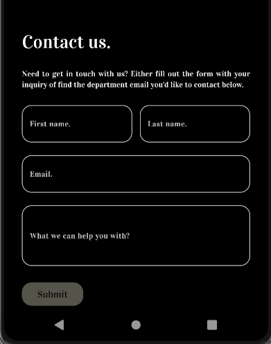
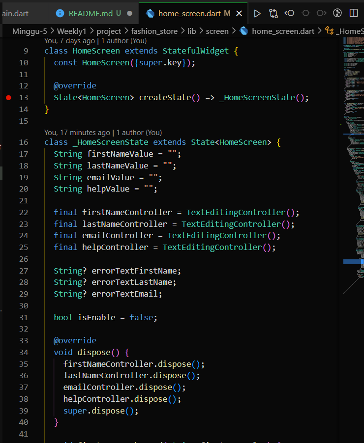

# Praktikum

# Code Competence 1

Saya membuat aplikasi bertema **Clothing Store** yang bernama &nbsp;`FashionHub`

1. **Buatlah header pada application kalian dengan memiliki (Text atau Logo)**

    Header saya buat logo sendiri dan saya letakkan di bagian atas &nbsp;`HomeScreen`&nbsp;.

    **Hasil Source Code :**
    
    

     

    **Hasil UI :**

    

      

2. **Jika dilakukan scroll, maka akan terdapat welcome section halaman kalian. Dan buatlah beberapa hal
Welcome section (terdapat gambar dan kata-kata yang menarik user)**

    Welcome section saya membuat dalam bentuk widget &nbsp;`PageView`&nbsp; yang berisi gambar-gambar yang menarik dalam &nbsp;`Image.asset`&nbsp; yang disusun bertumpuk dengan di atasnya terdapat kata-kata yang menarik juga dalam widget &nbsp;`Text`&nbsp;.

    

    Untuk membuatnya lebih menarik, saya tambahkan sedikit animasi pada &nbsp;`PageView`&nbsp; dengan menggunakan controller &nbsp;`_pageController`&nbsp; dan diberikan durasi untuk berpindah page tiap 5 detik otomatis dengan menggunakan &nbsp;`Timer.periodic`&nbsp;.

    

    Dan itu welcome section ini disimpan dalam bentuk widget component dan diberi nama &nbsp;`PageViewComponent`&nbsp;. Kemudian, dipanggil di &nbsp;`HomeScreen`&nbsp;.

    

    **Hasil UI :**

    

      

3. Masih pada halaman yang sama. Jika dilakukan scroll makan akan terdapat section contact us dengan kriteria dari aplikasi adalah sebagai berikut:  
a. Memiliki 3 buat form(username bertime text, email bertime email, message bertipe text area)  
b. Memiliki button submit.  
c. (Optional) Jika kita menekan tombol submit maka keluar alert yang berisikan data yang kita masukkan pada form.

    Pertama, saya membuat textfield menjadi widget component yang diberi nama &nbsp;`TextFieldComponent`&nbsp;.

    

    Kemudian, widget dipanggil pada &nbsp;`HomeScreen`&nbsp; untuk membuat 4 textfield nantinya yang terdiri dari :

    1. First Name
       

    2. Last Name
       

    3. Email 
       

    4. Help
       

    **Hasil UI :**

    

     

    Setelah itu, untuk membuat validatornya saya mendeklarasikan field untuk value dari tiap-tiap textfield nya, &nbsp;`controller`&nbsp;, beserta &nbsp;`errorText`&nbsp;nya yang tiap-tiap textfield beda aturannya. 

    

    Berikut merupakan `validator` dari beberapa textfield :
    1. **First Name `validator`**  
       `Validator` ini berfungsi untuk membuat agar user tidak mengisi First Name `TextField` dengan angka atau karakter lainnya. Sehingga ketika user mengetik yang tidak sesuai dengan kriteria, maka `TextField` akan langsung mendeteksi adanya kesalahan dengan &nbsp;`onChanged`&nbsp; dan akan memunculkan &nbsp;`errorText`&nbsp; berupa 'Woops! No special characters or numbers..'.

       

       **Hasil UI :**

    2. **Last Name `validator`**  
       `Validator` ini kurang lebih sama dengan First Name `validator`, menggunakan propeti &nbsp;`onChanged`&nbsp; dan akan memunculkan &nbsp;`errorText`&nbsp; berupa 'Woops! No special characters or numbers..'.

       

    3. **Email `validator`**  
       Pada `validator` ini, saya menggunakan library &nbsp;`email_validator`&nbsp; sehingga untuk menggunakannya tinggal memanggil method &nbsp;`EmailValidator.validate(value)`&nbsp; yang kemudian &nbsp;`value`&nbsp; akan diisi dengan &nbsp;`value`&nbsp; dari &nbsp;`value`&nbsp; yang dikembalikan dari properti &nbsp;`onChanged`&nbsp; untuk dicek kriterianya sesuai atau tidak. Jika tidak sesuai kriteria, maka akan langsung memunculkan &nbsp;`errorText`&nbsp; berupa 'Please enter a valid email'.

       

    Setelah itu, &nbsp;`Button`&nbsp; submit akan terus menjadi &nbsp;`disable`&nbsp; jika salah satu dari field kosong atau mengeluarkan &nbsp;`errorText`&nbsp;. Ketika sudah memenuhi kriteria dan sudah diisi semua, baru &nbsp;`Button`&nbsp; submit mempunyai warna dan bisa ditekan.

    

 

**Hasil Akhir :**  

WELCOME SECTION

CONTACT US

 

Untuk melihat hasil projek selengkapnya, dapat klik [di sini](https://github.com/aryaptradji/flutter_Muhammad-Aryaputra-Adji/tree/master/Minggu-5/Weekly1/project)

       
