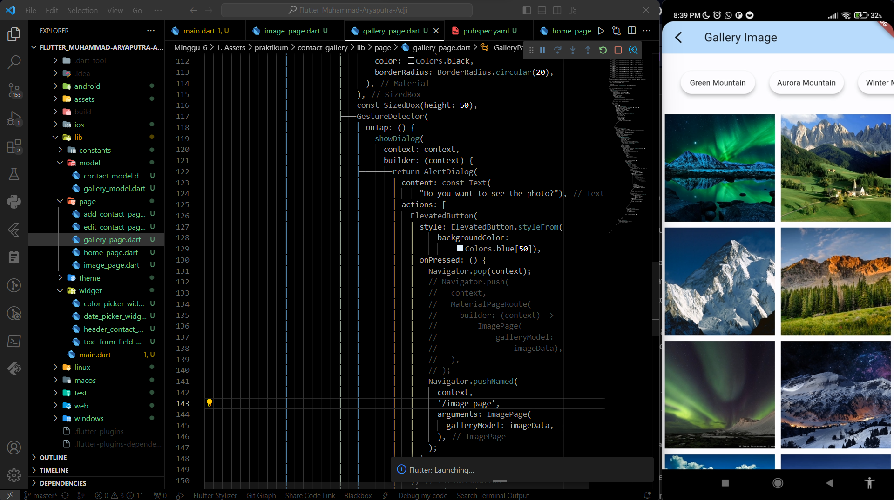
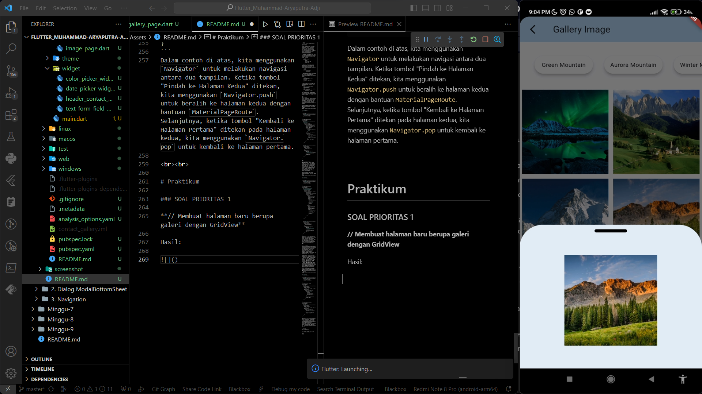
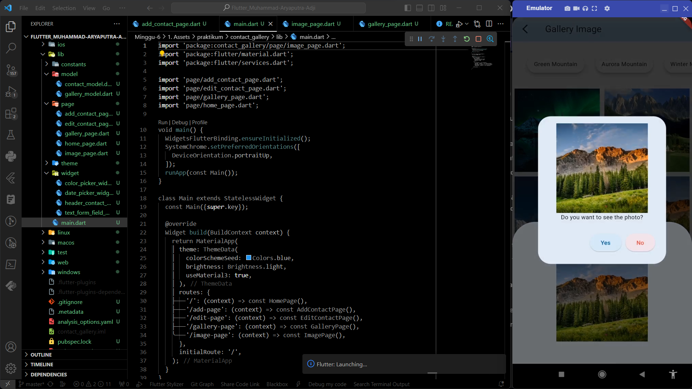
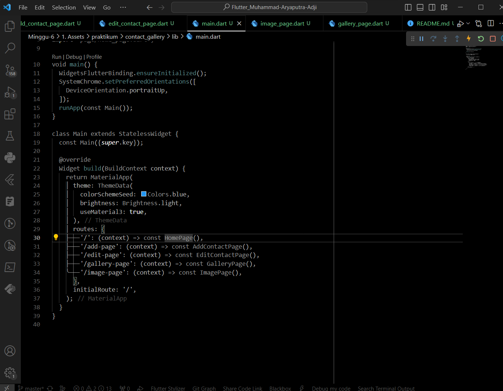
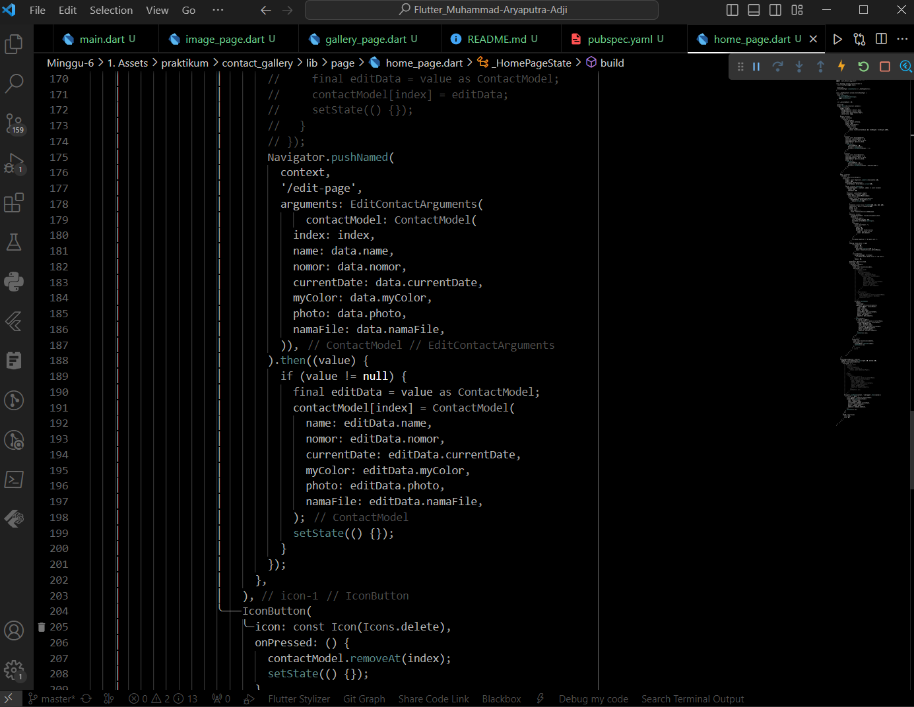
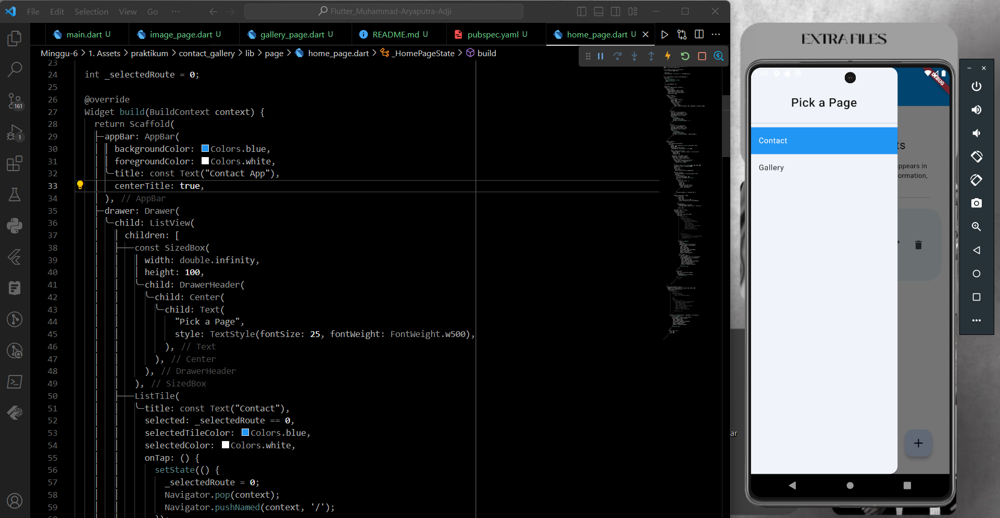
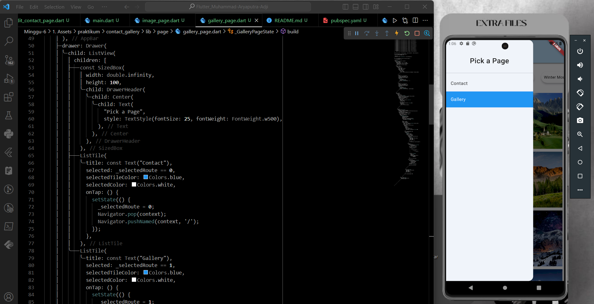
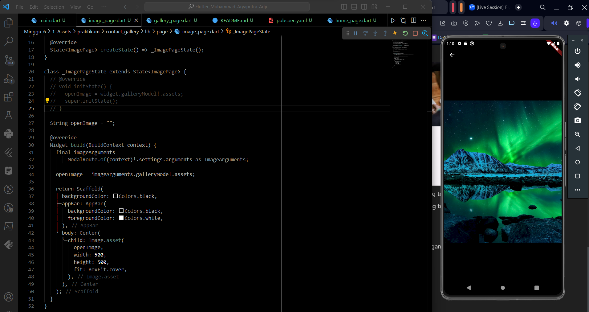

# Summary 

# Assets, Dialog, ModalBottomSheet, dan Navigation

### 1. Assets
Assets adalah file yang disertakan dalam proyek Flutter dan diakses selama runtime. Assets biasanya digunakan untuk meletakkan gambar, font, atau file konfigurasi yang diperlukan dalam aplikasi. Penggunaan assets membantu memisahkan konten statis dari kode aplikasi dan membuatnya mudah diakses.

Cara dan contoh penggunaannya:
1. Tambahkan berkas-berkas yang ingin disertakan ke dalam direktori `assets` di proyek Flutter. Direktori `assets` biasanya ditempatkan di tingkat root proyek. Misalnya:
    ```dart
    my_flutter_app/
    assets/
        images/
        sample_image.png
        fonts/
        my_font.ttf
    ```

2. Edit file `pubspec.yaml` untuk mengonfigurasi assets. Diperlukan menyertakan direktori assets dan menentukan path ke setiap berkas assets yang akan digunakan. Contohnya:
    ```dart
    flutter:
    assets:
        - assets/images/
        - assets/fonts/
    ```

3. Untuk mengakses berkas assets dalam kode Flutter, dapat menggunakan AssetImage untuk gambar atau TextStyle dengan font yang diletakkan di assets. Contoh:
    ```dart
    AssetImage('assets/images/sample_image.png')
    TextStyle(
    fontFamily: 'my_font',
    )
    ```

4. Dalam tampilan, dapat menggunakan widget seperti Image.asset atau Text untuk menggunakan assets ini dalam aplikasi :
    ```dart
    Image.asset('assets/images/sample_image.png')
    Text(
    'Contoh teks dengan font assets',
    style: TextStyle(
        fontFamily: 'my_font',
    ),
    ```
Dan jika menggunakan VSCode terdapat extensions yang dapat memudahkan dalam pembuatan assets, yaitu &nbsp;`Flutter Assets Gen`&nbsp;.

<br>

### 2. Dialog
Dialog adalah sebuah komponen UI yang muncul sebagai jendela pop-up untuk berinteraksi dengan pengguna. Dialog dapat berisi pesan, pilihan, input, atau konten kustom, dan digunakan untuk situasi di mana kita perlu mendapatkan respons atau tindakan dari pengguna.

Contoh penggunaannya ketika ingin menggunakan Widget &nbsp;`AlertDialog`&nbsp; untuk menampilkan pesan kepada pengguna:
```dart
import 'package:flutter/material.dart';

void main() {
  runApp(MyApp());
}

class MyApp extends StatelessWidget {
  @override
  Widget build(BuildContext context) {
    return MaterialApp(
      home: MyHomePage(),
    );
  }
}

class MyHomePage extends StatelessWidget {
  void _showAlertDialog(BuildContext context) {
    showDialog(
      context: context,
      builder: (BuildContext context) {
        return AlertDialog(
          title: Text('Konfirmasi'),
          content: Text('Apakah Kita yakin ingin melanjutkan?'),
          actions: <Widget>[
            TextButton(
              onPressed: () {
                Navigator.of(context).pop();
              },
              child: Text('Batal'),
            ),
            TextButton(
              onPressed: () {
                // Tindakan yang akan diambil jika pengguna mengonfirmasi
                Navigator.of(context).pop(); // Tutup dialog
              },
              child: Text('Ya'),
            ),
          ],
        );
      },
    );
  }

  @override
  Widget build(BuildContext context) {
    return Scaffold(
      appBar: AppBar(
        title: Text('Contoh AlertDialog'),
      ),
      body: Center(
        child: ElevatedButton(
          onPressed: () {
            _showAlertDialog(context);
          },
          child: Text('Tampilkan AlertDialog'),
        ),
      ),
    );
  }
}
```

<br>

### 3. ModalBottomSheet
`ModalBottomSheet` adalah sebuah widget dalam Flutter yang digunakan untuk menampilkan konten tambahan di bawah tampilan utama aplikasi dalam sebuah modal. Ini sering digunakan untuk menampilkan menu, filter, atau tindakan lainnya yang relevan dengan konten di layar. `ModalBottomSheet` muncul sebagai jendela kecil yang menutupi sebagian layar dan memungkinkan pengguna berinteraksi dengan konten tambahan.

Contoh penggunaan Widget &nbsp;`ModalBottomSheet`&nbsp; untuk menampilkan beberapa opsi dalam sebuah menu:
```dart
import 'package:flutter/material.dart';

void main() {
  runApp(MyApp());
}

class MyApp extends StatelessWidget {
  @override
  Widget build(BuildContext context) {
    return MaterialApp(
      home: MyHomePage(),
    );
  }
}

class MyHomePage extends StatelessWidget {
  void _showModalBottomSheet(BuildContext context) {
    showModalBottomSheet(
      context: context,
      builder: (BuildContext context) {
        return Container(
          child: Column(
            mainAxisSize: MainAxisSize.min,
            children: <Widget>[
              ListTile(
                leading: Icon(Icons.camera),
                title: Text('Ambil Gambar'),
                onTap: () {
                  // Tindakan yang akan diambil ketika "Ambil Gambar" dipilih
                  Navigator.pop(context);
                },
              ),
              ListTile(
                leading: Icon(Icons.photo),
                title: Text('Pilih Gambar dari Galeri'),
                onTap: () {
                  // Tindakan yang akan diambil ketika "Pilih Gambar dari Galeri" dipilih
                  Navigator.pop(context);
                },
              ),
            ],
          ),
        );
      },
    );
  }

  @override
  Widget build(BuildContext context) {
    return Scaffold(
      appBar: AppBar(
        title: Text('Contoh ModalBottomSheet'),
      ),
      body: Center(
        child: ElevatedButton(
          onPressed: () {
            _showModalBottomSheet(context);
          },
          child: Text('Tampilkan Modal'),
        ),
      ),
    );
  }
}
```
Dalam contoh di atas, dapat dilihat bahwa `showModalBottomSheet` untuk menampilkan `ModalBottomSheet`. Ketika tombol "Tampilkan Modal" ditekan, modal akan muncul, dan pengguna dapat memilih antara opsi "Ambil Gambar" atau "Pilih Gambar dari Galeri." Sesuai dengan pilihan pengguna dapat menentukan tindakan yang sesuai.

<br>

### 4. Navigation

Navigation dalam Flutter merujuk pada perpindahan antara layar atau tampilan dalam aplikasi. Ini adalah bagian kunci dari pembuatan aplikasi yang memiliki beberapa tampilan atau halaman yang berbeda. Flutter menyediakan beragam cara untuk mengelola navigasi, termasuk penggunaan &nbsp;`Navigator`&nbsp; dan berbagai widget yang mendukung navigasi.

Navigasi dalam Flutter adalah cara berpindah antara tampilan atau halaman dalam aplikasi. Ada 3 konsep utama:
1. Navigator: &nbsp;`Navigator`&nbsp; adalah kelas yang digunakan untuk mengelola tumpukan tampilan dalam aplikasi. Untuk penerapannya, dapat digunakan &nbsp;`Navigator`&nbsp; untuk menambah, menghapus, atau mengganti tampilan.
2. Route: &nbsp;`Route`&nbsp; adalah tampilan atau halaman dalam aplikasi. Untuk melakukannya, dapat dibuat rute kustom sendiri atau menggunakan widget seperti &nbsp;`MaterialPageRoute`&nbsp; untuk mengelola perpindahan antara halaman.

Contoh penerapan Navigation dengan menggunakan Widget &nbsp;`Navigator`&nbsp; dan &nbsp;`MaterialPageRoute`&nbsp; untuk melakukan navigasi antara 2 tampilan: 
```dart
import 'package:flutter/material.dart';

void main() {
  runApp(MyApp());
}

class MyApp extends StatelessWidget {
  @override
  Widget build(BuildContext context) {
    return MaterialApp(
      home: FirstScreen(),
    );
  }
}

class FirstScreen extends StatelessWidget {
  @override
  Widget build(BuildContext context) {
    return Scaffold(
      appBar: AppBar(
        title: Text('Halaman Pertama'),
      ),
      body: Center(
        child: ElevatedButton(
          onPressed: () {
            Navigator.push(
              context,
              MaterialPageRoute(builder: (context) => SecondScreen()),
            );
          },
          child: Text('Pindah ke Halaman Kedua'),
        ),
      ),
    );
  }
}

class SecondScreen extends StatelessWidget {
  @override
  Widget build(BuildContext context) {
    return Scaffold(
      appBar: AppBar(
        title: Text('Halaman Kedua'),
      ),
      body: Center(
        child: ElevatedButton(
          onPressed: () {
            Navigator.pop(context);
          },
          child: Text('Kembali ke Halaman Pertama'),
        ),
      ),
    );
  }
}
```
Dalam contoh di atas, kita menggunakan `Navigator` untuk melakukan navigasi antara dua tampilan. Ketika tombol "Pindah ke Halaman Kedua" ditekan, kita menggunakan `Navigator.push` untuk beralih ke halaman kedua dengan bantuan `MaterialPageRoute`. Selanjutnya, ketika tombol "Kembali ke Halaman Pertama" ditekan pada halaman kedua, kita menggunakan `Navigator.pop` untuk kembali ke halaman pertama.

<br><br>

# Praktikum 

### SOAL PRIORITAS 1

**// Membuat halaman baru berupa galeri dengan GridView**

Hasil:  



<br>

**// Menampilkan gambar pada ModalBottomSheet saat gambar ditekan**

Hasil:



<br>

**// Menampilkan gambar pada Dialog dan pilihan ya atau tidak pada Dialog**

Hasil:



<br><br>

### SOAL PRIORITAS 2

**// Modifikasi navigasi aplikasi dengan menggunakan routes**

1. Diawali dengan mendaftarkan routes pada &nbsp;`MaterialApp`&nbsp;
   
   

<br>

2. Berpindah halaman dan mengirimkan datanya menggunakan &nbsp;`Navigator.pushNamed`
   
   

<br>

**// Menggunakan drawer dan berfungsi untuk berpindah halaman**

Menambahkan properti &nbsp;`drawer`&nbsp; pada widget &nbsp;`Scaffold`&nbsp;


*Hasil:





<br>

**// Pada halaman baru, menampilkan gambar yang dipilih**

Gambar ditampilkan pada halaman &nbsp;`ImagePage`

*Hasil: 



<br>

Untuk melihat hasil praktikum, dapat klik [di sini](https://github.com/aryaptradji/flutter_Muhammad-Aryaputra-Adji/tree/master/Minggu-6/1.%20Assets/praktikum)