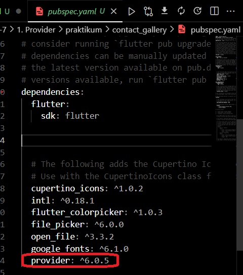
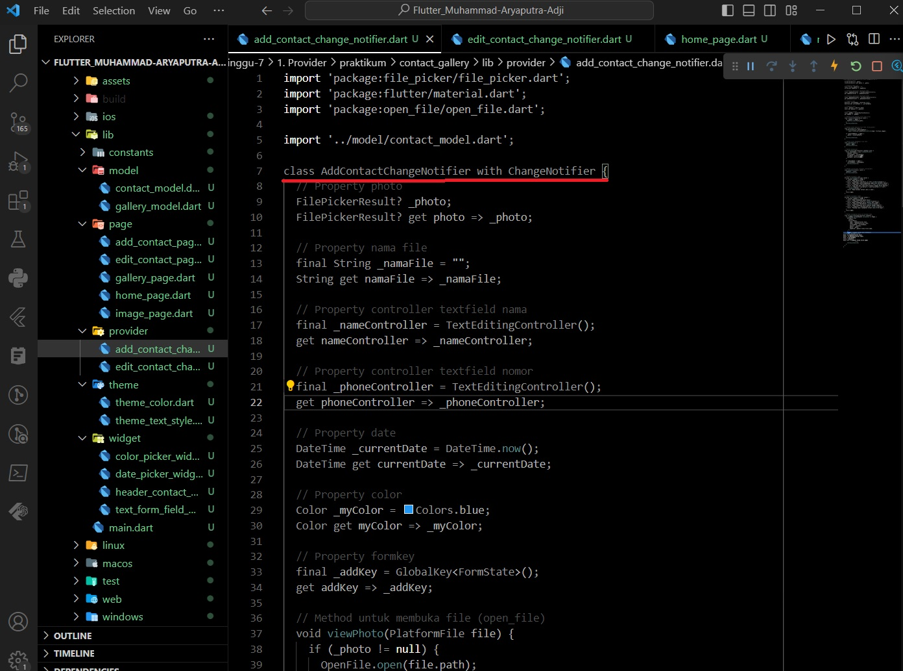
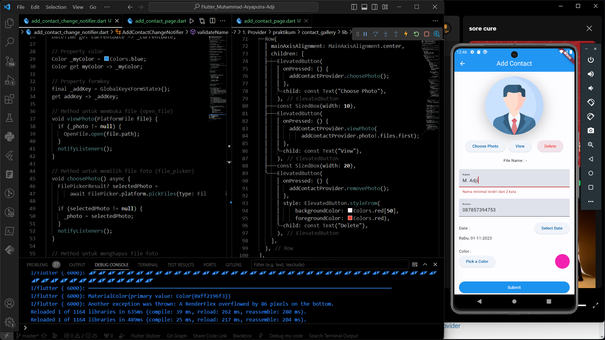
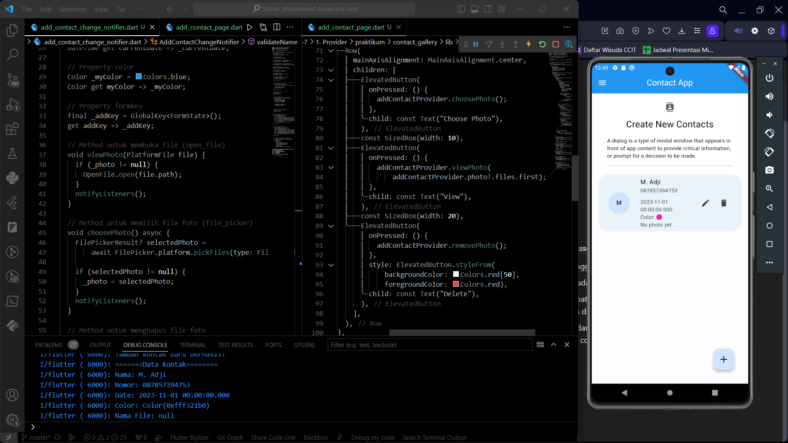
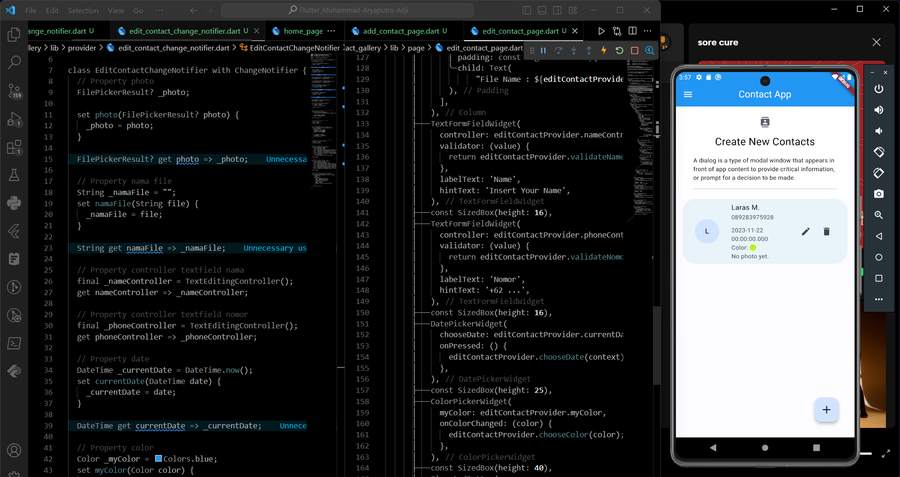
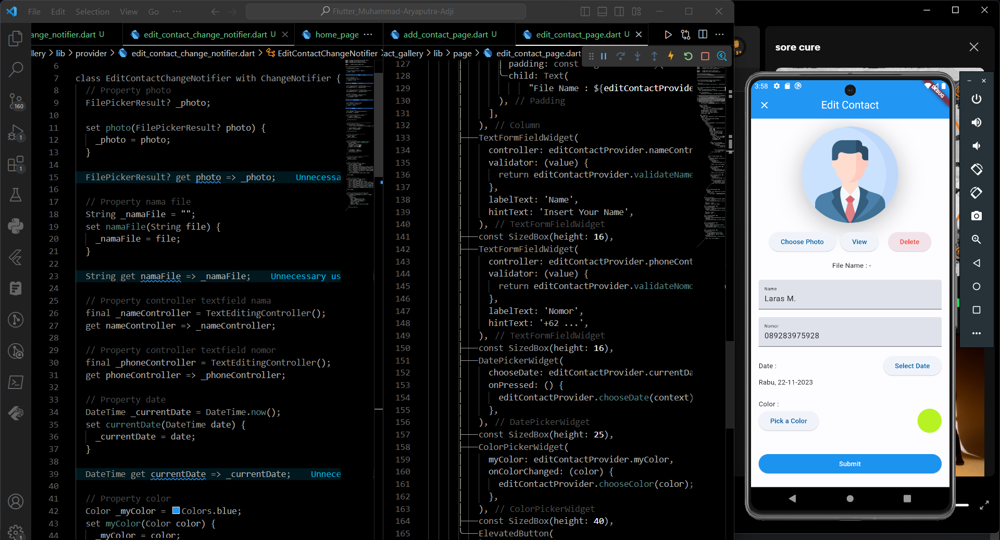

# Documentation 

# Provider (State Management)

Provider adalah sebuah library di Flutter yang digunakan untuk manajemen keadaan (state management). Dengan menggunakan Provider, Kita dapat dengan mudah membagikan dan mengakses data atau keadaan yang diperlukan dalam seluruh aplikasi Kita. Ini adalah salah satu metode yang umum digunakan dalam mengelola keadaan aplikasi Flutter.

Tujuan utama dari penggunaan &nbsp;`provider`&nbsp; ini adalah untuk memisahkan antara tampilan (UI) dengan Logic dari dalam projek Flutter itu sendiri.

Ada beberapa langkah yang biasanya dilakukan untuk penggunaan &nbsp;`provider`&nbsp;:

**1. Tambahkan library &nbsp;`provider`&nbsp; ke dalam depedencies**

```dart
dependencies:
provider: ^6.0.5
```

Seperti pada file &nbsp;`pubspec.yaml`&nbsp; saya :



<br>

**2. Membuat class dengan &nbsp;`ChangeNotifier` pada file tersendiri**

File ini akan berisi properti-properti, method-method, maupun widget-widget yang di dalamnya terdapat logic. Seperti saya membuat class Provider untuk halaman &nbsp;`AddContactPage`&nbsp; dan juga halaman &nbsp;`EditContactPage`&nbsp;.

Class &nbsp;`provider`&nbsp; untuk halaman &nbsp;`AddContactPage`&nbsp; :



Class &nbsp;`provider`&nbsp; untuk halaman &nbsp;`EditContactPage`&nbsp; :


<br>

**3. Mendaftarkan class-class &nbsp;`provider`&nbsp; tersebut di dalam Widget &nbsp;`runApp()`**

Ketika mendaftarkan class-class, jangan lupa juga untuk import library dari &nbsp;`provider`

'")

<br>

**4. Memasukkan properti-properti dari class &nbsp;`provider`&nbsp; ke dalam file**

Sebelum memasukkan properti, widget, maupun method dari class &nbsp;`provider`&nbsp; ke dalam file pastikan sudah import file &nbsp;`provider`&nbsp;nya.

Kemudian, diawali dengan membuat objek dari class &nbsp;`provider`&nbsp; yang berisi:
```dart
// build(BuildContext context)
namaObjekProvider = Provider.of<namaClassProvider>(context);
```

Setelah itu, memasukkan properti dll nya melalui objek yang sudah dibuat tadi.

Contoh membuat objek di halaman &nbsp;`AddContactPage`&nbsp; :


<br><br>

# Hasil Praktikum

Mengimplementasikan State Management berupa Provider ke dalam projek tugas Assets, Dialog Bottomsheet, Navigation

**// Penggunaan &nbsp;`provider`&nbsp; pada &nbsp;`AddContactPage`**




<br>

**// Penggunaan &nbsp;`provider`&nbsp; pada &nbsp;`EditContactPage`**






<br>

Untuk melihat hasil praktikum, dapat klik [di sini](https://github.com/aryaptradji/flutter_Muhammad-Aryaputra-Adji/tree/master/Minggu-7/1.%20Provider/praktikum)