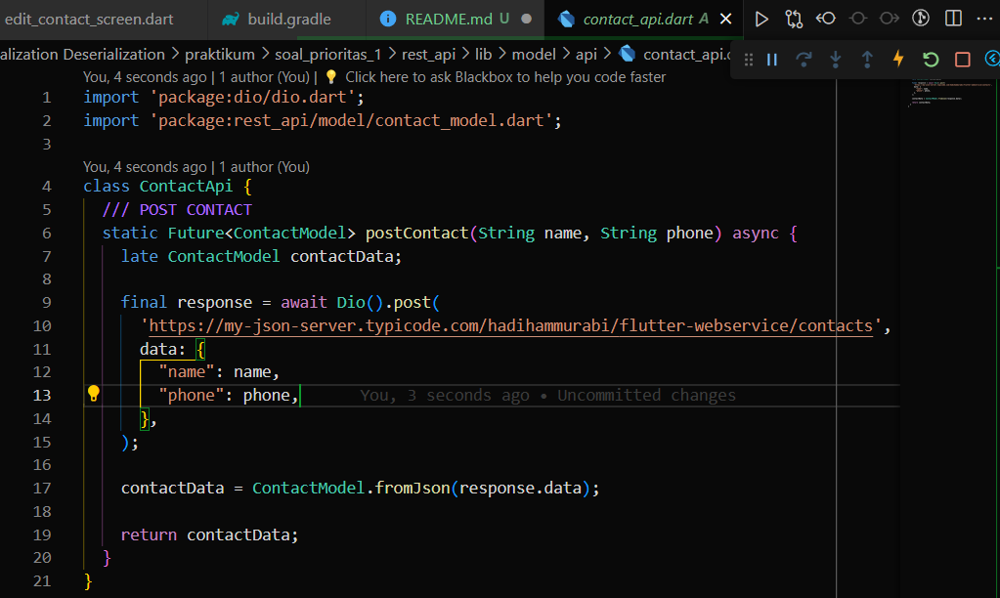

# Summary

# Intro REST API - JSON Serialization/Deserialization

### Apa itu REST API?

REST API (Representational State Transfer Application Programming Interface) merupakan jenis antarmuka pemrograman aplikasi berbasis web yang memungkinkan sistem perangkat lunak untuk saling berkomunikasi. Dalam konteks pengembangan aplikasi Flutter, REST API digunakan untuk mengambil data dari server dan melakukan operasi seperti penambahan, pembaruan, atau penghapusan data. Aplikasi Flutter dapat berinteraksi dengan REST API menggunakan permintaan HTTP seperti GET (mengambil data), POST (mengirim data), PUT (memperbarui data), dan DELETE (menghapus data). Data yang ditukar umumnya dalam format JSON atau XML. Integrasi REST API memungkinkan aplikasi Flutter untuk terhubung dengan server, mendapatkan informasi, dan menampilkan data secara dinamis dalam aplikasi.

<br>

### Metode-Metode 

Berikut adalah penjelasan penerapan REST API berdasarkan metode yang biasa digunakan dalam mengambil dan mengolah data, yaitu `POST`&nbsp;, `GET`&nbsp;, `PUT`&nbsp;, dan `DELETE`&nbsp; :

1. `GET`&nbsp;: Metode GET digunakan untuk mengambil data dari server. Dalam penerapan REST API, permintaan GET dapat digunakan untuk mengambil daftar kontak, artikel, atau informasi lainnya dari server. Data yang diterima kemudian dapat diolah dan ditampilkan dalam aplikasi.

2. `POST`&nbsp;p: Metode POST digunakan untuk mengirim data baru ke server. Dalam konteks REST API, penggunaan metode POST dapat terjadi saat pengguna menambahkan entri baru, misalnya menambahkan kontak baru ke dalam daftar. Data yang dimasukkan oleh pengguna kemudian dikirim ke server melalui REST API menggunakan metode POST.

3. `PUT`&nbsp;: Metode PUT digunakan untuk memperbarui data yang sudah ada di server. Dalam implementasi REST API, metode PUT dapat digunakan untuk memperbarui informasi kontak yang sudah ada, seperti mengubah nomor telepon atau alamat email seseorang dalam daftar kontak.

4. `DELETE`&nbsp;: Metode DELETE digunakan untuk menghapus data dari server. Dalam konteks REST API, penggunaan metode DELETE dapat terjadi saat pengguna ingin menghapus entri kontak dari daftar. Permintaan DELETE dikirim ke server melalui REST API untuk menghapus entri yang dipilih.

Penerapan metode-metode ini memungkinkan aplikasi untuk berinteraksi dengan server secara dinamis, melakukan operasi CRUD (Create, Read, Update, Delete) pada data, dan memperoleh respons dari server untuk ditampilkan kepada pengguna. Dengan menggunakan REST API, pengembang dapat membangun aplikasi yang terhubung dengan sumber daya eksternal dan menyediakan pengalaman pengguna yang responsif dan interaktif.

<br>

### Menggunakan Library `Dio`

`Dio`&nbsp; adalah salah satu library dari [pub.dev](https://pub.dev/packages/dio) yang memungkinkan pengguna untuk melakukan permintaan HTTP seperti GET, POST, PUT, dan DELETE ke server REST API.

Dalam konteks penerapan REST API, Dio memungkinkan pengguna untuk melakukan berbagai operasi seperti mengirimkan data pengguna baru ke server (metode POST), mengambil data pengguna dari server (metode GET), mengupdate data pengguna di server (metode PUT), dan menghapus data pengguna dari server (metode DELETE).

Berikut adalah contoh dan kode dalam penerapan REST API menggunakan metode-metode tersebut dengan menggunakan library `Dio`&nbsp;:

1. `POST`  
   **Contoh:** Mengirimkan data pengguna baru ke server  
   **Source Code:**  
    ```dart
    import 'package:dio/dio.dart';

    void main() async {
        Dio dio = Dio();
        String url = 'https://api.example.com/users';

        Map<String, dynamic> userData = {
            'name': 'John Doe',
            'email': 'johndoe@example.com',
            'password': 'password123',
        };

        try {
            Response response = await dio.post(url, data: userData);
            print(response.data);
        } catch (error) {
            print('Error: $error');
        }
    }
    ```

2. `GET`  
   **Contoh:** Mengambil data pengguna dari server  
   **Source Code:**
    ```dart
    import 'package:dio/dio.dart';

    void main() async {
        Dio dio = Dio();
        String url = 'https://api.example.com/users';

        try {
            Response response = await dio.get(url);
            print(response.data);
        } catch (error) {
            print('Error: $error');
        }
    }
    ```

3. `PUT`  
   **Contoh:** Mengupdate data pengguna di server  
   **Source Code:**
```dart
import 'package:dio/dio.dart';

void main() async {
    Dio dio = Dio();
    String url = 'https://api.example.com/users/1';

    Map<String, dynamic> updatedUserData = {
        'name': 'John Doe',
        'email': 'johndoe@example.com',
        'password': 'newpassword123',
    };

    try {
        Response response = await dio.put(url, data: updatedUserData);
        print(response.data);
    } catch (error) {
        print('Error: $error');
    }
}
```

4. `DELETE`  
   **Contoh:** Menghapus data pengguna dari server  
   **Source Code:**
```dart
import 'package:dio/dio.dart';

void main() async {
    Dio dio = Dio();
    String url = 'https://api.example.com/users/1';

    try {
        Response response = await dio.delete(url);
        print(response.data);
    } catch (error) {
        print('Error: $error');
    }
}
```

Dengan menggunakan library `Dio`&nbsp;, pengguna dapat dengan mudah mengimplementasikan permintaan HTTP ke server REST API dan mengelola responsenya. Semoga penjelasan ini dapat membantu! Jika ada pertanyaan lebih lanjut, jangan ragu untuk bertanya.

<br><br>

# Praktikum

### SOAL PRIORITAS 1

- Menggunakan file projek &nbsp;`Contact App`&nbsp; dengan menambahkan folder &nbsp;`api` di dalam folder &nbsp;`model`&nbsp; sehingga mempunyai struktur folder seperti ini:  
  
  

- Menggunakan State Management Provider dan MVVM
  
<br>

**// Soal 1: Lakukan POST request dengan menggunakan DIO untuk mengirimkan data contact! gunakan url pada slide 12**

***Source Code:** 




- Membuat class &nbsp;`Contact API`&nbsp; untuk menampung response data API dari [https://my-json-server.typicode.com/hadihammurabi/flutter-webservice/contacts](https://my-json-server.typicode.com/hadihammurabi/flutter-webservice/contacts)

- Melakukan metode POST dengan membuat suatu method static yang akan menampung nilai &nbsp;`Future`&nbsp; dengan tipe objek class &nbsp;`ContactModel`&nbsp; dengan code :
    ```dart
    Dio().post(<url>, <data>)
    // url: link api 
    // data: request body bertipe json
    ```

- Data yang diterima dari method POST tadi akan bersifat &nbsp;`dynamic`&nbsp; yang kemudian akan diconvert menjadi bertipe objek class &nbsp;`ContactModel`&nbsp;menggunakan named constructor &nbsp;`ContactModel.fromJson()`&nbsp; dari class &nbsp;`ContactModel`

- Menerapkannya pada bagian ADD CONTACT lebih tepatnya pada method ketika mengirimkan data dari &nbsp;`AddContactScreen`&nbsp; ke &nbsp;`HomeScreen`&nbsp;
  
  .png "Menerapkan method POST pada method sendNewContactData()")

  .png "Method sendNewContactData() yang digunakan pada widget Button 'Submit'")

<br>

***Output:**  
**CONSOLE LOG**


**UI**


<br>

**// Soal 2: Mengubah bentuk JSON berikut kedalam bentuk Object dari suatu class**

***Source Code:**  


- Membuat class &nbsp;`ContactModel`&nbsp; untuk convert response data dari API nantinya menjadi objek class &nbsp;`ContactModel`&nbsp; dengan menggunakan named constructor &nbsp;`ContactModel.fromJson()`&nbsp;

***Output:**


<br>

**// Soal 3: Lakukan PUT request dengan menggunakan `DIO`**

- Membuat class &nbsp;`JsonPlaceholderApi`&nbsp; untuk menampung berbagai macam proses request dan response API
  
  

- Membuat method &nbsp;`putContact()`&nbsp; untuk melakukan request ke API [https://jsonplaceholder.typicode.com/posts/1](https://jsonplaceholder.typicode.com/posts/1) dengan method PUT yang kemudian diterima dan diubah bentuknya ke dalam objek class &nbsp;`JsonPlaceholderModel` dan akan dikembalikan nilainya

- Method &nbsp;`putContact()` ini akan dipanggil di &nbsp;`EditContactViewModel`&nbsp;, lebih tepatnya pada method di &nbsp;`Button Submit`
  
  .png "Penerapan method PUT di button submit EditContactScreen")

- Ketika &nbsp;`Button Submit`&nbsp; ditekan maka &nbsp;`title`&nbsp; akan berubah menjadi &nbsp;`foo`&nbsp; dan &nbsp;`body`&nbsp; akan berubah menjadi &nbsp;`bar`
  
- **Sebelum Edit**  
  Menekan tombol edit untuk pergi ke halaman edit (Lionel Messi yang diedit kontaknya)
  
  
- **Sedang Edit**  
  Menekan tombol submit akan langsung mengubah &nbsp;`title`&nbsp; menjadi &nbsp;`foo`&nbsp; dan &nbsp;`body`&nbsp; menjadi &nbsp;`bar` sesuai data yang dari API
  

- **Setelah Edit**  
  Tampilan nama kontak berubah dan ada notifikasi SnackBar kalau edit kontak berhasil
  

- **Output:**  
  Muncul juga data yang didapat dari method PUT berupa &nbsp;`id`
  

<br><br>

### SOAL PRIORITAS 2 & EKSPLORASI

**// Membuat Aplikasi Image Generator dari DiceBear API**

*Kriteria:
1. Buatlah sebuah aplikasi untuk menampilkan gambar berdasarkan teks yang dimasukkan oleh user
2. Gambar diambil melalui mekanisme data fetching ke DiceBear API
3. Ketika tombol generate ditekan. Maka gambar ditampilkan

<br>

Langkah-langkah yang saya lakukan:
- Membuat projek baru bernama &nbsp;`dicebear`&nbsp; dengan struktur folder sebagai berikut:
  
  
  
- Menggunakan State Management BLoC yang diletakkan di dalam folder &nbsp;`screen`
  
- Membuat class &nbsp;`DiceBearServices`&nbsp; untuk melakukan proses request ke API [https://api.dicebear.com/7.x/thumbs/svg](https://api.dicebear.com/7.x/thumbs/svg) dengan method GET
  
  

   Method static &nbsp;`getDiceBear()`&nbsp; akan melakukan return value berupa tipe class generik sehingga ketika diambil nilainya tidak harus langsung sesuai tipe datanya (tidak hardcode)

- Class &nbsp;`DiceBearEvent`
  
  

  Berisi class &nbsp;`GetDiceBearEvent`&nbsp; yang akan berfungsi untuk memanggil nilai dari API dengan menampung nilai inputan dari user yang disimpan dalam field &nbsp;`avatarName`

- Class &nbsp;`DiceBearState`
  
  

  1. Class &nbsp;`DicebearInitial`&nbsp; akan menjadi state pertama dari tiap-tiap widget ketika semua widget pertama kali build
  2. Class &nbsp;`DiceBearLoadingState`&nbsp; menjadi state pertama kali yang dipanggil ketika event pertama kali ditrigger untuk memunculkan animasi loading
  3. Class &nbsp;`DiceBearLoadedSuccess`&nbsp; menjadi state ketika request data API berhasil dan mempunyai 2 nilai, yaitu &nbsp;`diceBearImage`&nbsp; untuk menampung data image dari API dan &nbsp;`snackBarMessage`&nbsp; untuk menampung data message dari snackbar
  4. Class &nbsp;`DiceBearLoadedFailed`&nbsp; menjadi state ketika request data API gagal yang mempunyai 1 nilai, yaitu &nbsp;`messageError`&nbsp; untuk menampung data message untuk snackbar

- Class &nbsp;`DiceBearBloc`
  
  

  Ketika &nbsp;`DiceBearEvent`&nbsp; ditrigger, maka akan terjadi 4 state:
  1. Pertama, dipanggil state &nbsp;`DiceBearLoadingState`
  2. Kemudian, akan dilakukan pemanggilan data API dengan menggunakan method &nbsp;`getDiceBear`&nbsp; dengan tipe generik String dari class &nbsp;`DiceBearServices`&nbsp; yang parameternya akan diisi dengan field &nbsp;`avatarName`&nbsp; dari event &nbsp;`GetDiceBearEvent`&nbsp; tadi yang disimpan disebuah variable &nbsp;`diceBearImage`&nbsp; bertipe &nbsp;`Future.delayed`
  3. Jika berhasil, maka akan dipanggil state &nbsp;`DiceBearLoadedSuccess`&nbsp; dengan field &nbsp;`snackBarMessage`&nbsp; diisi dengan nilai String &nbsp;`'Avatar Changed Successfully!'`&nbsp; dan field &nbsp;`diceBearImage`&nbsp; diisi dengan variable &nbsp;`diceBearImage`&nbsp; tadi yang berisi data dari API
  4. Jika gagal, maka akan dipanggil state &nbsp;`DiceBeaerLoadedFailed`&nbsp; dengan field &nbsp;`messageError`&nbsp; akan diisi dengan nilai String &nbsp;`'Oops! Connection is lost'`

- Penerapan dari event &nbsp;`GetDiceBearEvent`&nbsp; akan digunakan pada tombol &nbsp;`'GENERATE'`&nbsp; yang ketika ditekan akan mentrigger event tersebut
  
  

- Menggunakan &nbsp;`BlocBuilder`&nbsp; pada body dan mengolah state image dari &nbsp;`diceBearImage`
  
  

  1. State &nbsp;`DicebearInitial`&nbsp;: Menampilkan icon image
  2. State &nbsp;`DiceBearLoadingState`&nbsp;: Menampilkan animasi loading
  3. State &nbsp;`DiceBearLoadedSuccess`&nbsp;: Menampilkan gambar dalam bentuk SVG
  4. Selain 3 state itu, maka akan hanya menampilkan icon image saja

- Mengolah state dari widget &nbsp;`SnackBar`
  
  

  1. State &nbsp;`DiceBearLoadedSuccess`&nbsp;: Menampilkan &nbsp;`SnackBar`&nbsp; dengan nilai dari field &nbsp;`snackBarMessage`
  2. State &nbsp;`DiceBearLoadedFailed`&nbsp;: Menampilkan &nbsp;`SnackBar`&nbsp; dengan nilai dari field &nbsp;`messageError`

- Mengolah state dari button &nbsp;`'GENERATE'`
  
  

  1. State &nbsp;`DiceBearLoadingState`&nbsp;: Menampilkan Button yang di dalamnya terdapat Row yang berisi text &nbsp;`'GENERATE'`&nbsp; dan animasi loading
  2. Selain state itu, maka hanya menampilkan Button yang berisi text &nbsp;`'GENERATE'`

<br><br>

***Output:**  
**UI LOADING**


<br>

**UI SUCCESS**


<br>

**UI FAILED**


<br>

Untuk melihat hasil praktikum, dapat klik [di sini](https://github.com/aryaptradji/flutter_Muhammad-Aryaputra-Adji/tree/master/Minggu-8/1.%20JSON%20Serialization%20Deserialization/praktikum)