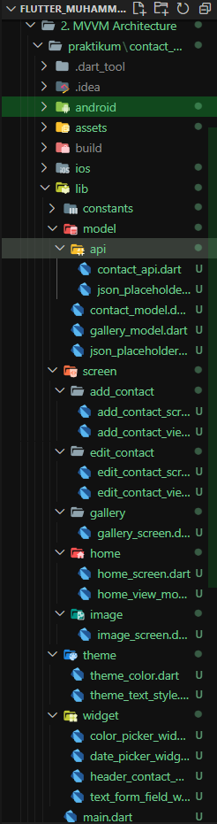

# Praktikum

# MVVM Architecture

MVVM (Model-View-ViewModel) adalah sebuah arsitektur perangkat lunak yang digunakan untuk mengorganisasi kode dalam sebuah aplikasi. MVVM terdiri dari tiga komponen utama: Model, View, dan ViewModel. Meskipun MVVM tidak spesifik untuk Flutter, konsep ini dapat diimplementasikan dalam pembangunan aplikasi Flutter.

Berikut adalah penjelasan singkat tentang setiap komponen MVVM dalam konteks Flutter:

1. **Model:**  
Representasi dari data dan logika bisnis aplikasi.
Model tidak memiliki ketergantungan pada View atau ViewModel. Ini berfungsi untuk mengelola dan menyediakan data yang diperlukan aplikasi.

2. **View:**  
Bertanggung jawab untuk menampilkan antarmuka pengguna (UI).
Tidak mengandung logika bisnis atau manipulasi data. Sebagai gantinya, View hanya menampilkan data yang diberikan oleh ViewModel.

3. **ViewModel:**  
Bertanggung jawab untuk menyediakan data dan logika presentasi yang dibutuhkan oleh View.
Menangani interaksi pengguna dan berkomunikasi dengan Model untuk mendapatkan atau memperbarui data.
Memastikan bahwa data yang diperoleh dari Model telah diubah ke format yang sesuai untuk ditampilkan oleh View.

 

Dalam konteks Flutter, implementasi MVVM sering melibatkan penggunaan:

1. **Model:** Kelas atau objek yang mewakili struktur data dan logika bisnis.
2. **View:** Widget Flutter yang menangani tampilan dan antarmuka pengguna.
3. **ViewModel:** Kelas yang memisahkan logika bisnis dari tampilan. Mungkin juga berisi state yang diperlukan oleh View.

  

# Praktikum

### SOAL PRIORITAS 1

**// Soal: Implementasikan penggunaan MVVM pada project Contacts yang telah dikerjakan**

**Hasil:**  
Struktur folder projek &nbsp;`contact_app`&nbsp; disusun berdasarkan &nbsp;`MVVM Architecture`&nbsp; dan State Management &nbsp;`Provider`

 

Untuk melihat hasil praktikum, dapat klik [di sini](https://github.com/aryaptradji/flutter_Muhammad-Aryaputra-Adji/tree/master/Minggu-8/2.%20MVVM%20Architecture/praktikum)