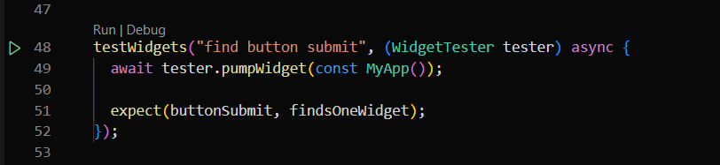
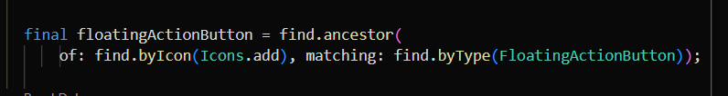

# Summary 

# UI Testing

UI testing, atau pengujian antarmuka pengguna (UI testing), adalah salah satu jenis pengujian perangkat lunak yang bertujuan untuk memastikan bahwa antarmuka pengguna (UI) dari suatu aplikasi berfungsi seperti yang diharapkan. Dalam konteks Flutter, UI testing mengacu pada pengujian antarmuka pengguna pada aplikasi Flutter.

Penting untuk menguji antarmuka pengguna karena UI adalah cara utama pengguna berinteraksi dengan aplikasi. Pengujian ini membantu memastikan bahwa elemen-elemen antarmuka pengguna, seperti tombol, input field, dan tata letak, berperilaku sesuai dengan desain dan fungsinya dengan benar.

Flutter menyediakan framework pengujian bawaan yang disebut &nbsp;`flutter_test`&nbsp; untuk memudahkan pengujian aplikasi. Dalam pengujian UI Flutter, biasanya menggunakan paket tes seperti &nbsp;`flutter_test`&nbsp; dan alat uji otomatis seperti &nbsp;`flutter driver`&nbsp; untuk mengotomatiskan interaksi dengan aplikasi dan memeriksa apakah aplikasi berperilaku dengan benar.

Berikut ini ada sedikit syntax yang saya pelajari:
### 1. testWidgets(description, callback)
Method untuk membuat suatu test case dengan parameter &nbsp;`description`&nbsp; untuk memberikan deskripsi mengenai apa yang mau ditest dan &nbsp;`callback`&nbsp; berupa suatu aynchronous function. Tiap test case wajib diberikan deskripsi yang jelas agar mudah dimengerti.

**Contoh:**
```dart
testWidgets('find email textfield', (tester) async {
    await tester.pumpWidget(const Login());

    final emailTextfield = find.byElementType(TextField);
    expect(emailTextfield , findsOneWidget);
});

testWidgets('find password textfield', (tester) async {
     await tester.pumpWidget(const Login());
    
     final passwordTextfield= find.byElementType(TextField);
     expect(passwordTextfield, findsOneWidget);
});
```

### 2. pumpWidget(widget)
Method untuk merender dan membangun widget dalam pohon widget yang sesuai dengan waktu yang telah ditentukan. Method ini mempunyai parameter &nbsp;`method`&nbsp; yang bisa diisi dengan widget apa yang ingin dirender 

**Contoh:**
```dart
testWidgets('Example Test', (WidgetTester tester) async {
  // Membuat widget dan merendernya
  await tester.pumpWidget(MyApp());
});
```
Dalam contoh ini, `pumpWidget` pertama kali digunakan untuk merender widget utama (`MyApp`). Kemudian, setelah beberapa perubahan pada widget, `pumpWidget` dipanggil lagi untuk memastikan tampilan telah diperbarui dengan benar.

### 3. tap(actual)
Method untuk mensimulasikan aksi sentuhan atau ketukan pada suatu widget.

**Contoh:**
```dart
testWidgets('Contoh Pengujian Tap', (WidgetTester tester) async {
  // Membuat widget dan merendernya
  await tester.pumpWidget(MyApp());

  // Menyimulasikan aksi tap pada widget dengan teks 'Press Button'
  await tester.tap(find.widgetWithText(ElevatedButton, 'Press Button'));

  // Memanggil pump untuk memperbarui tampilan setelah aksi tap
  await tester.pump();

  // Melakukan asert setelah aksi tap
  expect(find.text('Button Pressed'), findsOneWidget);
});
```
Dalam contoh di atas, metode `tap` digunakan untuk mensimulasikan aksi tap pada widget `ElevatedButton` yang memiliki teks 'Press Button'. Setelah aksi tap, metode `pump` dipanggil untuk memperbarui tampilan sesuai dengan perubahan yang terjadi. Kemudian, dilakukan asert menggunakan `expect` untuk memastikan bahwa setelah aksi tap, teks 'Button Pressed' muncul dalam antarmuka pengguna.

Metode `tap` sangat berguna dalam pengujian Flutter untuk mengotomatiskan interaksi pengguna dan memastikan bahwa aplikasi atau widget berperilaku seperti yang diharapkan selama pengujian.

### 4. enterText(finder, text)
Metode yang digunakan untuk mensimulasikan penggunaan keyboard dengan memasukkan teks ke dalam suatu widget input.

**Contoh:**
```dart
testWidgets('Contoh Pengujian Enter Text', (WidgetTester tester) async {
  // Membuat widget dan merendernya
  await tester.pumpWidget(MyApp());

  // Mensimulasikan memasukkan teks ke dalam widget dengan teks 'Username'
  await tester.enterText(find.widgetWithText(TextField, 'Username'), 'user123');

  // Memanggil pump untuk memperbarui tampilan setelah memasukkan teks
  await tester.pump();

  // Melakukan asert setelah memasukkan teks
  expect(find.text('user123'), findsOneWidget);
});
```
Dalam contoh di atas, metode `enterText` digunakan untuk mensimulasikan penggunaan keyboard dan memasukkan teks 'user123' ke dalam widget `TextField` yang memiliki teks 'Username'. Setelah memasukkan teks, metode `pump` dipanggil untuk memperbarui tampilan sesuai dengan perubahan yang terjadi. Kemudian, dilakukan asert menggunakan `expect` untuk memastikan bahwa teks 'user123' muncul dalam antarmuka pengguna setelah memasukkan teks.


### 3. expect(actual, matcher)
Method untuk mengevaluasi atau memverifikasi apakah suatu kondisi atau nilai yang diharapkan sesuai dengan yang sebenarnya. Terdapat 2 parameter, yaitu &nbsp;`actual`&nbsp; (Nilai aktual atau ekspresi yang diuji) seperti &nbsp;`find.text()`&nbsp; dan semacamnya (akan dijelaskan lebih lanjut), serta &nbsp;`matcher`&nbsp; untuk Pembanding atau predikat yang digunakan untuk memeriksa nilai &nbsp;`actual`&nbsp;.

**Contoh:**
```dart
testWidgets('Example Test', (WidgetTester tester) async {
  // Membuat widget dan merendernya
  await tester.pumpWidget(MyApp());

   // Melakukan asert atau pengujian terhadap widget
  expect(find.text('Hello World'), findsOneWidget);
});
```
Penggunaan `expect` membantu memastikan bahwa aplikasi atau kode yang diuji berperilaku sesuai dengan yang diharapkan, dan jika ada pelanggaran, kerangka kerja pengujian akan memberikan laporan tentang kesalahan tersebut.

### 4. find.text(String)
Method untuk memverifikasi keberadContoh:aan dan jumlah widget dengan teks tertentu dengan parameter berupa &nbsp;`String`&nbsp; text

**Contoh:**
```dart
testWidgets('Example Test', (WidgetTester tester) async {
  // Membuat widget dan merendernya
  await tester.pumpWidget(MyApp());

   // Melakukan asert atau pengujian terhadap widget
  expect(find.text('Hello World'), findsOneWidget);
  expect(find.text('Button Pressed!'), findsNothing);
});
```
Dalam contoh di atas, `find.text('Hello World')` digunakan untuk mencari widget yang memiliki teks 'Hello World', dan `find.text('Press Button')` digunakan untuk mencari widget yang memiliki teks 'Press Button'. Fungsi `find.text` ini biasanya digunakan bersamaan dengan fungsi `expect` untuk memberikan pernyataan asert atau klaim tentang perilaku yang diharapkan dari UI pada saat pengujian.

Penting untuk diingat bahwa metode `find.text` dapat digunakan bersamaan dengan berbagai matcher lainnya, seperti `findsOneWidget`, `findsNothing`, atau matcher kustom sesuai kebutuhan pengujian.

### 5. find.byType(type)
Method untuk mencari widget berdasarkan tipe (Type) widget tersebut dengan parameter &nbsp;`type`&nbsp; berupa tipe widget.

**Contoh:**
```dart
testWidgets('Contoh Pengujian', (WidgetTester tester) async {
  // Membuat widget dan merendernya
  await tester.pumpWidget(MyApp());

  // Mencari widget berdasarkan tipe widget tertentu
  expect(find.byType(MyCustomWidget), findsOneWidget);
  expect(find.byType(ElevatedButton), findsWidgets);
});
```
Dalam contoh di atas, `find.byType(MyCustomWidget)` digunakan untuk mencari widget yang merupakan instance dari kelas `MyCustomWidget`, dan `find.byType(ElevatedButton)` digunakan untuk mencari semua widget yang merupakan instance dari kelas `ElevatedButton`. Fungsi `find.byType` ini sering digunakan untuk memverifikasi keberadaan dan jumlah widget dengan tipe tertentu di dalam pohon widget selama pengujian UI.

Seperti halnya dengan fungsi pencarian lainnya dalam Flutter, metode `find.byType` juga dapat digunakan bersamaan dengan `matcher` seperti `findsOneWidget`, `findsNothing`, atau `matcher` kustom sesuai kebutuhan pengujian.

### 6. find.ancestor(of: {WidgetTarget}, matching: {Matcher})
Method untuk mencari widget leluhur (ancestor) dari suatu widget tertentu berdasarkan kriteria tertentu. Parameter &nbsp;`WidgetTarget`&nbsp; yaitu Widget yang dianggap sebagai titik awal pencarian atau widget anak yang ingin ditemukan leluhurnya, sedangkan &nbsp;`Matcher`&nbsp; adalah Kriteria yang digunakan untuk mencocokkan widget leluhur yang diinginkan.

**Contoh:**
```dart
testWidgets('Contoh Pengujian', (WidgetTester tester) async {
  // Membuat widget dan merendernya
  await tester.pumpWidget(MyApp());

  // Mencari widget anak (child) yang memiliki teks 'Button'
  final childWidget = find.text('Button');

  // Mencari widget leluhur (ancestor) yang merupakan instance dari MyCustomWidget
  expect(find.ancestor(of: childWidget, matching: find.byType(MyCustomWidget)), findsOneWidget);
});
```
Dalam contoh di atas, dilakukan pencarian widget anak (child) yang memiliki teks 'Button' (`childWidget`) dan kemudian menggunakan `find.ancestor` untuk mencari widget leluhur yang merupakan instance dari kelas `MyCustomWidget`.

Fungsi `find.ancestor` berguna ketika diperlukan untuk melakukan pengujian yang lebih spesifik berdasarkan hubungan hierarki antar widget di dalam pohon widget Flutter. Pencarian ini dapat membantu memastikan bahwa struktur widget di antarmuka pengguna sesuai dengan yang diharapkan.

<br><br>

# Praktikum
### SOAL PRIORITAS 1

**// Soal: Buatlah tugas (11. Soal Form & Advance Form Input). Lakukan Test seluruh halaman yang pernah dibuat pada bagian judul, body, dan seluruh elemen yang ada pada halaman tersebut**  

**Soal Form: &nbsp;`contact_app`**  
Saya melakukan test pada file yang diberi nama &nbsp;`contact_page_test.dart`&nbsp; yang terletak pada folder &nbsp;`test`&nbsp;. Berikut adalah langkah-langkah testing yang saya lakukan : 
1. Mendeklarasikan variable-variabel widget yang akan dilakukan testing
   
   
   
2. Tes judul dari `AppBar`
   
   

3. Tes judul dari Header
   
   

4. Tes `TextField` ada 2
   
   

5. Tes `TextField` nama
   
   

6. Tes `TextField` nomor
   
   

7. Tes `Button` submit
   
   

8. Tes title 'List Contact'
   
   

9. Tes mengisi `TextField` nama
    
    

10. Tes mengisi `TextField` nomor
    
    

11. Tes validasi 'Nama wajib diisi' & 'Nomor handphone wajib diisi'
    
    

12. Tes validasi 'Nama tidak boleh mengandung angka atau karakter khusus'
    
    

13. Tes validasi 'Tiap kata dari nama harus diawali dengan Huruf Kapital'
    
    

14. Tes validasi 'Nama minimal terdiri dari 2 kata'
    
    

15. Tes validasi 'Nomor handphone harus terdiri dari angka'
    
    

16. Tes validasi 'Nomor handphone harus dimulai dengan angka 0'
    
    

17. Tes validasi 'Panjang nomor handphone terdiri dari 8-15 digit'
    
    

18. Tes jika berhasil menambahkan kontak baru
    
    

<br>

**Hasil Tes :**  


<br>

**Soal Advance Form: &nbsp;`datecolorfile_picker`**  
Saya melakukan test pada file yang diberi nama &nbsp;`interactive_widget_page_test.dart`&nbsp; yang terletak pada folder &nbsp;`test`&nbsp;. Berikut adalah langkah-langkah testing yang saya lakukan : 
1. Mendeklarasikan variabel-variabel widget yang akan dilakukan testing
   
   

2. Tes judul `AppBar`
   
   

3. Tes `Text` 'Date :'
   
   

4. Tes `Button` Select Date
   
   

5. Tes `Button` Select Date berfungsi atau tidak
   
   

6. Tes `Text` 'Color :'
   
   

7. Tes `Button` Pick a Color
   
   

8. Tes `Button` Pick a Color berfungsi atau tidak
   
   

9. Tes `Container` untuk display `Color`
    
    

10. Tes `Text` 'Photo :'
    
    

11. Tes `Button` Choose Photo
    
    

12. Tes `Button` Choose Photo berfungsi atau tidak
    
    

14. Tes `Button` View Photo
    
    

<br>

**Hasil Tes :**


<br>

### SOAL PRIORITAS 2

**// Soal: Lakukan testing UI pada halaman lain yang pernah dibuat!**

Saya melakukan testing pada salah satu tugas yang pernah dibuat, yaitu aplikasi &nbsp;`contact_gallery`&nbsp;. Di sini, saya hanya melakukan UI testing pada &nbsp;`GalleryPage`&nbsp; yang dikerjakan pada file &nbsp;`gallery_page_test.dart`&nbsp; di dalam folder &nbsp;`test`&nbsp;. Berikut merupakan langkah-langkah yang saya lakukan dalam melakukan UI Testing :

1. Tes judul `AppBar`
   
   

2. Tes UI filter category
   
   

3. Tes `GridView` picture gallery
   
   

4. Tes `Drawer` berfungsi atau tidak
   
   

5. Tes `Container` image dapat memunculkan `BottomSheet` atau tidak
   
   

<br>

**Hasil Tes :**


<br>

### SOAL EKSPLORASI

**// Soal: Pilih aplikasi dan lakukan UI Testing pada aplikasi yang telah dikembangkan. Pastikan semua fitur dilakukan UI Testing**

Saya melakukan UI Testing pada:  
- **Aplikasi &nbsp;`contact_app`**  
Aplikasi ini saya buat dari tugas-tugas dan dimodifikasi agar seperti aplikasi Contact sungguhan. Aplikasi ini sudah terintegrasi dengan local db &nbsp;`sqlite`&nbsp;. Terdapat beberapa fitur dan UI yang akan dites:  

**1) UI HomeScreen**  
Pada &nbsp;`HomeScreen`&nbsp;, UI Testing dilakukan untuk memastikan widget yang ditampilkan sesuai.
1. Import &nbsp;`sqflite_ffi.dart`&nbsp; dan melakukan inisialisasi &nbsp;`sqflite`
   
   

2. Membuat variable-variable yang dilakukan testing
   

3. Tes main title
   
   

4. Tes `Text` 'No Contacts Yet.' ketika data kontak masih kosong
   
   

5. Tes `FloatingActionButton`
   
   

6. Cek `FloatingActionButton` berfungsi atau tidak
   
   

<br>

**Hasil :**


**UI :**  


<br>

**2) UI AddContactScreen**
Di sini, Ui Testing dilakukan untuk memastikan widget sesuai dan error text dari validator juga sesuai apabila user melakukan kesalahan dalam input nama ataupun nomor handphone.
   
   

1. Tes title `AppBar`
   
   

2. Tes 'Choose Photo', 'View', dan 'Delete' `Button`
   
   

3. Tes name `TextField`
   
   

4. Tes phone `TextField`
   
   

5. Tes submit `Button`
   
   

<br>

**Hasil Tes :**


**UI :**


**3) Feature Add Contact**  
Pada UI Testing ini, dilakukan agar memastikan feature dapat berjalan dengan sebagaimana mestinya yaitu user dapat menambahkan kontak baru pada &nbsp;`AddContactScreen`&nbsp; dan daftar kontak dapat ditampilkan pada &nbsp;`HomeScreen`&nbsp;. Berikut adalah langkah-langkah saya dalam melakukan UI Testing :
1. Melakukan inisialisasi &nbsp;`sqflite_ffi`&nbsp; dan deklarasi variabel widget yang akan dilakukan testing
   
   

2. Cek tambah kontak berhasil
   
   

<br>

**Hasil :**


**UI :**


<br>

**4) Feature Edit Contact**  
Di halaman ini, testing dilakukan untuk memastikan fitur edit kontak berfungsi atau tidak. Namun, saya mengalami kendala dalam melakukan UI Testing berupa &nbsp;`Icons.edit`&nbsp; yang berguna untuk menuju ke halaman edit tidak dapat terdeteksi. Untuk error mengeluarkan output berikut :


Dan saya juga sudah cari berbagai cara dari internet tetapi tetap tidak bisa juga. Sehingga untuk UI Testing &nbsp;`EditContactScreen`&nbsp; feature tidak bisa dilanjutkan. Namun, untuk feature edit contact pada aplikasi dapat dilakukan dan berjalan sebagaimana mestinya.

<br>

**Source Code :**


**UI :**


<br>

Untuk melihat hasil praktikum, dapat klik [di sini](https://github.com/aryaptradji/flutter_Muhammad-Aryaputra-Adji/tree/master/Minggu-9/1.%20UI%20Testing/praktikum)
