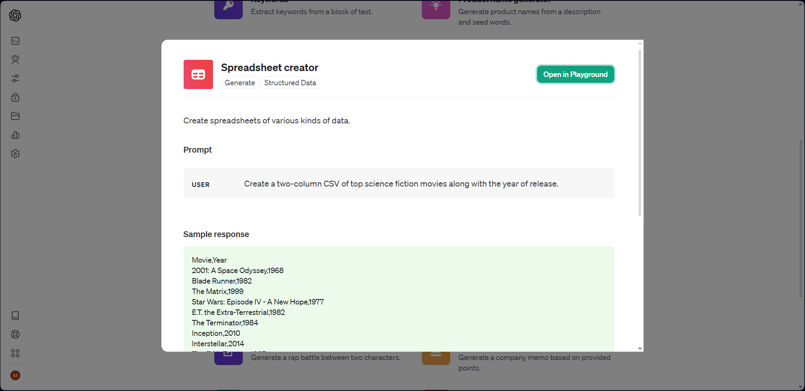
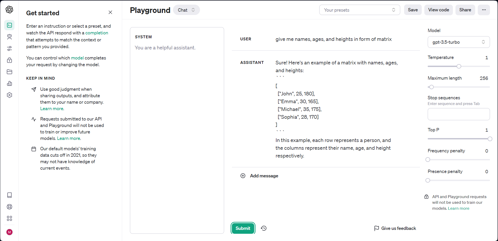

# Summary

# Introduction to OpenAI

### Apa itu AI?
AI atau Artificial Intelligence adalah merujuk pada kecerdasan yang dibuat secara buatan, yang dapat diterapkan pada mesin atau program komputer untuk melakukan tugas tertentu tanpa keterlibatan manusia. Tujuan utama dari AI adalah membuat mesin mampu berpikir, belajar, dan mengambil keputusan seperti manusia. Ada dua jenis utama AI: AI lemah (narrow or weak AI) yang dirancang untuk tugas tertentu, dan AI kuat (strong AI) yang memiliki kemampuan serba guna seperti manusia.

### Apa itu OpenAI?
OpenAI adalah organisasi riset kecerdasan buatan yang didirikan pada Desember 2015. Tujuannya adalah untuk memajukan riset dalam bidang kecerdasan buatan dan memastikan bahwa manfaat dari kemajuan tersebut dapat diakses secara luas oleh masyarakat. OpenAI menyelidiki berbagai aspek kecerdasan buatan, termasuk pengembangan model besar berbasis bahasa alam seperti GPT (Generative Pre-trained Transformer). OpenAI telah merilis beberapa model, termasuk GPT-3 yang dikenal sebagai salah satu model bahasa terbesar dan paling canggih yang ada.

Singkatnya, AI adalah konsep kecerdasan buatan yang mencakup berbagai teknologi dan aplikasi, sementara OpenAI adalah organisasi yang secara khusus berfokus pada riset dan pengembangan di bidang kecerdasan buatan, dengan menghasilkan model-model besar seperti GPT-3.

### Playground OpenAI
Playground OpenAI merupakan antarmuka web yang memungkinkan pengguna untuk berinteraksi langsung dengan model-model OpenAI tanpa perlu mengintegrasikannya ke dalam aplikasi atau sistem mereka sendiri. Fungsi utama dari playground ini adalah untuk memungkinkan pengguna:
1. **Eksplorasi Model:**  
Pengguna dapat menggunakan model bahasa seperti GPT-3 untuk menghasilkan teks berdasarkan input yang diberikan. Hal ini memungkinkan pengguna untuk memahami kemampuan dan keterbatasan model secara langsung.

2. **Pengujian Ide:**  
Playground dapat digunakan untuk menguji ide atau skenario tertentu dengan menggunakan model OpenAI. Ini memungkinkan pengembang atau peneliti untuk melihat bagaimana model berperilaku dalam konteks tertentu.

3. **Pemahaman API:**  
Playground seringkali menyediakan pengguna dengan contoh kode atau interaksi API yang dapat digunakan untuk mengintegrasikan model OpenAI ke dalam proyek mereka sendiri. Ini membantu pengguna memahami cara menggunakan API OpenAI.

4. **Pelatihan:**  
Beberapa playground mungkin juga memberikan kesempatan bagi pengguna untuk melatih model-model OpenAI dengan data khusus.

5. **Dokumentasi dan Tutorial:**  
Playground juga bisa disertai dengan dokumentasi dan tutorial untuk membantu pengguna memahami konsep dan fitur model-model OpenAI.

  

# Praktikum

 

Untuk melihat hasil praktikum dalam bentuk file doc, dapat klik [di sini](https://github.com/aryaptradji/flutter_Muhammad-Aryaputra-Adji/tree/master/Minggu-9/2.%20Introduction%20to%20OpenAI/praktikum)

**atau** 

bisa juga akses melalui link [https://docs.google.com/document/d/1dRxT7qE7uveAjG3WMh6KqFm3_TsmDCC1gVXEtfC_3E8/edit?usp=sharing](https://docs.google.com/document/d/1dRxT7qE7uveAjG3WMh6KqFm3_TsmDCC1gVXEtfC_3E8/edit?usp=sharing)